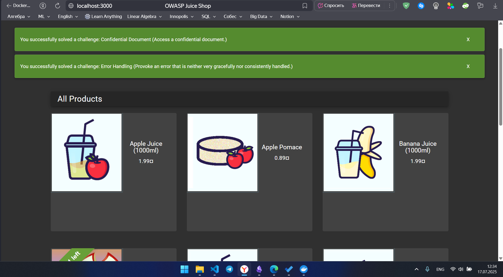
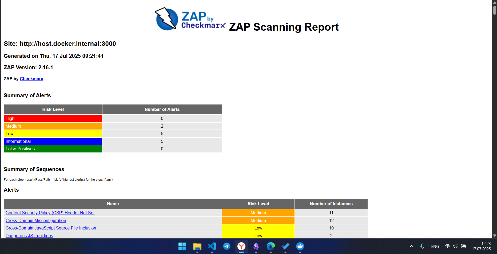
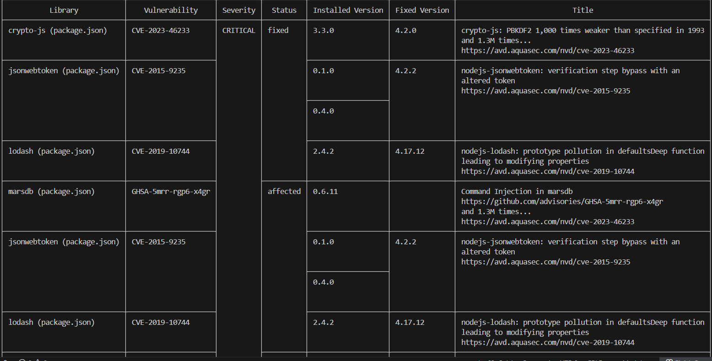

# Solution to Lab 9

by Dadakhon Turgunboev <d.turgunboev@innopolis.university>
## Task 1: Web Application Scanning with OWASP ZAP

**Command:**

```bash
docker run -d --name juice-shop -p 3000:3000 bkimminich/juice-shop
```

**Output:**

  


**Command:**

```bash
docker run --rm -u zap -v $(pwd):/zap/wrk:rw \
    -t ghcr.io/zaproxy/zaproxy:stable zap-baseline.py \
    -t "http://$(ip -f inet -o addr show docker0 | awk '{print $4}' | cut -d '/' -f 1):3000" \
    -g gen.conf \
    -r zap-report.html
```

**Output:**

```text
zap-report.html
```

## Task 1 Results
- Juice Shop vulnerabilities found (Medium): 2
- Most interesting vulnerability found: Content Security Policy (CSP) Header Not Set
- Security headers present: No

## Task 2: Container Vulnerability Scanning with Trivy

**Command:**

```bash
      docker run --rm -v /var/run/docker.sock:/var/run/docker.sock \
      aquasec/trivy:latest image \
      --severity HIGH,CRITICAL \
      bkimminich/juice-shop
```

docker run --rm -v /var/run/docker.sock:/var/run/docker.sock aquasec/trivy:latest image --severity HIGH,CRITICAL bkimminich/juice-shop

### Task 2 Results

- **Critical vulnerabilities in Juice Shop image:** 8  
- **Vulnerable packages:**
  1. crypto-js  
  2. jsonwebtoken  
  3. lodash  
  4. marsdb  
  5. vm2  
- **Dominant vulnerability type:** Sandbox Escape / Command Injection / Prototype Pollution (Node.js app-level vulnerabilities)

## Screenshots

  
