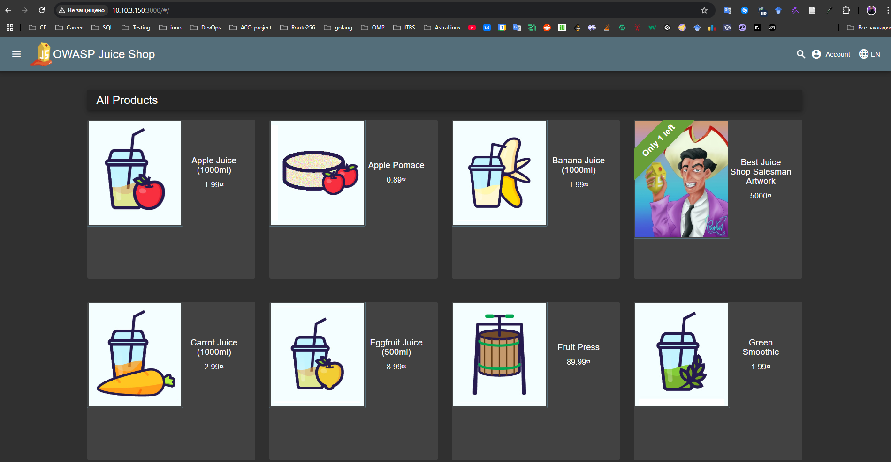
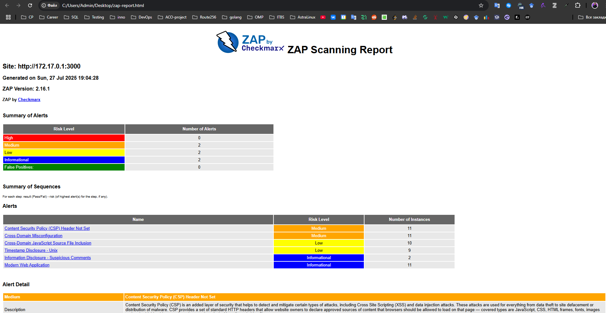
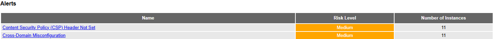
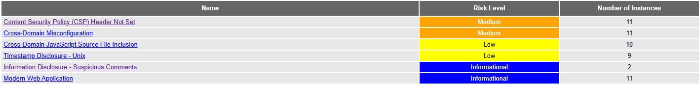
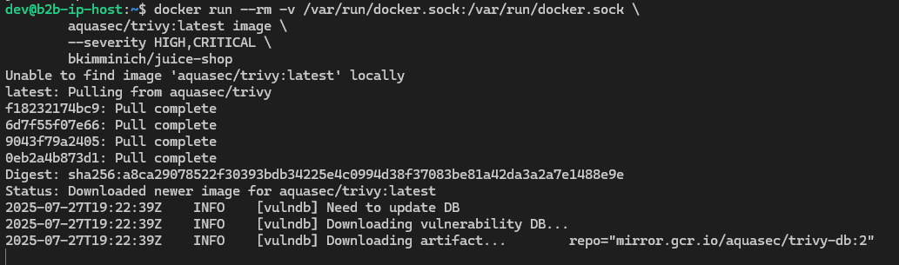
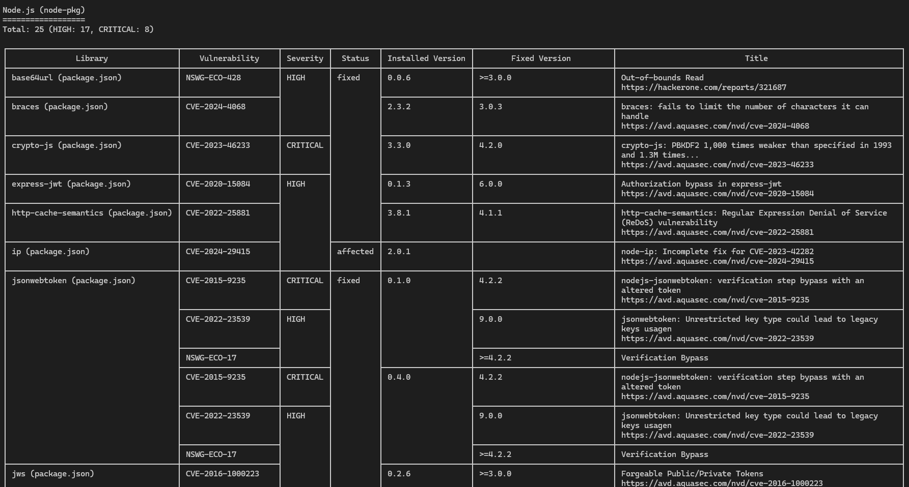

# Introduction to DevSecOps Tools

In this lab, you'll explore fundamental DevSecOps practices by performing security scans on containers and web applications using industry-standard tools. You'll learn how to identify vulnerabilities in a safe, controlled environment using intentionally vulnerable targets.

## Task 1: Web Application Scanning with OWASP ZAP

**Objective**: Perform automated security scanning of a vulnerable web application using OWASP ZAP in Docker to identify common web vulnerabilities. Web application scanning helps discover security flaws like XSS, SQL injection, and misconfigurations before attackers exploit them. ZAP is an industry-standard tool maintained by OWASP.

1. **Start the vulnerable target application** (Juice Shop):

    ```bash
        docker run -d --name juice-shop -p 3000:3000 bkimminich/juice-shop
    ```

    Verify it's running: `http://localhost:3000` in your browser

    

2. **Scan with OWASP ZAP**:

    ```bash
        docker run --rm -u zap -v $(pwd):/zap/wrk:rw \
        -t ghcr.io/zaproxy/zaproxy:stable zap-baseline.py \
        -t http://host.docker.internal:3000 \
        -g gen.conf \
        -r zap-report.html
    ```

    > *Note*:
    > - Mac/Windows: Use `host.docker.internal` as above
    > - Linux: Replace with your machine's LAN IP. You can use following command `ip -f inet -o addr show docker0 | awk '{print $4}' | cut -d '/' -f 1`

    

    Juice Shop vulnerabilities found (Medium): 2

    

    **Content Security Policy (CSP) Header Not Set**: Content Security Policy (CSP) is an added layer of security that helps to detect and mitigate certain types of attacks, including Cross Site Scripting (XSS) and data injection attacks. These attacks are used for everything from data theft to site defacement or distribution of malware. CSP provides a set of standard HTTP headers that allow website owners to declare approved sources of content that browsers should be allowed to load on that page — covered types are JavaScript, CSS, HTML frames, fonts, images and embeddable objects such as Java applets, ActiveX, audio and video files.

    **Cross-Domain Misconfiguration**: Web browser data loading may be possible, due to a Cross Origin Resource Sharing (CORS) misconfiguration on the web server.

    

    Most interesting vulnerability found: Content Security Policy (CSP) Header Not Set.

    - CSP is a powerful browser feature that helps prevent Cross-Site Scripting (XSS), data injection, and clickjacking.
    - Without CSP, attackers can inject malicious scripts into trusted pages, leading to data theft, session hijacking, or drive-by downloads.
    - It's often overlooked in security configs, yet critical for modern web apps.

    Security headers present: No

---

## Task 2: Container Vulnerability Scanning with Trivy

**Objective**: Identify vulnerabilities in container images using Trivy executed via Docker, focusing on intentionally vulnerable images for education. Container scanning detects OS/library vulnerabilities in images before deployment. Trivy is the industry's most comprehensive open-source scanner.

1. **Scan using Trivy in Docker**:

    ```bash
        docker run --rm -v /var/run/docker.sock:/var/run/docker.sock \
        aquasec/trivy:latest image \
        --severity HIGH,CRITICAL \
        bkimminich/juice-shop
    ```

    

2. **Analyze results**:

    

    Total Critical Vulnerabilities: 8

    Vulnerable Packages:
    - crypto-js – CVE-2023-46233: Weak PBKDF2 implementation
    - jsonwebtoken – CVE-2015-9235: Token verification bypass
    - lodash – CVE-2019-10744: Prototype pollution
    - marsdb – GHSA-5mrr-rgp6-x4gr: Command injection
    - vm2 – CVE-2023-32314: Sandbox escape
    - vm2 – CVE-2023-37466: Bypass of promise handler sanitization
    - vm2 – CVE-2023-37903: Escape via custom inspect
    - jsonwebtoken (duplicate entry of CVE-2015-9235 with a different version)

    Dominant Vulnerability Type:
    Sandbox Escape and Prototype Pollution

    These issues allow attackers to break out of secure environments or manipulate object structures—posing serious security risks, especially in containerized and user-facing environments.

3. **Clean up**:

    ```bash
        docker rmi bkimminich/juice-shop
    ```

---

> **Safety Note**: All scans target intentionally vulnerable containers/web apps running locally. Never run automated scanners against production systems without explicit permission.
