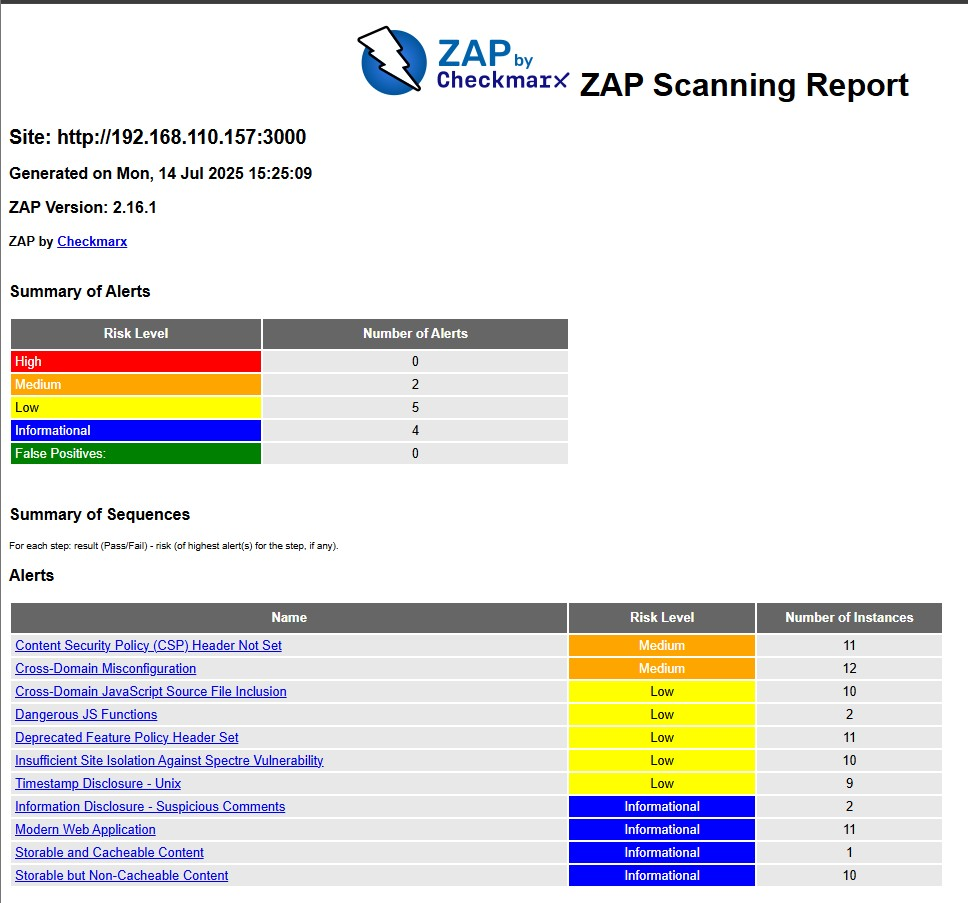


# Introduction to DevSecOps Tools

## Task 1:Web Application Scanning with OWASP ZAP

### Results

- Juice Shop vulnerabilities found (Medium): 2
- Most interesting vulnerability found: 
  - Content Security Policy (CSP) Header Not Set
  - Cross-Domain Misconfiguration.
- Security headers present: 
  - No

## Task 2: Container Vulnerability Scanning with Trivy

### Results

- Critical vulnerabilities in Juice Shop image: 8
- Vulnerable packages: 
  - base64url
  - braces
  - crypto-js
  - express-jwt
  - http-cache-semantics
  - ip
  - jsonwebtoken
  - jws
  - lodash
  - lodash.set
  - marsdb
  - moment
  - sanitize-html
  - vm2
  - ws
  - libc6 (Debian package)
- Dominant vulnerability type: Prototype Pollution, Token Verification Bypass.

