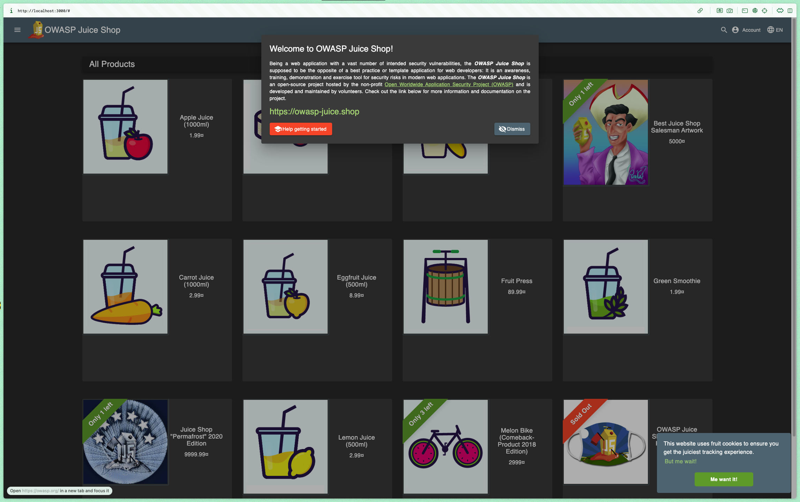
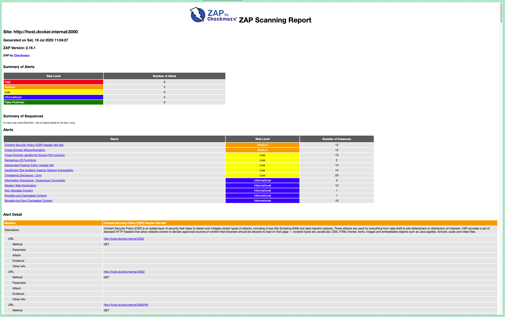
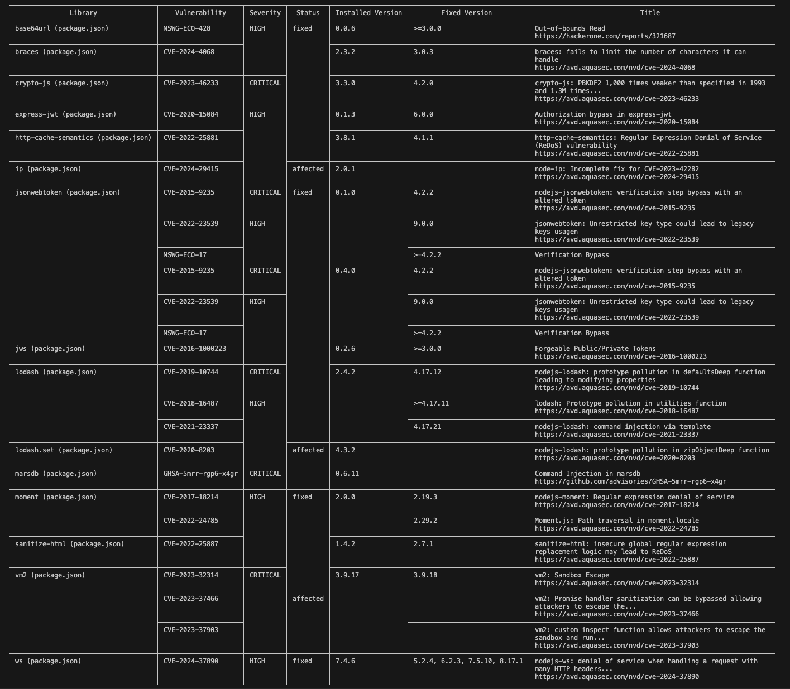

# Lab 9 - DevSecOps

Timur Nugaev

---

I'm using Mac silicon for this lab

---

## Task 1

### 1. cmd:
```bash
docker run -d --name juice-shop -p 3000:3000 bkimminich/juice-shop
Unable to find image 'bkimminich/juice-shop:latest' locally
latest: Pulling from bkimminich/juice-shop
...
Digest: sha256:51134b74c523b6779a4bf25bca021b5cfae7898b6e68f6545e8bb9e4d33ce6b0
Status: Downloaded newer image for bkimminich/juice-shop:latest
eedeb522acb3975b5375969dd4d74973ed1db350b586d5205ca44eecb6eb7b81
```

verify it's running:



### 2. scan
```bash
docker run --rm -u zap -v $(pwd):/zap/wrk:rw \
-t ghcr.io/zaproxy/zaproxy:stable zap-baseline.py \
-t http://host.docker.internal:3000 \
-g gen.conf \
-r zap-report.html

...pulling image for zaproxy...


Digest: sha256:1832ccb6b361763250a8be11c75ee5f49e76f16c0940459adb7619929110fd8e
Status: Downloaded newer image for ghcr.io/zaproxy/zaproxy:stable
Total of 95 URLs
PASS: Vulnerable JS Library (Powered by Retire.js) [10003]
PASS: In Page Banner Information Leak [10009]
PASS: Cookie No HttpOnly Flag [10010]
PASS: Cookie Without Secure Flag [10011]
PASS: Re-examine Cache-control Directives [10015]
PASS: Content-Type Header Missing [10019]
PASS: Anti-clickjacking Header [10020]
PASS: X-Content-Type-Options Header Missing [10021]
PASS: Information Disclosure - Debug Error Messages [10023]
PASS: Information Disclosure - Sensitive Information in URL [10024]
PASS: Information Disclosure - Sensitive Information in HTTP Referrer Header [10025]
PASS: HTTP Parameter Override [10026]
PASS: Information Disclosure - Suspicious Comments [10027]
PASS: Off-site Redirect [10028]
PASS: Cookie Poisoning [10029]
PASS: User Controllable Charset [10030]
PASS: User Controllable HTML Element Attribute (Potential XSS) [10031]
PASS: Viewstate [10032]
PASS: Directory Browsing [10033]
PASS: Heartbleed OpenSSL Vulnerability (Indicative) [10034]
PASS: Strict-Transport-Security Header [10035]
PASS: HTTP Server Response Header [10036]
PASS: Server Leaks Information via "X-Powered-By" HTTP Response Header Field(s) [10037]
PASS: X-Backend-Server Header Information Leak [10039]
PASS: Secure Pages Include Mixed Content [10040]
PASS: HTTP to HTTPS Insecure Transition in Form Post [10041]
PASS: HTTPS to HTTP Insecure Transition in Form Post [10042]
PASS: User Controllable JavaScript Event (XSS) [10043]
PASS: Big Redirect Detected (Potential Sensitive Information Leak) [10044]
PASS: Content Cacheability [10049]
PASS: Retrieved from Cache [10050]
PASS: X-ChromeLogger-Data (XCOLD) Header Information Leak [10052]
PASS: Cookie without SameSite Attribute [10054]
PASS: CSP [10055]
PASS: X-Debug-Token Information Leak [10056]
PASS: Username Hash Found [10057]
PASS: X-AspNet-Version Response Header [10061]
PASS: PII Disclosure [10062]
PASS: Hash Disclosure [10097]
PASS: Source Code Disclosure [10099]
PASS: Weak Authentication Method [10105]
PASS: Reverse Tabnabbing [10108]
PASS: Modern Web Application [10109]
PASS: Authentication Request Identified [10111]
PASS: Session Management Response Identified [10112]
PASS: Verification Request Identified [10113]
PASS: Script Served From Malicious Domain (polyfill) [10115]
PASS: Absence of Anti-CSRF Tokens [10202]
PASS: Private IP Disclosure [2]
PASS: Session ID in URL Rewrite [3]
PASS: Script Passive Scan Rules [50001]
PASS: Insecure JSF ViewState [90001]
PASS: Java Serialization Object [90002]
PASS: Sub Resource Integrity Attribute Missing [90003]
PASS: Charset Mismatch [90011]
PASS: Application Error Disclosure [90022]
PASS: WSDL File Detection [90030]
PASS: Loosely Scoped Cookie [90033]
WARN-NEW: Cross-Domain JavaScript Source File Inclusion [10017] x 10 
        http://host.docker.internal:3000/ (200 OK)
        http://host.docker.internal:3000/ (200 OK)
        http://host.docker.internal:3000/sitemap.xml (200 OK)
        http://host.docker.internal:3000/sitemap.xml (200 OK)
        http://host.docker.internal:3000 (200 OK)
WARN-NEW: Content Security Policy (CSP) Header Not Set [10038] x 12 
        http://host.docker.internal:3000/ (200 OK)
        http://host.docker.internal:3000/sitemap.xml (200 OK)
        http://host.docker.internal:3000 (200 OK)
        http://host.docker.internal:3000/ftp (200 OK)
        http://host.docker.internal:3000/ftp/package-lock.json.bak (403 Forbidden)
WARN-NEW: Deprecated Feature Policy Header Set [10063] x 14 
        http://host.docker.internal:3000/ (200 OK)
        http://host.docker.internal:3000/runtime.js (200 OK)
        http://host.docker.internal:3000/polyfills.js (200 OK)
        http://host.docker.internal:3000/sitemap.xml (200 OK)
        http://host.docker.internal:3000 (200 OK)
WARN-NEW: Timestamp Disclosure - Unix [10096] x 20 
        http://host.docker.internal:3000/ (200 OK)
        http://host.docker.internal:3000/ (200 OK)
        http://host.docker.internal:3000/ (200 OK)
        http://host.docker.internal:3000/main.js (200 OK)
        http://host.docker.internal:3000/sitemap.xml (200 OK)
WARN-NEW: Cross-Domain Misconfiguration [10098] x 12 
        http://host.docker.internal:3000/ (200 OK)
        http://host.docker.internal:3000/polyfills.js (200 OK)
        http://host.docker.internal:3000/robots.txt (200 OK)
        http://host.docker.internal:3000/main.js (200 OK)
        http://host.docker.internal:3000/assets/public/favicon_js.ico (200 OK)
WARN-NEW: Dangerous JS Functions [10110] x 2 
        http://host.docker.internal:3000/main.js (200 OK)
        http://host.docker.internal:3000/vendor.js (200 OK)
WARN-NEW: Insufficient Site Isolation Against Spectre Vulnerability [90004] x 14 
        http://host.docker.internal:3000/ (200 OK)
        http://host.docker.internal:3000/ (200 OK)
        http://host.docker.internal:3000/sitemap.xml (200 OK)
        http://host.docker.internal:3000/sitemap.xml (200 OK)
        http://host.docker.internal:3000 (200 OK)
FAIL-NEW: 0     FAIL-INPROG: 0  WARN-NEW: 7     WARN-INPROG: 0  INFO: 0 IGNORE: 0       PASS: 58
```

### 3. Analyze the report of .html:



two Medium‑risk issues found in the report:

- Content Security Policy (CSP) Header Not Set.

This would mean the website is vulnerable to XSS attacks and data injections.

- Cross‑Domain Misconfiguration (CORS).

any origin can read unauthorized materials and access the private data (Access‑Control‑Allow‑Origin header is set to pattern match with '*' which is any origin)

Security headers status:

- Content‑Security‑Policy: missing. No CSP header.

- Access‑Control‑Allow‑Origin: present but '*'.

- Feature‑Policy: deprecated Feature‑Policy header, should be renamed to Permissions‑Policy.

- Cross‑Origin‑Embedder‑Policy: Not set: Spectre‐style attacks are possible.


### 4. clean-up

```bash
aladdinych@MacBook-Pro-Timur lab9 %    docker stop juice-shop && docker rm juice-shop
juice-shop
juice-shop
```


## Task 2: Container Vulnerability Scanning with Trivy

### 1. Scan using Trivy in Docker:

```bash
docker run --rm -v /var/run/docker.sock:/var/run/docker.sock \
aquasec/trivy:latest image \
--severity HIGH,CRITICAL \
bkimminich/juice-shop
```

### 2. Analyze results:



- Total critical vulnerabilities: 8

- Two vulnerable packages: crypto‑js, marsdb

- Most common vulnerability type: Prototype pollution

### 3. Cleanup

`   docker rmi bkimminich/juice-shop`