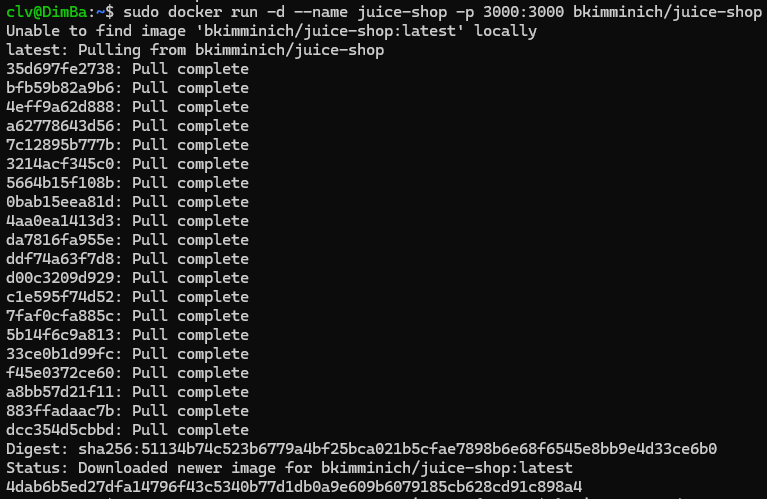
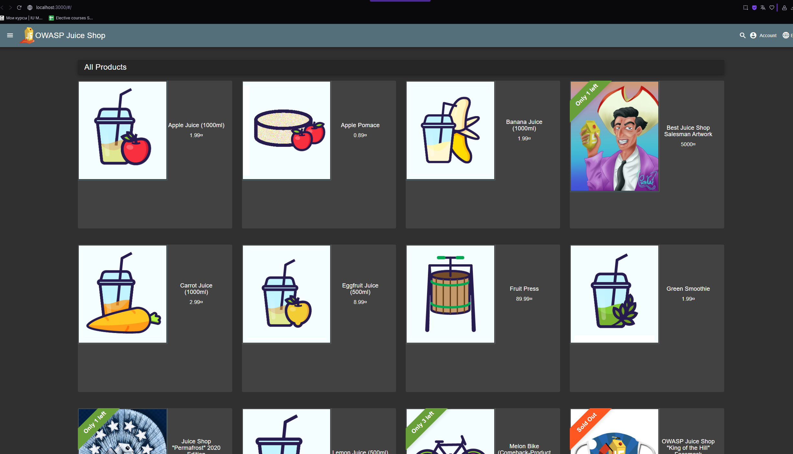
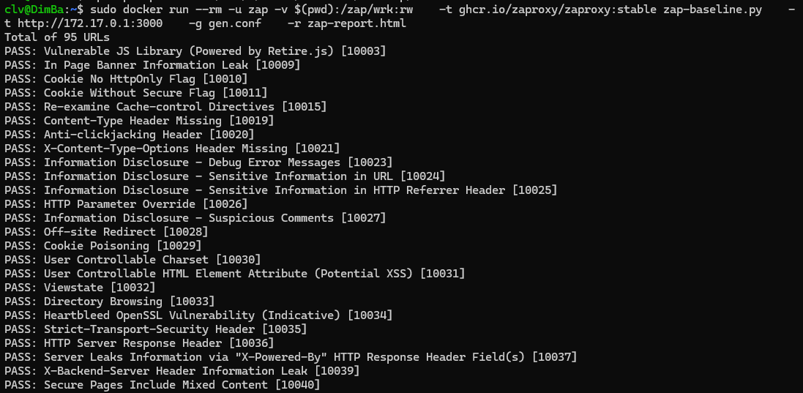
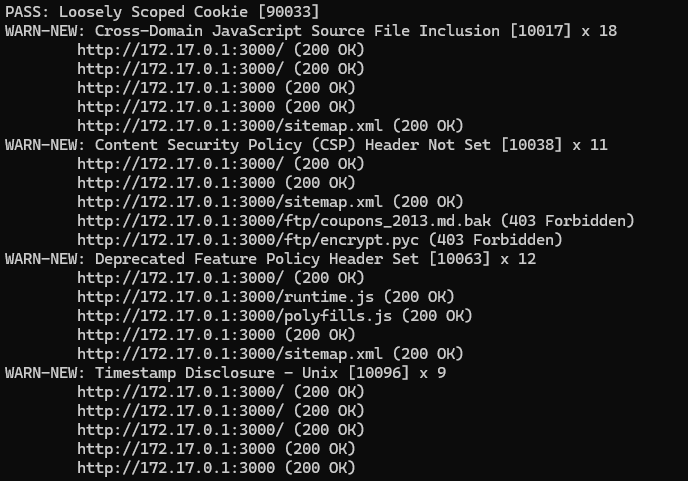
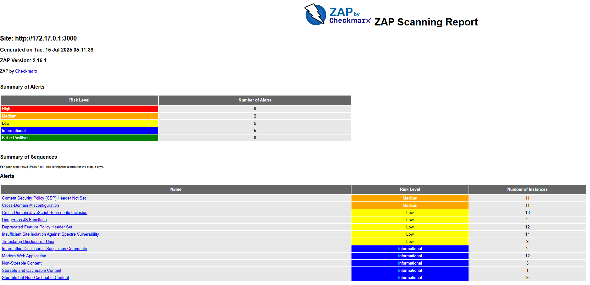
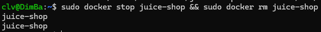
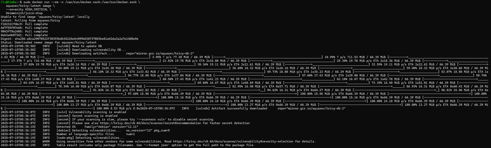
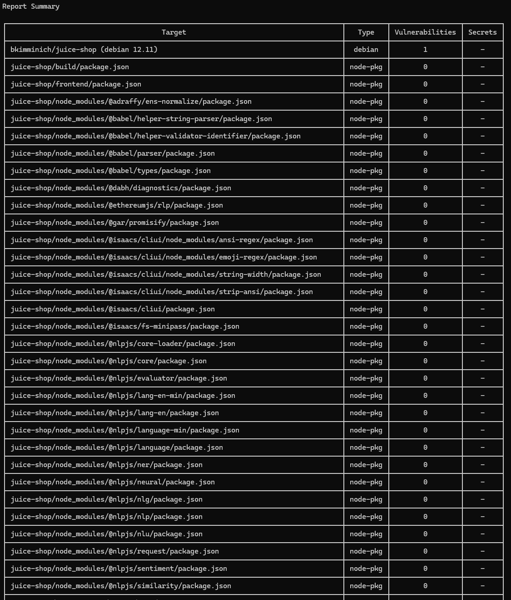
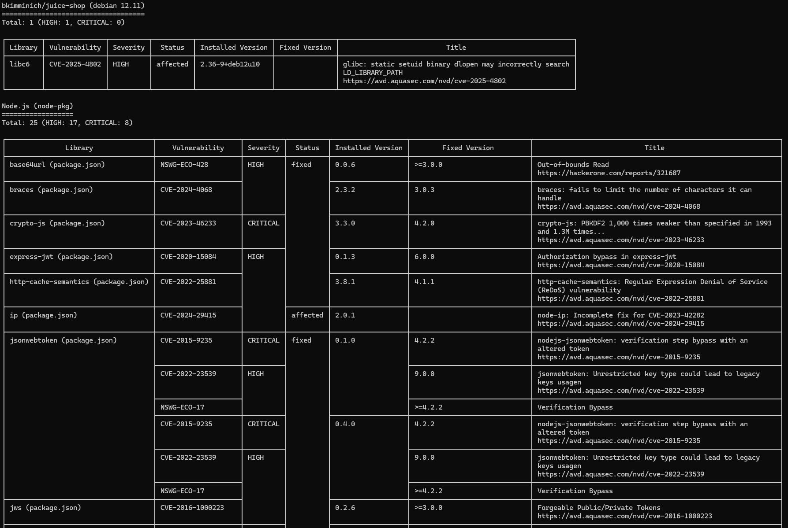

# Task 1

## Task 1 Results
- Juice Shop vulnerabilities found (Medium): 2
- Most interesting vulnerability found: Content Security Policy (CSP) Header Not Set
- Security headers present: No

# Task 2

## Task 2 Results
- Critical vulnerabilities in Juice Shop ./images/image: 8
- Vulnerable packages: 
   1. Node.js (node-pkg) — Total of 25 vulnerabilities, 8 of which are critical
   2. bkimminich/juice-shop
- Dominant vulnerability type: Prototype Pollution