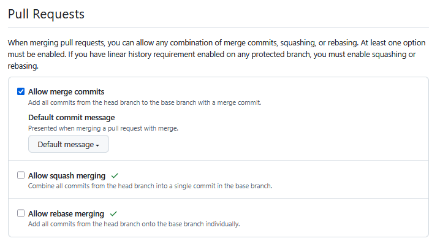

# Task 1: SSH Commit Signature Verification
## Benefits of signing commits
In general it is a case of verification.

- As mentioned on lab, signed commits are nowaays acknowledged as proof of authorship ever since the lawsuit between Linus Torwalds and Microsoft (if I remember correctly, could not find the lawsuit in question)
- Acts as a form of 2FA. Supposedly there is a trivial author spoofing possible due to Git's design via `git config user.email/name` [highlighted by Mike Gerwitz in 2012](https://mikegerwitz.com/2012/05/a-git-horror-story-repository-integrity-with-signed-commits). An additional verification via an SSH key used for signature helps ounteract that.
- (Anecdotally) GDPR regulation suggests commit signing as a standard way of signing off authorship. UK Government also requires that [all commits must be signed by the author](https://engineering.homeoffice.gov.uk/standards/signing-code-commits/#all-code-commits-must-be-cryptographically-signed-by-the-author-of-that-commit).
## SSH Key Generation
I did generate it, but I am not showing it because sources tell I shouldn't share anything about my keys.
## Making a Signed Commit
The commit with which this document was pushed is signed.

# Task 2: Merge Strategies in Git
## Merge Strategies Comparison  
| **Strategy**       | **Mechanism**                              | **Pros**                                                                 | **Cons**                                                                 |
|---------------------|--------------------------------------------|--------------------------------------------------------------------------|--------------------------------------------------------------------------|
| **Standard Merge**  | Creates a merge commit combining branch histories. Preserves all original commits.  |  Full audit trail & branch context.  Easy reverts (`git revert -m`).  Works with `git bisect` for debugging.  |  Cluttered history with merge commits.  Timelines get complicated.  |
| **Squash and Merge**| Condenses all branch commits into one new commit.  |  Clean, linear main-branch history.  Hides intermediate/WIP commits.  |  Loses granular commit history.  Obscures authorship/details.  Hard to revert partial changes.  |
| **Rebase and Merge**| Replays feature-branch commits atop the base branch. No merge commit.  | Linear history without merge commits.  Preserves individual commits.  |  High conflict risk on long branches.  Rewrites history (breaks shared branches).  Complex reverts.  |

### **Why Standard Merge Is Preferred for Collaboration**  
- **Traceability**: Maintains full context of development.
- **Safety**: Non-destructive, avoids history rewriting risks (e.g., force-push disasters).
- **Tool compatibility**: Works seamlessly with `git bisect`, `git blame`, and CI/CD pipelines .  
- **Compliance**: Audits benefit from unaltered commit timelines .  

 **Trade-off**: History appears "messier" and it might be harder to navigate, but the traceability is nigh-complete.

**Sources**:
- https://www.atlassian.com/git/tutorials/merging-vs-rebasing
- https://learn.microsoft.com/en-us/azure/devops/repos/git/merging-with-squash?view=azure-devops
- https://lukemerrett.com/different-merge-types-in-git/
- https://graphite.dev/blog/pull-request-merge-strategy
- https://git-scm.com/docs/merge-strategies
- https://docs.github.com/en/pull-requests/collaborating-with-pull-requests/incorporating-changes-from-a-pull-request/merging-a-pull-request

## Repository Settings
The repository settings have been set to only standard merge per instruction.
