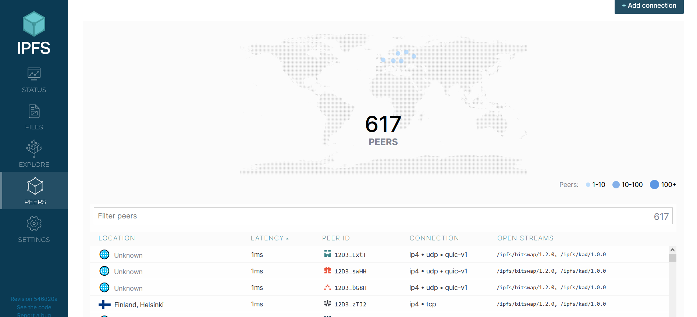
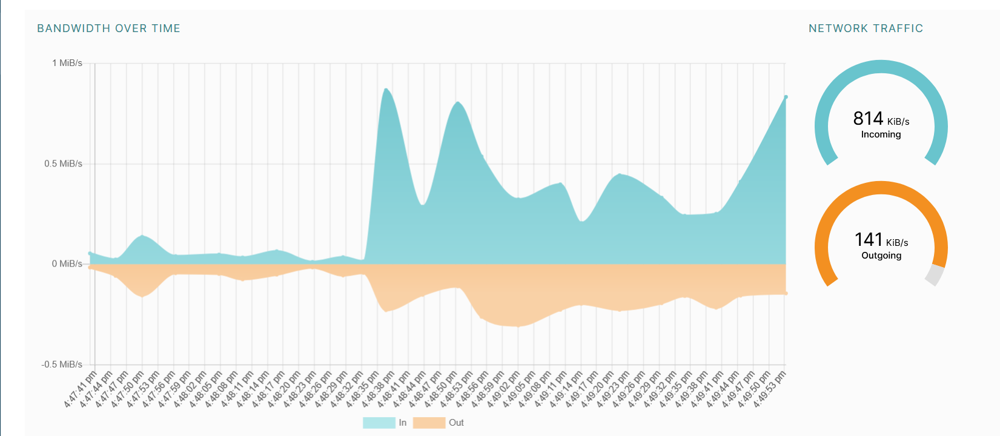

# Lab 10

## Local IPFS Node Setup and File Publishing    

```
docker run -d --name ipfs_node \
  -v ipfs_staging:/export \
  -v ipfs_data:/data/ipfs \
  -p 4001:4001 -p 8080:8080 -p 5001:5001 \
  ipfs/kubo:latest
```

```
docker exec ipfs_node ipfs swarm peers
```

```
/ip4/1.162.191.174/tcp/39094/p2p/QmY9bu6eihqfYd14Sz5nEQD3vnTZBSxdW7kfXgGmMGVkzD
/ip4/1.168.3.247/tcp/54010/p2p/QmPmcywpcqXX8byRUSHvLuFzMwweeegfqyAUwux8riDZHo
/ip4/1.208.108.242/tcp/34401/p2p/Qmb4g6pog6W7m9cw2JNeUhSBxXZq8EpftQB52eoPbjxeAV
/ip4/1.208.108.242/tcp/42867/p2p/QmY9pMMpjU5uEEnkpLdh1Y58fEZisoc67PYd2rHCWG4ftQ

...

/ip4/98.59.196.95/tcp/50971/p2p/QmeWMeqLZxfoUgfqFuoe4TBUXU6nwBhAJBND1jmdYAGcrg
/ip4/99.105.194.189/tcp/4001/p2p/12D3KooWESiMsimKuudy2u1iTt9FhvvsFiq2YwhVCxbDrGDasp1s
/ip4/99.63.39.167/tcp/39025/p2p/QmdWysXvx7nqFC2ofcorzTnDSqxdihPGSEScC4xpU6KTkn
```

```
echo "Hello IPFS Lab" > testfile.txt
docker cp testfile.txt ipfs_node:/export/
docker exec ipfs_node ipfs add /export/testfile.txt
```

```
Successfully copied 2.05kB to ipfs_node:/export/
15 B / 15 B  100.00%added QmUFJmQRosK4Amzcjwbip8kV3gkJ8jqCURjCNxuv3bWYS1 testfile.txt
```

```
curl https://ipfs.io/ipfs/QmUFJmQRosK4Amzcjwbip8kV3gkJ8jqCURjCNxuv3bWYS1
```

```
Hello IPFS Lab
```

connect to `http://127.0.0.1:5001/webui/`




## Task 1 Results
- IPFS Node Peer Count: 617
- IPFS Node Bandwidth: input 814 Kib/sm output 141 Kib/s
- Test File CID: QmUFJmQRosK4Amzcjwbip8kV3gkJ8jqCURjCNxuv3bWYS1
- Public Gateway URL: https://ipfs.io/ipfs/QmUFJmQRosK4Amzcjwbip8kV3gkJ8jqCURjCNxuv3bWYS1

## Static Site Deployment with 4EVERLAND

