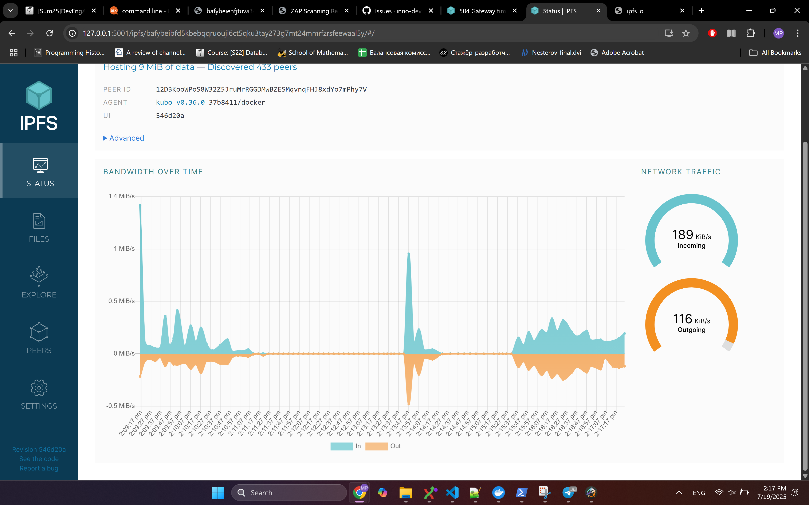
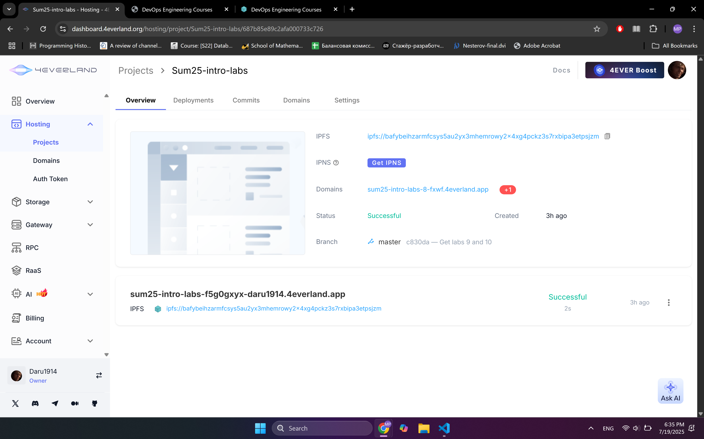
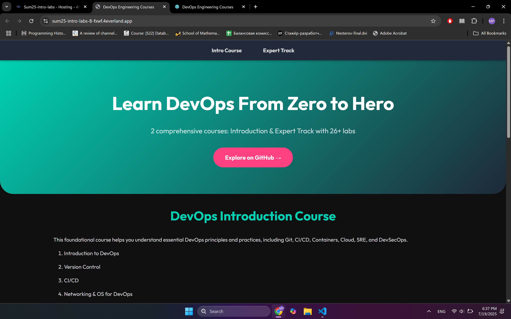
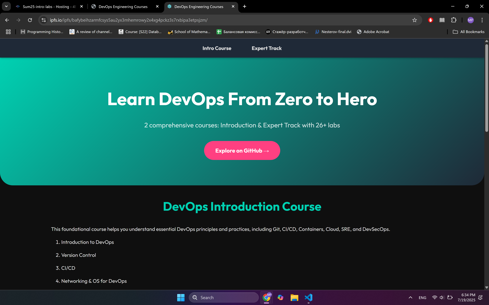

# Lab 10 - Decentralized Web Hosting with IPFS & 4EVERLAND

## Task 1 Results
   - IPFS Node Peer Count: **572**
   
   - IPFS Node Bandwidth: **Incoming 189 KiB/s, outgoing 116 KiB/s**.
   
   - Test File CID: QmXSHFVEZ2xB3s29K9FHSoKhqfW9VLZ1GMiV5pWuqmCYEy
   - Public Gateway URL: (https://ipfs.io/ipfs/QmXSHFVEZ2xB3s29K9FHSoKhqfW9VLZ1GMiV5pWuqmCYEy)

## Task 2 Results
   - 4EVERLAND Project URL: https://dashboard.4everland.org/hosting/project/Sum25-intro-labs/687b85e89c2afa000733c726
   Also see https://sum25-intro-labs-8-fxwf.4everland.app/ and https://sum25-intro-labs-f5g0gxyx-daru1914.4everland.app/ for the public-facing site.
   
   
   - GitHub Repository (if you used your own app): https://github.com/Daru1914/Sum25-intro-labs
   - IPFS CID from 4EVERLAND: bafybeihzarmfcsys5au2yx3mhemrowy2x4xg4pckz3s7rxbipa3etpsjzm
   