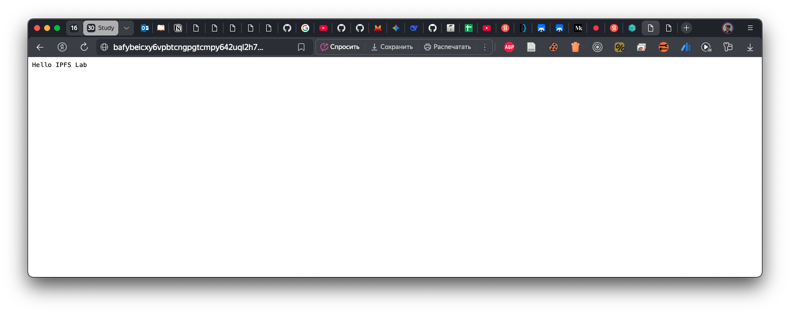
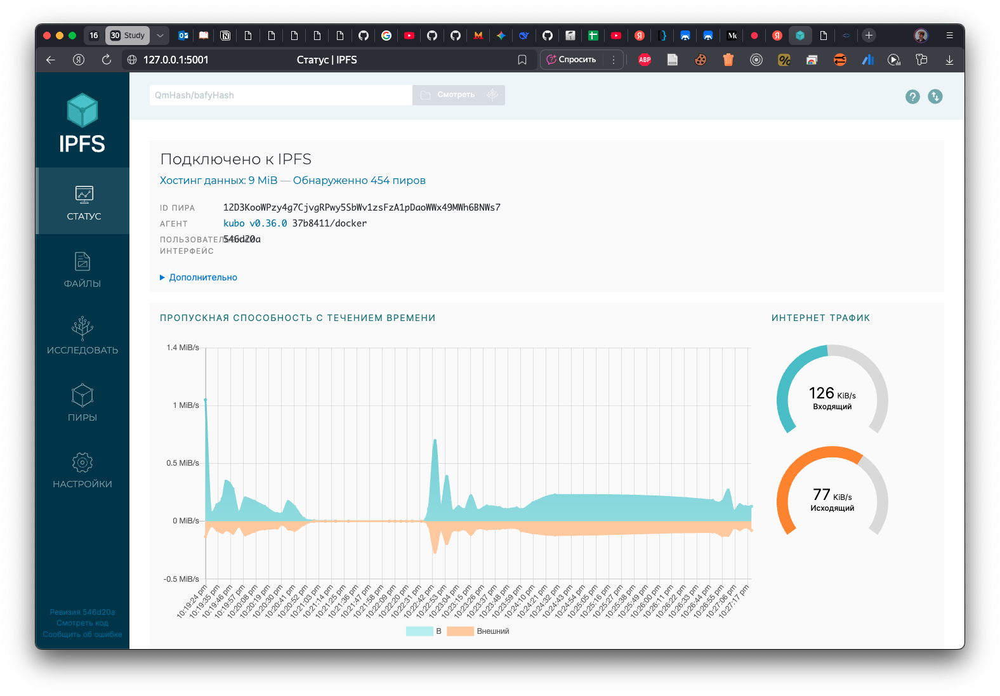
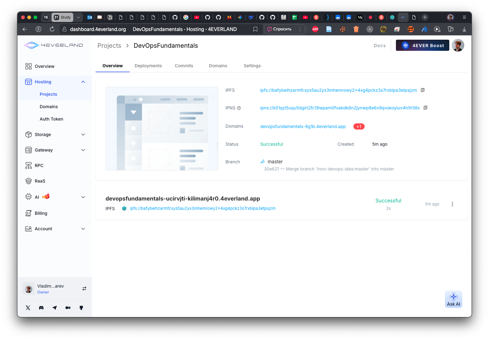
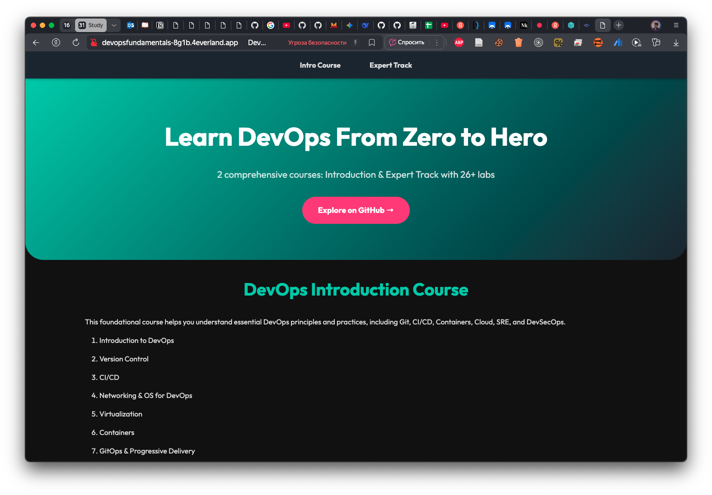

# Lab 10

## Task 1

```bash
(base) ➜  DevOpsFundamentals git:(lab10) ✗    docker run -d --name ipfs_node \
     -v ipfs_staging:/export \
     -v ipfs_data:/data/ipfs \
     -p 4001:4001 -p 8080:8080 -p 5001:5001 \
     ipfs/kubo:latest
Unable to find image 'ipfs/kubo:latest' locally
latest: Pulling from ipfs/kubo
d8cd077c1d1c: Pull complete 
3c5219c83cfa: Pull complete 
b971de49973b: Pull complete 
def5dd004564: Pull complete 
052e21e0be3a: Pull complete 
160de00d05aa: Pull complete 
a94a7032c40c: Pull complete 
4f4fb700ef54: Pull complete 
8a248cdae65c: Pull complete 
e3fcbbfc1d8c: Pull complete 
a2798e190096: Pull complete 
492ef60fb2ee: Pull complete 
be0735d78022: Pull complete 
Digest: sha256:51dd374d5a6a7e1a7c77358701d65bbf558a2e76802d65d4f81b125877811ee1
Status: Downloaded newer image for ipfs/kubo:latest
a80089c31be956f19fc9acff0f01330c733c8a0eb09423c6058359bf159ca2be
```

```bash
(base) ➜  DevOpsFundamentals git:(lab10) ✗ docker logs ipfs_node
Changing user to ipfs
ipfs version 0.36.0
generating ED25519 keypair...done
peer identity: 12D3KooWPzy4g7CjvgRPwy5SbWv1zsFzA1pDaoWWx49MWh6BNWs7
initializing IPFS node at /data/ipfs
Initializing daemon...
Kubo version: 0.36.0-37b8411
Repo version: 16
System version: arm64/linux
Golang version: go1.24.5
PeerID: 12D3KooWPzy4g7CjvgRPwy5SbWv1zsFzA1pDaoWWx49MWh6BNWs7
2025/07/29 19:16:26 failed to sufficiently increase receive buffer size (was: 208 kiB, wanted: 7168 kiB, got: 416 kiB). See https://github.com/quic-go/quic-go/wiki/UDP-Buffer-Sizes for details.
Swarm listening on 127.0.0.1:4001 (TCP+UDP)
Swarm listening on 172.17.0.2:4001 (TCP+UDP)
Swarm listening on [::1]:4001 (TCP+UDP)
Run 'ipfs id' to inspect announced and discovered multiaddrs of this node.
RPC API server listening on /ip4/0.0.0.0/tcp/5001
WebUI: http://127.0.0.1:5001/webui
Gateway server listening on /ip4/0.0.0.0/tcp/8080
Daemon is ready
```

- IPFS node is initialized.

```bash
(base) ➜  DevOpsFundamentals git:(lab10) ✗ docker exec ipfs_node ipfs swarm peers
/ip4/104.168.122.107/udp/4001/quic-v1/p2p/12D3KooWMFJHd4ZUxACtRFoLpv3S1j4DQw3mnszPNezio4TiU6wE
/ip4/104.237.4.105/tcp/4001/p2p/12D3KooWFeHu75n14FDrSUDXbb7cXhRUJCYxsRCQLA8nZ9R7uJEg
/ip4/108.61.217.129/udp/4001/quic-v1/p2p/12D3KooWKE4b2HMqwPez7mnSA83PkgAXpKKsKzgsJKF7FjFyZ6Gz
/ip4/109.123.248.175/tcp/4001/p2p/12D3KooWPCLfyN3JEqMsSRiUJgvoBL3JtMCD9cuCfUtg4gz6UEUJ
/ip4/121.235.142.70/tcp/48806/p2p/QmZzxPrXtqgGrp5DWXcSHpLJ4LVAGRcFxx2zHrmyRxKznr
/ip4/128.199.204.253/udp/4001/quic-v1/p2p/12D3KooWJofunz59WsKPNQJx1iNYPWWgVamyJeNPgWoB9hmhKnQ7
/ip4/129.151.69.9/tcp/4001/p2p/12D3KooWFWHQnbL3FEMJTjKrhaxw5J14cdnoPn8E7nh4P7rHsNpy
/ip4/13.236.179.39/tcp/4001/p2p/12D3KooWKBW4jXaQXUdLoUSYT5xHrzrbW46XH8XVRo12mAnEbcbL
/ip4/134.122.124.231/tcp/45575/p2p/QmWjtReWex74WhhV7yB3UjEbqdVF6v2PZ34dMjxt8nPo4R
/ip4/141.164.61.153/tcp/4001/p2p/12D3KooWR1ybfzkcoB3BDiUaGF4BDtpuPd7MwU9WMVMFMgjBAL2Z
/ip4/141.98.7.114/tcp/37729/p2p/QmcN2gefzjT1sBADa6K9A7sD1cThu1YB2GCy1YXqNhpG7p
/ip4/143.110.156.190/tcp/4001/p2p/12D3KooWSLUQhhW6jN2tg9s5y6CFQngB5TYcT9Q6MHArvTjBN8Nb
/ip4/144.126.139.249/udp/4001/quic-v1/p2p/12D3KooWAah3WpgXR4eGhvxBXoFiAUa5GmkHdCCavt2Dwj1kYQM5
/ip4/145.40.118.135/udp/4001/quic-v1/p2p/QmcZf59bWwK5XFi76CZX8cbJ4BhTzzA3gU1ZjYZcYW3dwt
/ip4/146.190.19.96/tcp/24395/p2p/QmV4oEKf3wwoaeGdRCnekxN6sxk2jGFkKaTatfN5LAkNGd
/ip4/147.182.137.165/tcp/33949/p2p/QmQpvL6ERPoTn3Zrfa3VeY8pD9DoK6hhi5xxKmjtHnJcqM
/ip4/152.53.142.12/tcp/29231/p2p/QmXqwMfDeLhNJvpAJye2zP2v3EC7i98Bzre6R6YBMZtdPD
/ip4/152.53.187.14/tcp/28063/p2p/QmRJ1gY5z41WDSfwMdsC6LNEwnKQyC2rkuSsRAPwZKkJdT
/ip4/152.53.247.122/tcp/42119/p2p/QmYT8HwUsgw3Y6ZYunueg26NYFnB98XBg7vbWWRpuoKyze
/ip4/152.53.38.101/tcp/36139/p2p/QmcyZeaRsZkAFeRBETD68FaozgwJZ449kmEoMDQcosNYDA
/ip4/157.230.33.96/tcp/42647/p2p/Qmd8X12zzEtT6u3wdEVMFVMMrquA6R8WN4J42TARytatQ7
/ip4/157.245.140.3/tcp/39165/p2p/QmWr4RVW4PycbveS3HEWh5CAx37X2AQHJFQu71XA6mKNVF
/ip4/158.220.98.162/udp/4001/quic-v1/p2p/12D3KooWQJBeYBnvBeKv8AhUmZH1m5ADzAzdzsfeGpxAtuSD3SEM
/ip4/162.244.81.90/tcp/9000/p2p/QmZBD5GVhNPqR9X4FsLJpZuf68kmELNBsiKRWMpooCwi6H
/ip4/162.55.199.251/tcp/42575/p2p/QmRMgDB6XpGTzQW3Dsdo1r1HCuVcoQtPmfsjeaaMz4jCyr
/ip4/165.227.133.84/tcp/11329/p2p/QmciqJ8aHBRYyGSCKcFxt8WJNJ8PEgAaPNmr2tENdQRdFw
/ip4/165.232.142.152/tcp/2989/p2p/QmNXA6tgt8MuwxcRjeQDGenRQTyRaqYi7z9pJi35n3ooRq
/ip4/168.119.139.77/tcp/38887/p2p/QmbzkJGTwQ7DTgKZZoe2NDZ3XhwNjV8h9oG4ZvfizBowic
/ip4/168.119.88.184/tcp/36509/p2p/QmX8hcnmu3ni1B7pfMveXUAjTP85jUstxhV58Lqqgi6saN
/ip4/172.104.152.111/udp/4001/quic-v1/p2p/12D3KooWMunHNq2xfMU6tU2bHFsUebCugmxLhbsrox7ddPNJV5mP
/ip4/172.104.74.4/udp/4001/quic-v1/p2p/12D3KooWFvTrEyepjMU5jWUG98YhS1TE246g4L7YmA4au87Tskmw
/ip4/178.150.181.172/tcp/44441/p2p/QmV63Jr5HhRYFUV19doyDwHWKJUdRStNYkmZ2PTLzQrqdJ
/ip4/178.62.193.212/tcp/20051/p2p/QmNXfPY3uvp9bQNMYHZ2FetyfgCNJ9KC3DH9UnpGrfxk2z
/ip4/179.5.95.81/tcp/56720/p2p/12D3KooWDYxGrCLjAJMhjR7fFwcKhbzR6x7iKCzNX6mpmRqY5NCf
/ip4/185.240.103.86/tcp/4001/p2p/12D3KooWFGZzgLmv3y1Zx3SVkUME8h9vnDueDhbfHA7r1s5nu2Cx
/ip4/185.246.85.100/udp/4001/quic-v1/p2p/12D3KooWPyqs1v6EqYf1UQyy17JrmtimNQX6VaRFQEzv4FQ8s2Yu
/ip4/188.245.52.52/tcp/46681/p2p/QmNbs1wsZQxuLwnFXPYERpmTNzWrWsuVj24utmXTVPJmi8
/ip4/20.191.205.95/tcp/4001/p2p/QmbNZMjhiEd8qVN6cAPmwwcN75YtPX6USw5JLaPzBajya2
/ip4/207.244.240.200/udp/4001/quic-v1/p2p/12D3KooWFQJPVDLWVyHrKU6nfDLPsHQypne6wWN1Ld9ic9b82YP6
/ip4/212.237.217.17/udp/4001/quic-v1/p2p/12D3KooWFeNikgCaSSMYQdLTsEvaWV1QCW2iV7VQZjq7uVTWPPpt
/ip4/23.94.131.198/tcp/4001/p2p/12D3KooWFvAGquDHvHbRhULGeBDfSaHQTgW5LkpaJ93oZogsPds8
/ip4/3.214.50.244/tcp/4001/p2p/12D3KooWNq8MegvK7u4dPYySi9w7HfJs9s1wcVtQL6bbwYzMqX82
/ip4/37.142.120.100/udp/4001/quic-v1/p2p/12D3KooWLnz8QzpcZnkCHpgfMUz9gbRWZEyWTbPPdNFsobmy3gaL
/ip4/45.130.104.20/udp/4001/quic-v1/p2p/12D3KooWR5xt3SiXFSQapeByeF74whXownVJQRwCP1u4en8GaKJ8
/ip4/45.32.132.120/udp/4001/quic-v1/p2p/12D3KooWNfXLbW6CXMSMQ4XqK5veBqvRg5AtP27B9LTZFr4RBntZ
/ip4/45.76.246.32/udp/4001/quic-v1/p2p/12D3KooWKjT53DRz3PAM25JUtPyWPDFQdDZ8YuJFwZY2dN6UXaqr
/ip4/45.76.248.161/udp/4001/quic-v1/p2p/12D3KooWJwntmukhXtsDgeEyA9zjmwMN9TNgSKD2GkepfWbvWEqV
/ip4/45.76.27.102/tcp/4001/p2p/12D3KooWN7GC3WM2tiMHTUvwXcezpyYccR7Snu892TUuWhTzhanS
/ip4/5.189.184.141/tcp/43073/p2p/Qmdf2UG4xCjQgqxngFy5irLWRGMZYhAba8k5pnaqrDwvpK
/ip4/5.39.223.50/udp/4001/quic-v1/p2p/12D3KooWMo9uXdPNbGGMiGzmiDCFyb1AAi4x9vt2iQFVqTFUxCc7
/ip4/51.159.103.9/tcp/4001/p2p/12D3KooWNMsv8YWV7knic3dCxDYuDPcH6ESSL7kt2J3PVBPjeQKi
/ip4/51.81.37.143/udp/4001/quic-v1/p2p/12D3KooWBTWEhZVjDez2wUh9b1y3iQz8nXuicDjMWmp2KG8vHKTm
/ip4/54.167.83.107/tcp/4001/p2p/12D3KooWKGEUSUzNEMxBop42dRWWMtsBnnyvgsZJPNqaK4xdAV1Y
/ip4/66.94.112.28/udp/4001/quic-v1/p2p/12D3KooWNPhi1TXgi3GSgpsxnq5ZZgHHCHTJUM9DQH8v25fUG6fj
/ip4/68.183.31.107/tcp/4001/p2p/12D3KooWA33PbKABgVetfZGxaq5cwFNMNo5RVhxJf36GDycpMtR6
/ip4/75.119.146.163/udp/4001/quic-v1/p2p/12D3KooWCuJbz7GVuM4TcuMij7yqgqNsTK4uWSDGJDZowTaMCzRz
/ip4/82.193.83.120/udp/4001/quic-v1/p2p/12D3KooWPKm62P29widabpW7pKo2FrY2ZWEbKR5LCAYUPRVfuJt3
/ip4/82.78.125.195/tcp/35335/p2p/QmNRD1RmEi2HqACaVRoahA8BCogznpaMxQoSX5DoLnjxX7
/ip4/85.239.232.155/udp/4001/quic-v1/p2p/12D3KooWPTGxA5bdwGijxb2h9z2p4ufgR8SU3b3ithcKK27qstM9
/ip4/86.48.17.37/udp/4001/quic-v1/p2p/12D3KooWAiMT3cuQEWzrKeFA1Snx7qWmX7w2qpchBtie6qjqkMM1
/ip4/87.120.84.98/tcp/34325/p2p/QmZUdh2KmzqUYkZ1goGU7AqcmESpxJLvUe8HuPtoDAJ2FU
/ip4/88.210.13.224/udp/4001/quic-v1/p2p/12D3KooWKTg7JXQ7XpECZu6NBvYntimPd3gr5aAFE7v9ojFwXeRf
/ip4/94.156.112.72/tcp/40643/p2p/QmYqRWyeJiykPiZfJD1eGh1RsMB43wEpyhN1QzgrkXocKG
/ip4/95.216.244.113/udp/4001/quic-v1/p2p/12D3KooWN6V8aXWs2bXpLBp4ibjxNPJh9CfGRprPPiUDxSamFU2v
/ip4/95.217.141.37/tcp/4001/p2p/12D3KooWGonwba7sF1WM9xzkFcHW3GEiTfNrihVnFxp5MweBbUhu
/ip4/95.217.226.49/tcp/35827/p2p/QmUepmj5q2dmojYEjnDq1TLizeApJT9JKwZzZ4LimxAEHs
```

- A lot of peers are connected to our node.

```bash
(base) ➜  DevOpsFundamentals git:(lab10) ✗    echo "Hello IPFS Lab" > testfile.txt
   docker cp testfile.txt ipfs_node:/export/
   docker exec ipfs_node ipfs add /export/testfile.txt
Successfully copied 2.05kB to ipfs_node:/export/
 15 B / 15 B  100.00%added QmUFJmQRosK4Amzcjwbip8kV3gkJ8jqCURjCNxuv3bWYS1 testfile.txt
```

- Local gateway URL: http://localhost:8080/ipfs/QmUFJmQRosK4Amzcjwbip8kV3gkJ8jqCURjCNxuv3bWYS1.

Local content:


Connected peers and bandwidth:


- IPFS Node Peer Count: 454
- IPFS Node Bandwidth: 126/77
- Test File CID: QmUFJmQRosK4Amzcjwbip8kV3gkJ8jqCURjCNxuv3bWYS1
- Public Gateway URL: https://cloudflare-ipfs.com/ipfs/QmUFJmQRosK4Amzcjwbip8kV3gkJ8jqCURjCNxuv3bWYS1 (https://ipfs.io/ipfs/QmUFJmQRosK4Amzcjwbip8kV3gkJ8jqCURjCNxuv3bWYS1)

## Task 2

- 4EVERLAND Project URL: https://devopsfundamentals-8g1b.4everland.app/
- GitHub Repository (if you used your own app): https://github.com/kilimanj4r0/DevOpsFundamentals
- IPFS CID from 4EVERLAND: bafybeihzarmfcsys5au2yx3mhemrowy2x4xg4pckz3s7rxbipa3etpsjzm
- Public gateway URL: https://ipfs.io/ipfs/bafybeihzarmfcsys5au2yx3mhemrowy2x4xg4pckz3s7rxbipa3etpsjzm



