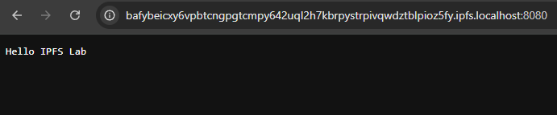
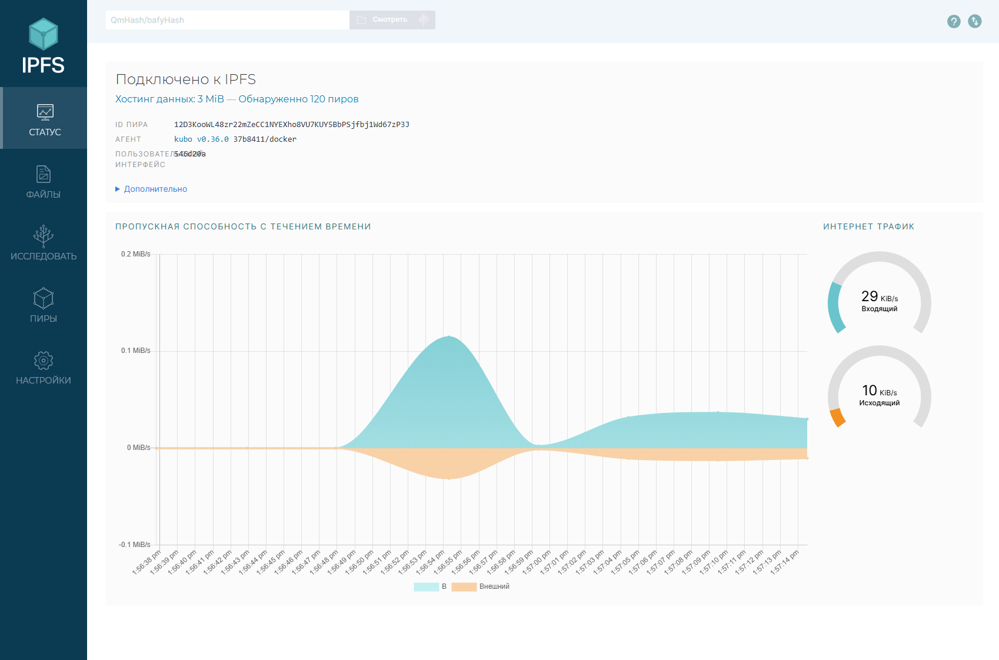
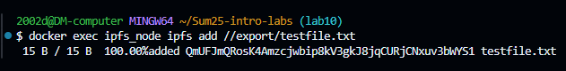
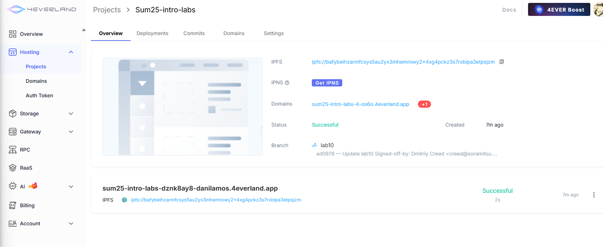
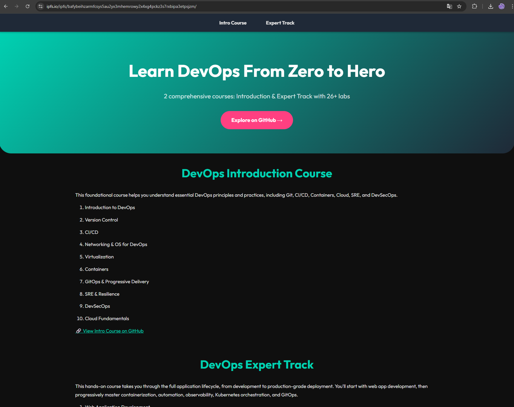

## Task 1 Results
- IPFS Node Peer Count: 76
- IPFS Node Bandwidth: [число из веб-интерфейса]
- Test File CID: QmUFJmQRosK4Amzcjwbip8kV3gkJ8jqCURjCNxuv3bWYS1
- Public Gateway URL: https://ipfs.io/ipfs/QmUFJmQRosK4Amzcjwbip8kV3gkJ8jqCURjCNxuv3bWYS1

## Task 2 Results
- 4EVERLAND Project URL: https://sum25-intro-labs-4-os6o.4everland.app
- GitHub Repository: https://github.com/DanilaMos/Sum25-intro-labs
- IPFS CID from 4EVERLAND: bafybeihzarmfcsys5au2yx3mhemrowy2x4xg4pckz3s7rxbipa3etpsjzm

