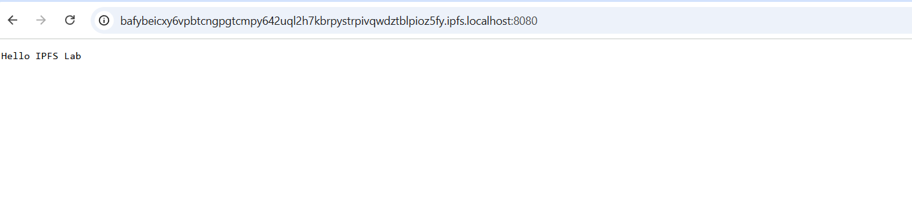
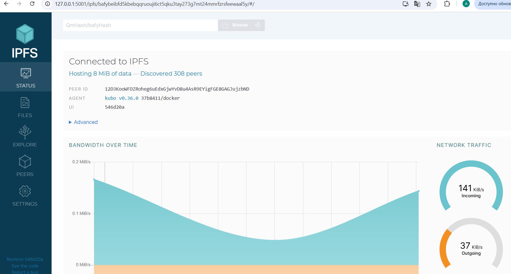
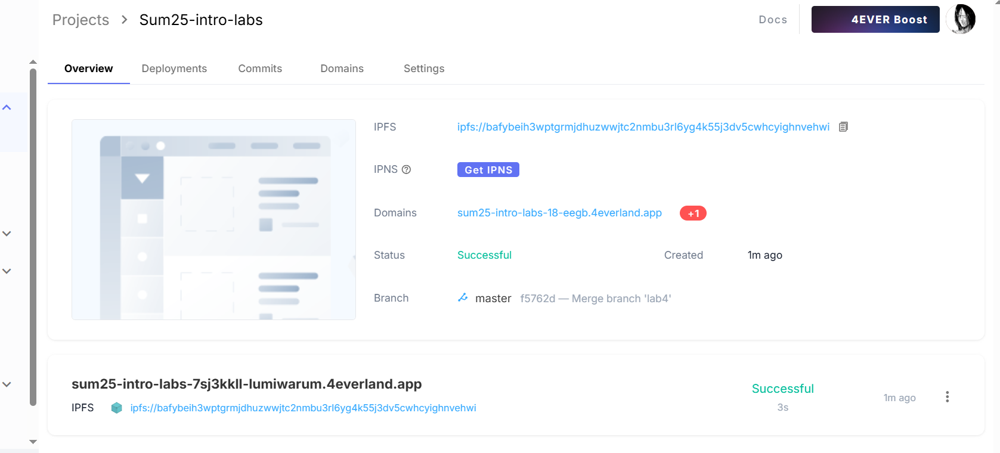

# Credentials

The work is done by M24-RO student  
Anton Kirilin  
a.kirilin@innopolis.university  

# Task 1  

```bash
:~/Sum25-intro-labs$ sudo docker exec ipfs_node ipfs swarm peers
/ip4/100.42.190.87/tcp/4001/p2p/12D3KooWAreVRM7rkbRoyAj1MWpmk4uCsQw2LR2ugwjmKz9GHF4D
/ip4/101.33.81.69/tcp/39883/p2p/QmXisskEpAPqS2iUh9mXBxjGiH1pk7WpjKMibLMQWvpmCN
/ip4/101.47.182.46/tcp/35675/p2p/QmQn5BNjwZ9Kky8obeNrZQxDemSymDd5ysjW1LeiHdWJXv
/ip4/104.236.0.134/tcp/4001/p2p/12D3KooWCkT234YfDHFvj9wzDzwTwJxe6z35TCe1MfSxTYVFk3Sh
/ip4/104.248.43.150/tcp/26245/p2p/QmdGH25AHrScpAdwHTamXZpM4YwyajxiMtpkFb2w6Z4W4Z
/ip4/107.170.254.5/udp/4001/quic-v1/p2p/12D3KooWLJ2DwWAMd2a3s5JabdVKM1srt7D2TnwjCjr4hwnqk6zh
/ip4/107.170.35.243/tcp/39323/p2p/QmetzdfZ3FV7qRDh6DAm2f3QzpjsEiKY1bJkWLnbGmGqCe
/ip4/107.21.157.47/tcp/4001/p2p/12D3KooWBSmyVK1un8cNJ57ohJKLJSCgQCPxVnKyCqfGpjgXi4BC
/ip4/108.160.134.203/tcp/4001/p2p/12D3KooWN5GVRcDFnjAYhRncUEDYCab1ArPHuYnLZZvHoxgZLdnP
/ip4/119.192.249.52/tcp/32026/p2p/QmY2G75nMKC4aG2D6GYZRdyh4hUbmhj8rKpSEwPsDZZqUg
/ip4/119.28.150.186/tcp/42695/p2p/QmfUxAeRHPB3CaDtf2pY69F4p7rxnQbTHehZD4Uy8C4bvd
/ip4/132.255.61.226/tcp/4001/p2p/12D3KooWCNtTd4mKhEP4pCPU8i63csjPrzDmhcHbJoSJFMdKijk
e.t.c.
```  

```bash
:~/Sum25-intro-labs$ echo "Hello IPFS Lab" > testfile.txt
:~/Sum25-intro-labs$ sudo docker cp testfile.txt ipfs_node:/export/
Successfully copied 2.05kB to ipfs_node:/export/
:~/Sum25-intro-labs$ sudo docker exec ipfs_node ipfs add /export/testfile.txt
 15 B / 15 B  100.00%added QmUFJmQRosK4Amzcjwbip8kV3gkJ8jqCURjCNxuv3bWYS1 testfile.txt
 15 B / 15 B  100.00%
 ```  

 Local access
 

 IPFS web ui

 


# Task 1 Results
- IPFS Node Peer Count: 308
- IPFS Node Bandwidth: 141 KiB/s incoming  37 KiB/s outcoming
- Test File CID: QmUFJmQRosK4Amzcjwbip8kV3gkJ8jqCURjCNxuv3bWYS1
- Public Gateway URL: [\[link\]](https://ipfs.io/ipfs/QmUFJmQRosK4Amzcjwbip8kV3gkJ8jqCURjCNxuv3bWYS1)

# Task 2



## Task 2 Results
- 4EVERLAND Project URL: [\[your-site.on..4everland.app\]](https://sum25-intro-labs-18-eegb.4everland.app/)
- GitHub Repository (if you used your own app): [\[github.com/your/repo\]](https://github.com/Lumiwarum/Sum25-intro-labs)
- IPFS CID from 4EVERLAND: bafybeih3wptgrmjdhuzwwjtc2nmbu3rl6yg4k55j3dv5cwhcyighnvehwi
