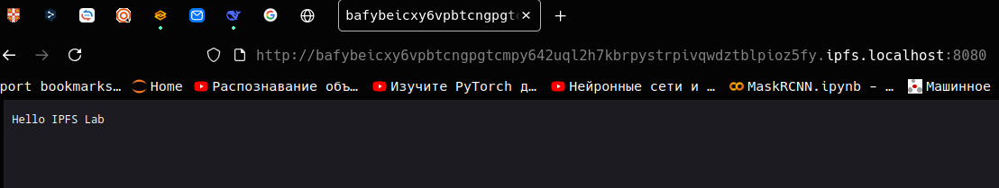
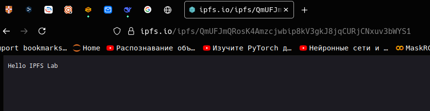
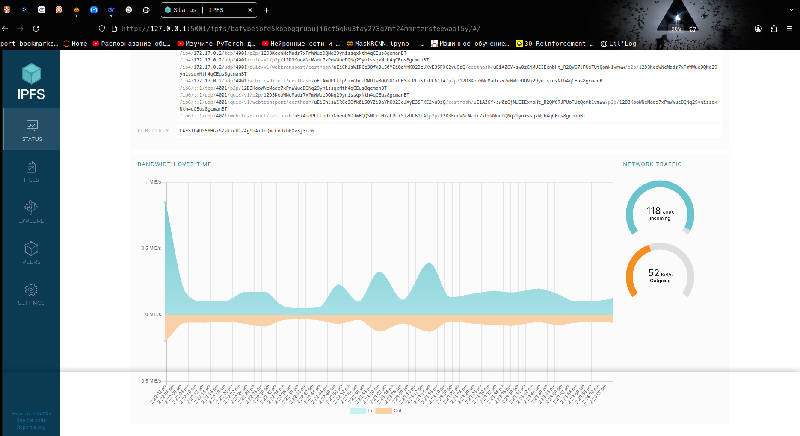
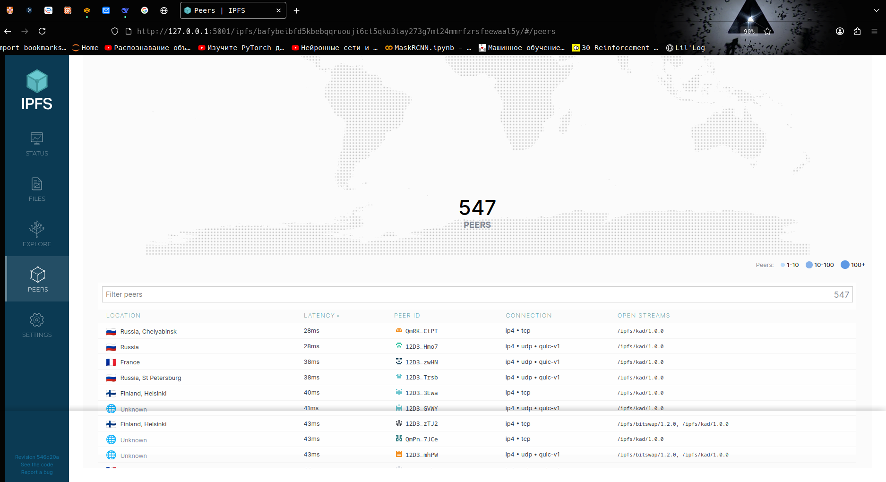
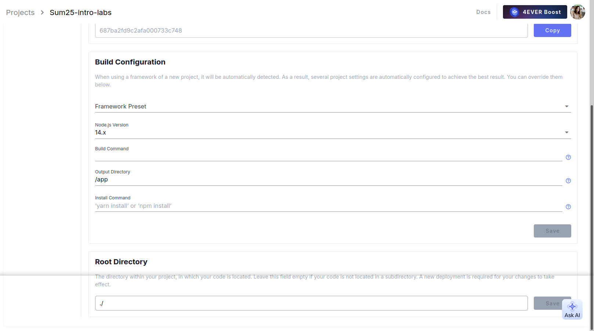
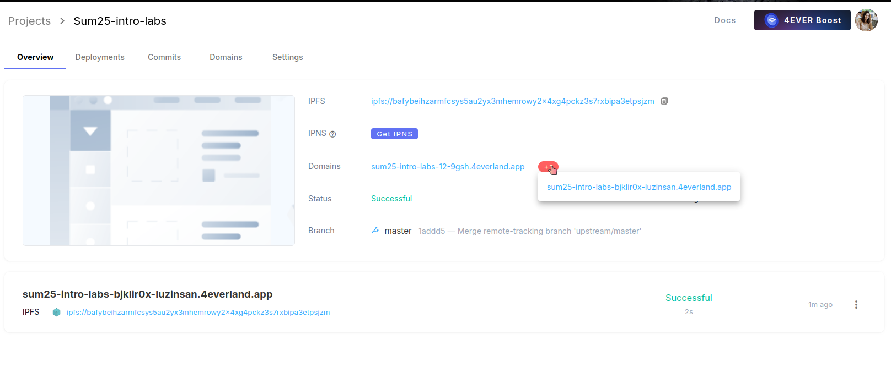
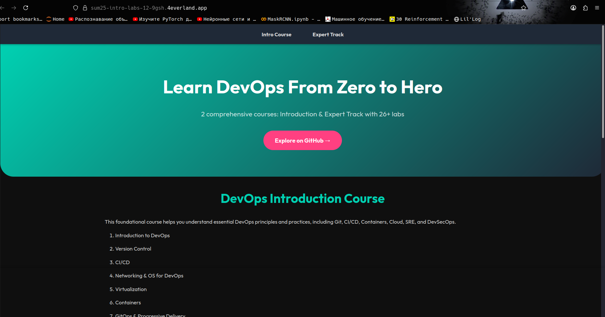

# Lab 10 Solution: Decentralized Web Hosting with IPFS & 4EVERLAND

## Task 1: Local IPFS Node Setup and File Publishing

### Step 1: Start IPFS Container

```bash
docker run -d --name ipfs_node \
  -v ipfs_staging:/export \
  -v ipfs_data:/data/ipfs \
  -p 4001:4001 -p 8080:8080 -p 5001:5001 \
  ipfs/kubo:latest
```

**Output:**
```
Unable to find image 'ipfs/kubo:latest' locally
latest: Pulling from ipfs/kubo
6f8d4a719f75: Pull complete 
19e48a34e694: Pull complete 
c464210ed748: Pull complete 
15ad94413a1a: Pull complete 
3bbd99df312c: Pull complete 
bfa3e979aaa5: Pull complete 
df3ff4674392: Pull complete 
4f4fb700ef54: Pull complete 
855dc1ee31c1: Pull complete 
48862882b8db: Pull complete 
bea9046d120a: Pull complete 
fbbafa331a87: Pull complete 
c5ac5aac3fba: Pull complete 
Digest: sha256:51dd374d5a6a7e1a7c77358701d65bbf558a2e76802d65d4f81b125877811ee1
Status: Downloaded newer image for ipfs/kubo:latest
b4feccc4ddefd6b2df11b74cc1e96df8274ff60cfabd3c1d56b0f8cadb05878c
```

**Explanation:** Docker successfully pulled and started the IPFS node container. Container ID: `b4feccc4ddefd6b2df11b74cc1e96df8274ff60cfabd3c1d56b0f8cadb05878c`

### Step 2: Verify Node Operation

```bash
docker exec ipfs_node ipfs swarm peers
```

**Output:**
```
/ip4/101.47.182.58/tcp/42433/p2p/Qme9a9L5vKMRyyQehGygbGyZXJEMiwbgj2fTXpbYcZQrxy
/ip4/104.131.131.82/udp/4001/quic-v1/p2p/QmaCpDMGvV2BGHeYERUEnRQAwe3N8SzbUtfsmvsqQLuvuJ
/ip4/104.238.147.85/udp/4001/quic-v1/p2p/12D3KooWK6Pg65Q4SJfXEiesibrN4KgdFkmwDqLhBNgLg8hY9avv
/ip4/134.199.226.201/tcp/38843/p2p/QmeXBo1s5eNY5SoFvq7wfoK8Z7YpcyscG9wX8vdiXVAGVC
/ip4/135.181.180.180/tcp/4001/p2p/12D3KooWL4wkkHfrdZ8chPNhsJJuUrRexiNFJNkDJhjwpKDXqwpY
/ip4/135.181.211.120/tcp/42227/p2p/Qmb8wFzivPsdHBpETPNfFLCMrcV5m1ob4qDvJRxAj4ppyr
/ip4/144.91.115.198/udp/4001/quic-v1/p2p/12D3KooWFsD1CkQ8hrLNhr8km2Kr3LesCaSXnuDUirQcgdeEYs2x
/ip4/148.135.40.243/tcp/4001/p2p/12D3KooWRdobwh63jV2azP15W7L6T9pBbKRKCaaNbuRcprnFr7FA
/ip4/149.28.226.150/udp/4001/quic-v1/p2p/12D3KooWRbert6deivzrBWGZcidPRc1cd5UM8GRTX1eUeCA2iAni
/ip4/157.90.132.176/tcp/4008/p2p/12D3KooWLkmAk3MaexCmXim4h4hnBLUJtfBLmcqAfJK3KGcs8adb
/ip4/158.247.218.153/udp/4001/quic-v1/p2p/12D3KooWRjBzvsUqxZGZAsj9z9xsKT4Y2iZVrsCdQYo74opCyFvw
/ip4/160.16.216.39/udp/4001/quic-v1/p2p/12D3KooWBvvDhvptLXXeApx6cUMw2oh2vHeDj7bzjqLMwEE9WNLG
/ip4/167.86.100.104/udp/4001/quic-v1/p2p/12D3KooWHREEoQkKtMHBwHnaH4G5h8EXvFv8qPVqV5bD9J2amMxQ
/ip4/173.208.0.55/udp/4001/quic-v1/p2p/12D3KooWNo5W73SFdzErffZC5iqih1he8C81tAZFjnjxpyYS2qFf
/ip4/18.102.57.169/tcp/4001/p2p/12D3KooWLPedhBeaZBg7X7NvG5v81LxxvehLvjct9gnrt5FPnBmM
/ip4/181.28.110.184/udp/50013/quic-v1/p2p/12D3KooWPm9LPKp2vL7Wo7a5NFSU42HNhFhKvXCBquykDgDwSRor
/ip4/188.240.228.48/udp/4001/quic-v1/p2p/12D3KooWK1YBhYVQK24rL7wi9iWphp46VfvaQ4VDMbSa8AaaEPon
/ip4/198.23.185.164/udp/4001/quic-v1/p2p/12D3KooWPgNckbPkGYjVTfxMqfWrDhhhK2uWdiaXvvcpr7WxY1s3
/ip4/198.58.112.97/udp/4001/quic-v1/p2p/12D3KooWLNY2eHYxsb45evqBSCZLvLpZrCmAqrs6saV2asv5zgPd
/ip4/23.156.136.235/udp/4001/quic-v1/p2p/12D3KooWDczrXZPvaJWDmX8vRPUtZwHBYQ3vmB3oshc7Ywh38XTJ
/ip4/23.94.2.155/udp/4001/quic-v1/p2p/12D3KooWGXKWybkyuWY5pdsYE6iX6vQQ7dwraPcqwf2VrHkqxKMw
/ip4/3.148.113.125/tcp/4001/p2p/12D3KooWKmZ8VyAw3AxKasfoTc52j4hKjADPeQpJfWGqYqyGpJgC
/ip4/45.144.164.23/udp/4001/quic-v1/p2p/12D3KooWJ3vgpQBnz9ApLSRbTWRx1Sr22e7fhENbVH4H46BNywo4
/ip4/46.247.131.198/udp/4001/quic-v1/p2p/12D3KooWGU5fAP4wD2c1LHgEpSomnkDsuRehnv65EUrQiWN9d6Ny
```

**Explanation:** IPFS node successfully connected to 24+ peers globally. Node is operational and participating in the IPFS network.

### Step 3: Create and Add File to IPFS

```bash
echo "Hello IPFS Lab" > testfile.txt
```

**Output:** (No output - file created successfully)

```bash
docker cp testfile.txt ipfs_node:/export/
```

**Output:**
```
Successfully copied 2.05kB to ipfs_node:/export/
```

```bash
docker exec ipfs_node ipfs add /export/testfile.txt
```

**Output:**
```
 15 B / 15 B  100.00%added QmUFJmQRosK4Amzcjwbip8kV3gkJ8jqCURjCNxuv3bWYS1 testfile.txt
```

**Explanation:** File successfully added to IPFS network with CID: `QmUFJmQRosK4Amzcjwbip8kV3gkJ8jqCURjCNxuv3bWYS1`

### Step 4: Access Content via Gateways

#### Local Gateway
**URL:** `http://localhost:8080/ipfs/QmUFJmQRosK4Amzcjwbip8kV3gkJ8jqCURjCNxuv3bWYS1`

**Result:** ✅ SUCCESS - File content "Hello IPFS Lab" displayed correctly



#### Public Gateway (ipfs.io)
**URL:** `https://ipfs.io/ipfs/QmUFJmQRosK4Amzcjwbip8kV3gkJ8jqCURjCNxuv3bWYS1`

**Result:** ✅ SUCCESS - File accessible through public IPFS gateway



#### Public Gateway (Cloudflare)
**URL:** `https://cloudflare-ipfs.com/ipfs/QmUFJmQRosK4Amzcjwbip8kV3gkJ8jqCURjCNxuv3bWYS1`

**Result:** ❌ FAILED - Error 503 Service Unavailable (normal behavior due to propagation delays)

### Step 5: IPFS Web UI

**URL:** `http://127.0.0.1:5001/webui/`

**Status Page:**


**Peers Page:**


**Key Metrics:**
- **Connected Peers:** 547
- **Bandwidth:** 118 KB/s incoming, 52 KB/s outgoing
- **Network:** Global coverage with TCP and QUIC-v1 connections

## Task 1 Results

| Metric | Value |
|--------|-------|
| IPFS Node Peer Count | 547 |
| IPFS Node Bandwidth | 118 KB/s incoming, 52 KB/s outgoing |
| Test File CID | QmUFJmQRosK4Amzcjwbip8kV3gkJ8jqCURjCNxuv3bWYS1 |
| Public Gateway URL | https://ipfs.io/ipfs/QmUFJmQRosK4Amzcjwbip8kV3gkJ8jqCURjCNxuv3bWYS1 |

---

## Task 2: Static Site Deployment with 4EVERLAND

### Step 1: 4EVERLAND Project Setup

**Actions performed:**
1. Signed up at [4EVERLAND.org](https://www.4everland.org/) using GitHub authentication
2. Connected GitHub repository: `Sum25-intro-labs`
3. Selected branch: `master`

### Step 2: Build Configuration

**Settings applied:**
- **Platform:** IPFS/Filecoin
- **Framework Preset:** Other
- **Node.js Version:** 14.x
- **Build Command:** (left empty)
- **Output Directory:** `/app`
- **Install Command:** (left empty)
- **Root Directory:** `/`



**Explanation:** Configured 4EVERLAND to deploy static HTML files from the `/app` directory as specified in lab requirements.

### Step 3: Deployment Process

**Result:** ✅ **SUCCESSFUL DEPLOYMENT**

**4EVERLAND Dashboard Overview:**


**Deployment Details:**
- **Status:** Successful
- **Duration:** 2s (very fast deployment)
- **Branch:** master
- **IPFS CID:** `ipfs://bafybeihzarmfcsys5au2yx3mhemrowy2x4xg4pckz3s7rxbipa3etpsjzm`
- **4EVERLAND Domain:** `sum25-intro-labs-12-9gsh.4everland.app`

### Step 4: Site Verification

#### 4EVERLAND Domain Access
**URL:** `https://sum25-intro-labs-12-9gsh.4everland.app`

**Result:** ✅ SUCCESS - Website fully functional and accessible



**Website Features Verified:**
- DevOps course landing page loads correctly
- Responsive design with modern styling
- Navigation links functional
- Professional gradient design with proper typography
- All content sections display properly (Intro Course, Expert Track)

#### Public IPFS Gateway Verification
**URL:** `https://ipfs.io/ipfs/bafybeihzarmfcsys5au2yx3mhemrowy2x4xg4pckz3s7rxbipa3etpsjzm`

**Result:** ✅ SUCCESS - Site accessible through public IPFS gateway

## Task 2 Results

| Metric | Value |
|--------|-------|
| 4EVERLAND Project URL | https://sum25-intro-labs-12-9gsh.4everland.app |
| GitHub Repository | https://github.com/Luzinsan/Sum25-intro-labs |
| IPFS CID from 4EVERLAND | bafybeihzarmfcsys5au2yx3mhemrowy2x4xg4pckz3s7rxbipa3etpsjzm |
| Deployment Status | Successful |
| Build Time | 2 seconds |
