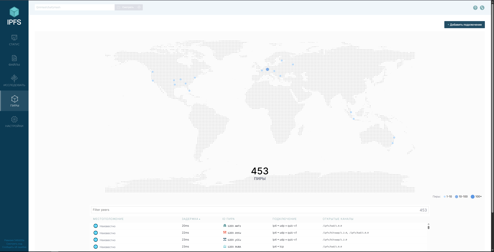
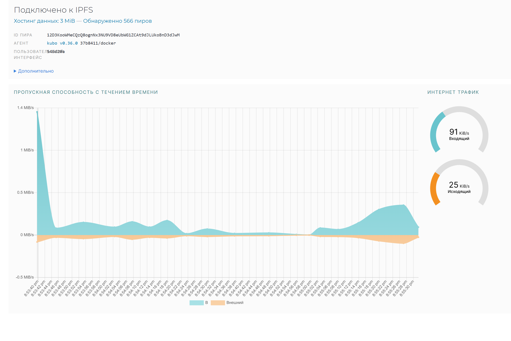

## Task 1 Results
- IPFS Node Peer Count: 453 
- IPFS Node Bandwidth: Input - up to 1.4 MiB/s, Output - 80 KiB/s
    
- Test File CID: `QmUFJmQRosK4Amzcjwbip8kV3gkJ8jqCURjCNxuv3bWYS1`
- Public Gateway URL: `https://ipfs.io/ipfs/QmUFJmQRosK4Amzcjwbip8kV3gkJ8jqCURjCNxuv3bWYS1`

Local Gateway proof:

Public Gateway proof:

## Task 2 Results
- 4EVERLAND Project URL: `https://sum25-intro-labs-uuwqnndp-kadaverciant.4everland.app/`
- GitHub Repository (if you used your own app): `https://github.com/Kadaverciant/Sum25-intro-labs/tree/labs/Lab-10`
- IPFS CID from 4EVERLAND: `ipfs://bafybeihzarmfcsys5au2yx3mhemrowy2x4xg4pckz3s7rxbipa3etpsjzm`

