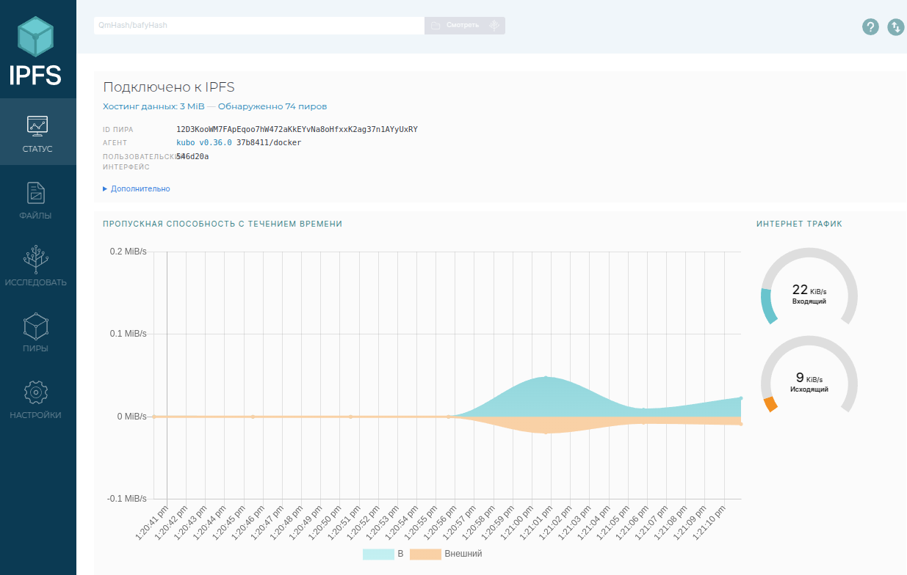
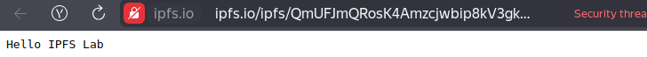
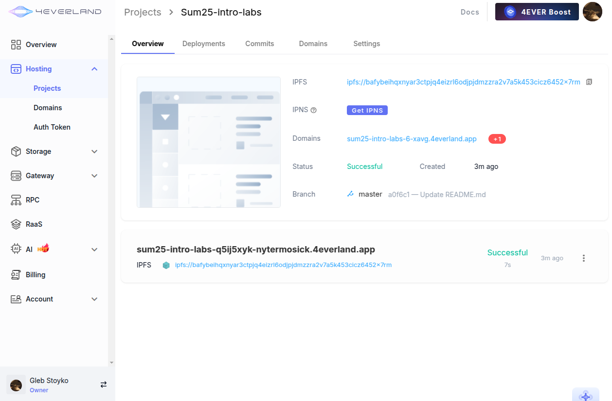
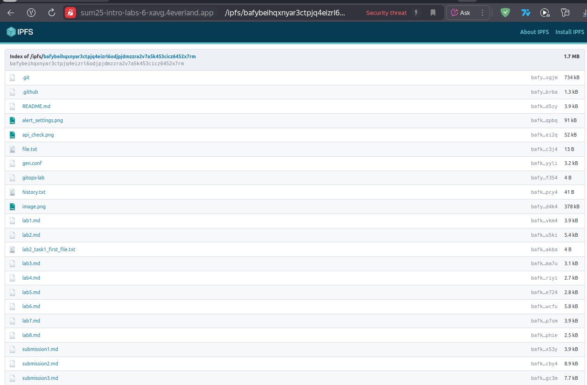

# Decentralized Web Hosting with IPFS & 4EVERLAND

## Task 1: Local IPFS Node Setup and File Publishing

**Objective**: Run a personal IPFS node using Docker, publish files to the IPFS network, and verify decentralized access through public gateways.

- IPFS Node Peer Count: 74
- IPFS Node Bandwidth: ~22 KiB/s peak incoming, ~9 KiB/s peak outgoing
- Test File CID: `QmUFJmQRosK4Amzcjwbip8kV3gkJ8jqCURjCNxuv3bWYS1`
- Public Gateway URL: `https://ipfs.io/ipfs/QmUFJmQRosK4Amzcjwbip8kV3gkJ8jqCURjCNxuv3bWYS1`

---

## Task 2: Static Site Deployment with 4EVERLAND

**Objective**: Deploy a website to IPFS using 4EVERLAND's automation platform and manage continuous deployment workflows. 4EVERLAND simplifies deploying and managing websites on decentralized infrastructure, providing CI/CD-like workflows for Web3 hosting with automatic IPFS publishing.

- 4EVERLAND Project URL: `https://sum25-intro-labs-6-xavg.4everland.app/`
- GitHub Repository (if you used your own app): `https://github.com/Nytermosick/Sum25-intro-labs`
- IPFS CID from 4EVERLAND: `bafybeihqxnyar3ctpjq4eizrl6odjpjdmzzra2v7a5k453cicz6452x7rm`

