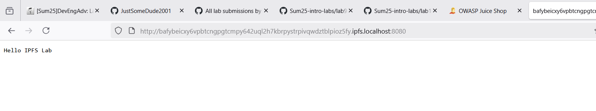
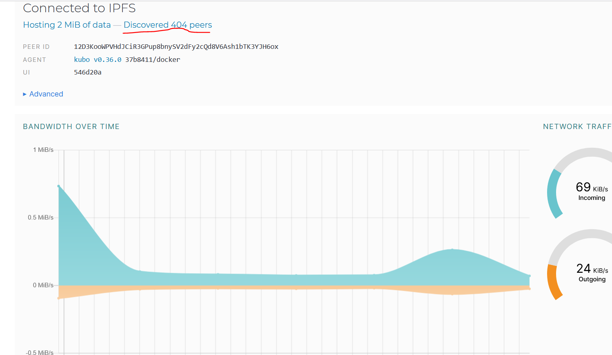
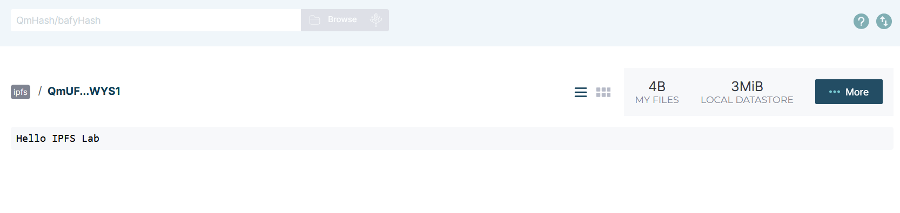
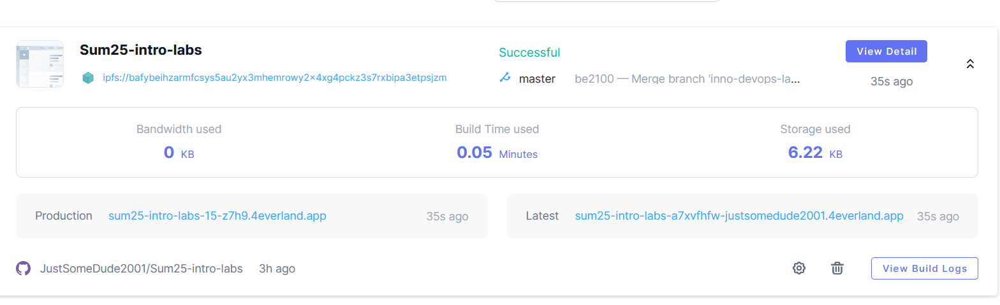

# Decentralized Web Hosting with IPFS & 4EVERLAND
## Task 1: Local IPFS Node Setup and File Publishing

**Objective**: Run a personal IPFS node using Docker, publish files to the IPFS network, and verify decentralized access through public gateways.

IPFS (InterPlanetary File System) enables decentralized, content-addressed storage that's resilient to single-point failures. Understanding IPFS helps prepare for Web3 development and decentralized application hosting.

1. **Start IPFS container**:

```bash
docker run -d --name ipfs_node \
  -v ipfs_staging:/export \
  -v ipfs_data:/data/ipfs \
  -p 4001:4001 -p 8080:8080 -p 5001:5001 \
  ipfs/kubo:latest
```

   - Wait 60 seconds for initialization

2. **Verify node operation**:

```bash
docker exec ipfs_node ipfs swarm peers
```

   - Should show connected peers

Snippet of output:
```
/ip4/101.235.111.***/udp/52348/quic-v1/p2p/12D3KooWAyW8a4KFoRLbsjXuDDMPnsd5NwEKNEup7HGd51meb7Nu
/ip4/101.33.81.***/tcp/39131/p2p/QmXisskEpAPqS2iUh9mXBxjGiH1pk7WpjKMibLMQWvpmCN
/ip4/101.47.182.***/tcp/38095/p2p/QmY5Ldxo6aXkPvcqtF1GqyE8kzUpvQj8KEro27TDwAKVgq
/ip4/104.238.182.***/udp/4001/quic-v1/p2p/12D3KooWJZM1CRPzMi5hYmStYB3ZHMQATzWD9T6RmQGEHtCiiUMt
/ip4/107.170.254.***/udp/4001/quic-v1/p2p/12D3KooWLJ2DwWAMd2a3s5JabdVKM1srt7D2TnwjCjr4hwnqk6zh
/ip4/107.172.158.***/udp/4001/quic-v1/p2p/12D3KooWHimfir21wjhgumPWZyYtm9661g1miq1TydE6dDt2xegG
/ip4/107.172.72.***/tcp/4001/p2p/12D3KooWQFJuXqw86x55iMEyP4JNdf3kcZG9pfNBuG45wR2fpbMS
...
```

3. **Add file to IPFS**:

```bash
echo "Hello IPFS Lab" > testfile.txt
docker cp testfile.txt ipfs_node:/export/
docker exec ipfs_node ipfs add /export/testfile.txt
```

Results
```bash
justsomedude@DESKTOP-VD06QG9:~/Sum25-intro-labs$ sudo docker cp testfile.txt ipfs_node:/export/
Successfully copied 2.05kB to ipfs_node:/export/
justsomedude@DESKTOP-VD06QG9:~/Sum25-intro-labs$ sudo docker exec ipfs_node ipfs add /export/testfile.txt
 15 B / 15 B  100.00%added QmUFJmQRosK4Amzcjwbip8kV3gkJ8jqCURjCNxuv3bWYS1 testfile.txt
```

   - Generated CID: QmUFJmQRosK4Amzcjwbip8kV3gkJ8jqCURjCNxuv3bWYS1

4. **Access content**:
   - Via local gateway: `http://localhost:8080/ipfs/<CID>`
   - Via public gateways:
     - `https://ipfs.io/ipfs/<CID>`
     - `https://cloudflare-ipfs.com/ipfs/<CID>`
   - *Note: Public access may take 2-5 minutes*


   - Open a browser and access the IPFS web UI:

     ```sh
     http://127.0.0.1:5001/webui/
     ```

   - Share information about connected peers and bandwidth in your report.


   - Provide the hash (CID) and the public gateway URLs used to verify the file on the IPFS gateways.

CID: QmUFJmQRosK4Amzcjwbip8kV3gkJ8jqCURjCNxuv3bWYS1
Public Gateway URL: https://ipfs.io/ipfs/QmUFJmQRosK4Amzcjwbip8kV3gkJ8jqCURjCNxuv3bWYS1

---

## Task 2: Static Site Deployment with 4EVERLAND

**Objective**: Deploy a website to IPFS using 4EVERLAND's automation platform and manage continuous deployment workflows. 4EVERLAND simplifies deploying and managing websites on decentralized infrastructure, providing CI/CD-like workflows for Web3 hosting with automatic IPFS publishing.

1. **Set up 4EVERLAND project**:
   1. Sign up at [4EVERLAND.org](https://www.4everland.org/) (use GitHub or any wallet  like Metamask auth)
   2. Click "Create New Project" → "Connect GitHub repository"
   3. Select your current repository and branch or any real pet web app/site
   4. Configure build settings for this repo (if you use your own repo adjust configs):
      - Platform: IPFS/Filecoin
      - Framework: Other
      - Publish directory: `/app`
   5. Deploy!
Deployed


2. **Verify deployment**:
   - In 4EVERLAND dashboard:
     - Note IPFS CID under "Site Info"
        - bafybeihzarmfcsys5au2yx3mhemrowy2x4xg4pckz3s7rxbipa3etpsjzm
     - Access site via *.4everland.app subdomain
        - Accessible on either:
            - https://sum25-intro-labs-15-z7h9.4everland.app/
            - https://bafybeihzarmfcsys5au2yx3mhemrowy2x4xg4pckz3s7rxbipa3etpsjzm.ipfs.dweb.link/
   - Verify on public gateway:
     `https://ipfs.io/ipfs/bafybeihzarmfcsys5au2yx3mhemrowy2x4xg4pckz3s7rxbipa3etpsjzm`

---


## Task 1 Results
- IPFS Node Peer Count: Varying from 56 to 456
- IPFS Node Bandwidth: Varying from 20 to 200 KiB/s
- Test File CID: QmUFJmQRosK4Amzcjwbip8kV3gkJ8jqCURjCNxuv3bWYS1
- Public Gateway URL: https://ipfs.io/ipfs/QmUFJmQRosK4Amzcjwbip8kV3gkJ8jqCURjCNxuv3bWYS1

## Task 2 Results
- 4EVERLAND Project URL: https://sum25-intro-labs-15-z7h9.4everland.app/
- IPFS CID from 4EVERLAND: bafybeihzarmfcsys5au2yx3mhemrowy2x4xg4pckz3s7rxbipa3etpsjzm
```

2. Include screenshots of:
   - Successful access via local gateway (Task 1)
        - 
        - 
   - 4EVERLAND deployment dashboard (Task 2)
        - 
   - Site accessed through *.on.4EVERLAND.co domain
        - 
