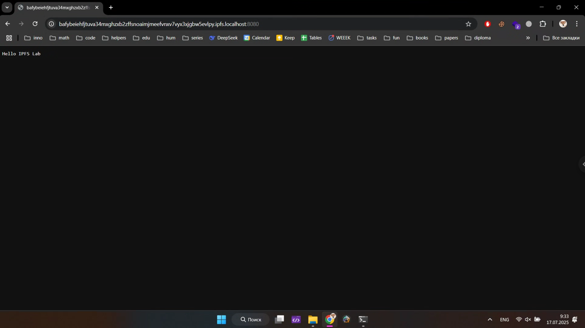
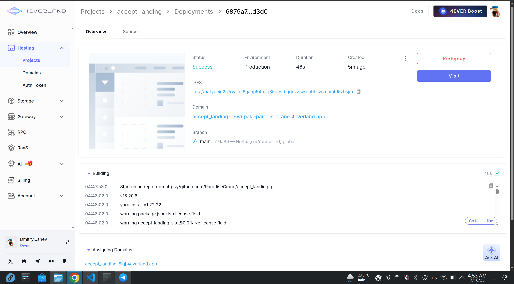
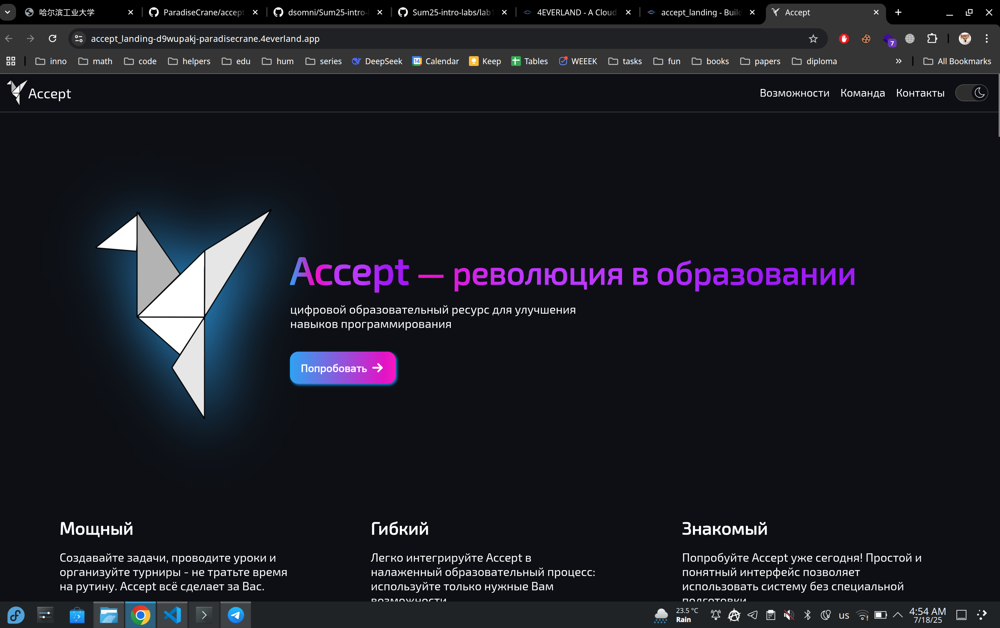

# Solution to Lab 10

by Dmitry Beresnev <d.beresnev@innopolis.university>

The tasks are done under **Linux Fedora 42**

## Task 1: Local IPFS Node Setup and File Publishing

**Command:**

```bash
docker run -d --name ipfs_node \
     -v ipfs_staging:/export \
     -v ipfs_data:/data/ipfs \
     -p 4001:4001 -p 8080:8080 -p 5001:5001 \
     ipfs/kubo:latest
docker exec ipfs_node ipfs swarm peers
```

**Output:**

```text
/ip4/100.24.22.64/tcp/4001/p2p/12D3KooWFZRXArRfkfa6hDtZSWJ87xH7vYhnMWgsXqEsRPVt5pRY
/ip4/101.47.180.193/tcp/37231/p2p/QmZqVKjL1eoizcMPQSes5NG1pT1YFBtWDzqKbVepy4qgLy
/ip4/101.47.181.38/tcp/37131/p2p/QmacsEgdFe75qQ2feNodL3FwntBEHFeGvQKVRY48fCCdqP
/ip4/104.37.188.46/udp/4001/quic-v1/p2p/12D3KooWBEp1UM5y8dda14UCcGKkPqk3mfdpqy2rph5wd2G3HbSX
/ip4/108.160.133.96/tcp/4001/p2p/12D3KooWHtxYizpwyy5o2L52YkB5DpVsuZ3c5pN6f3jZMYEwf1Fz
/ip4/108.61.205.146/tcp/4001/p2p/QmNcovN4nAeP2XQafvTsGKXXED5eB7bcyjPtN7rKudi3KW
/ip4/122.118.195.13/tcp/54805/p2p/QmbLzDxwV71dvrXdKthXjQg3LX9TBhGyhxHmJj4Lz3Cwyo
/ip4/125.78.228.248/tcp/50667/p2p/QmPLH9nB7UnZokaaVggvBS3o1YkHRQ87yWqTpsA4T5ryg3
/ip4/130.51.180.169/tcp/4001/p2p/12D3KooWPKVFt77yKK1n7m3Tthp3AMR9FBCeE4qDrdByeAtL85F9
/ip4/139.180.172.19/udp/4001/quic-v1/p2p/12D3KooWETziisbGN4ntPZ1XdfeBCacFwKQh21jurWcRqTHrxJ8i
/ip4/146.0.231.93/tcp/4001/p2p/12D3KooWBa4BadD5BfTRJ6gyK69hfdsje4vXvG59Aw7HCNxTzgWe
/ip4/148.113.218.38/tcp/4001/p2p/12D3KooWHWEF3JYS8GGNk6qkT83zsdfDaPxLsYm8hRnnz21AGTqF
/ip4/149.248.1.133/tcp/4001/p2p/12D3KooWHW8cq6Utd1vU7VD9Kpu8y2oaV8wnLBmsNeFnhB4vyPSb
/ip4/149.248.9.108/udp/4001/quic-v1/p2p/12D3KooWAiCjh6q4fXjpUvyDcPf1EjNVsu2JgQ6ghTDd9CUbfpwW
/ip4/149.28.247.67/tcp/4001/p2p/12D3KooWAombRT8v2aRHLyEEcKj5scTchKfZpJCW5F1AddEucyTb
/ip4/15.168.132.234/tcp/4001/p2p/12D3KooWDuDrX75ichmjarFRdRkfzp6TrVDvQMVKXaGtnDoV7uAU
/ip4/152.53.141.247/tcp/4451/p2p/QmUjiS3skqxtj6AzUeTUM4oWLw6QTNux8sZQrXZXnMCJPM
/ip4/152.53.255.57/tcp/30801/p2p/QmQa1VeDqyeFmAdzSMKAHzcq3JF1UZtRsLHCCotFzmFRpj
/ip4/154.38.181.52/tcp/4001/p2p/12D3KooWGqo6ftcGyQUzReMALk6PASbnkYc27d8yzPoJrNzRc5f5
/ip4/154.91.1.181/tcp/19988/p2p/12D3KooWForH2nsSRN5cynPhoona6re1nw2EcimQJxHnicd1yqUV
...
```

**Command:**

```bash
echo "Hello IPFS Lab" > testfile.txt
docker cp testfile.txt ipfs_node:/export/
docker exec ipfs_node ipfs add /export/testfile.txt
```

**Output:**

```text
added QmXSHFVEZ2xB3s29K9FHSoKhqfW9VLZ1GMiV5pWuqmCYEy testfile.txt
 16 B / 16 B  100.00%
```

**Screenshots:**



### Task 1 Results

- IPFS Node Peer Count: always changes, ~550-700
- IPFS Node Bandwidth:
  - Incoming: always changes, ~150 Kib/s
  - Outgoing: always changes, ~100 Kib/s
- Test File CID: QmXSHFVEZ2xB3s29K9FHSoKhqfW9VLZ1GMiV5pWuqmCYEy
- Public Gateway URLs:
  - <https://ipfs.io/ipfs/QmXSHFVEZ2xB3s29K9FHSoKhqfW9VLZ1GMiV5pWuqmCYEy>
  - <https://cloudflare-ipfs.com/ipfs/QmXSHFVEZ2xB3s29K9FHSoKhqfW9VLZ1GMiV5pWuqmCYEy>

---

## Task 2: Static Site Deployment with 4EVERLAND

**Screenshots:**




### Task 2 Results

- 4EVERLAND Project URL: <https://accept_landing-d9wupakj-paradisecrane.4everland.app/>
- GitHub Repository (if you used your own app): <https://github.com/ParadiseCrane/accept_landing>
- IPFS Hash from 4EVERLAND: <https://bafybeig2c7rwxdx6gaop54fmg35oesfbqgnzzjwsimbhsw2ubmtd5zbsjm.ipfs.dweb.link/>
