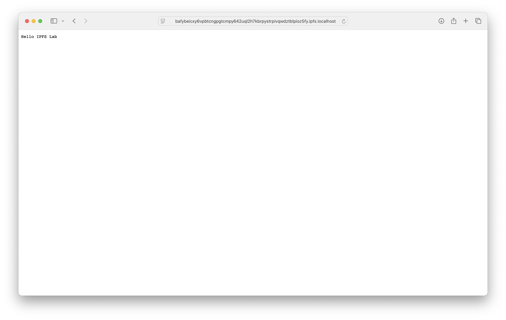
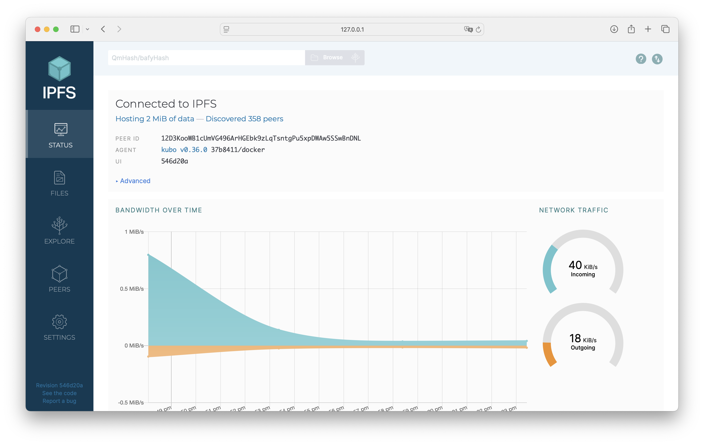
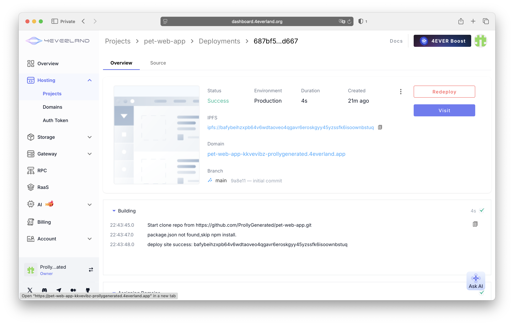

# Lab 10: Decentralized Web Hosting with IPFS & 4EVERLAND

## Task 1: Local IPFS Node Setup and File Publishing

  ### Start IPFS container

  ```
  danilandreev@Danils-MacBook-Air ms24-sum25-devops % docker run -d --name ipfs_node \
    -v ipfs_staging:/export \
    -v ipfs_data:/data/ipfs \
    -p 4001:4001 -p 8080:8080 -p 5001:5001 \
    ipfs/kubo:latest
  ```

  ### Verify node operation

  ```
  danilandreev@Danils-MacBook-Air ms24-sum25-devops % docker exec ipfs_node ipfs swarm peers
  /ip4/1.40.140.178/tcp/4001/p2p/12D3KooWFf8rRmmQHJja3KsXXcwVNjXJKaQkiPM3W3Wf81NdxZwb
  /ip4/101.33.81.69/tcp/39131/p2p/QmXisskEpAPqS2iUh9mXBxjGiH1pk7WpjKMibLMQWvpmCN
  /ip4/101.47.181.50/tcp/40277/p2p/QmexWyqas72LDS7AFo9tbidRNt1Ur9GKHn28QoMsrDwLyr
  /ip4/104.156.229.123/udp/4001/quic-v1/p2p/12D3KooWF6ckXV3iUBAuJeHN3eJjavFSKwoRpR47tR2TiRkAP3YT
  /ip4/104.168.122.153/tcp/4001/p2p/12D3KooWBDztuaN6j1UrqVt5ZiEF2RMFGSuUStYJ78K3nw2uESVZ
  /ip4/104.168.125.112/tcp/4001/p2p/12D3KooWGVkXAKSu6fJ4DW35w8NQHJGcgDe2HuisjyDonGiiQo3p
  /ip4/107.170.254.5/udp/4001/quic-v1/p2p/12D3KooWLJ2DwWAMd2a3s5JabdVKM1srt7D2TnwjCjr4hwnqk6zh
  /ip4/109.123.242.135/udp/4001/quic-v1/p2p/12D3KooWHyvCk6ctPPcfDoJT72SxREmgP3vM5vEU765Sapui6tu1
  /ip4/121.229.99.143/tcp/4001/p2p/12D3KooWQqay5ShjPErCNXTivkcGF39qwPBH6vChVLKyMiqiPQzk
  /ip4/124.230.110.9/tcp/64489/p2p/QmTSjwFiCoPhvpfUeKHnhQeCZaGTv7bFA4D7tXQzrXGZWf
  /ip4/134.122.94.211/tcp/4001/p2p/12D3KooWS3TU4wj7um6yD7eJhgZEXnFC8J5wFj3hB6zXWdSxZf9B
  ...
  ```

  ### Add a file to IPFS

  ```
  danilandreev@Danils-MacBook-Air ms24-sum25-devops % echo "Hello IPFS Lab" > testfile.txt
  ```
  
  ```
  danilandreev@Danils-MacBook-Air ms24-sum25-devops % docker cp testfile.txt ipfs_node:/export/
  Successfully copied 2.05kB to ipfs_node:/export/
  ```

  ```
  danilandreev@Danils-MacBook-Air ms24-sum25-devops % docker exec ipfs_node ipfs add /export/testfile.txt
  15 B / 15 B  100.00%added QmUFJmQRosK4Amzcjwbip8kV3gkJ8jqCURjCNxuv3bWYS1 testfile.txt
  ```

  ### Access content

  Via local gateway:

  

  Via public gateway:

  

  IPFS web UI:

  

  ### Results

  - IPFS Node Peer Count: 358
  - IPFS Node Bandwidth: 40 KiB/s incoming and 18 KiB/s outcoming
  - Test File CID: QmUFJmQRosK4Amzcjwbip8kV3gkJ8jqCURjCNxuv3bWYS1
  - Public Gateway URL: [https://ipfs.io/ipfs/QmUFJmQRosK4Amzcjwbip8kV3gkJ8jqCURjCNxuv3bWYS1](https://ipfs.io/ipfs/QmUFJmQRosK4Amzcjwbip8kV3gkJ8jqCURjCNxuv3bWYS1)

## Task 2: Static Site Deployment with 4EVERLAND

  Deployment dashboard:

  

  Site accessed through the domain:

  

  ### Results

  - 4EVERLAND Project URL: [https://pet-web-app-88xv.4everland.app/](https://pet-web-app-88xv.4everland.app/)
  - GitHub Repository (if you used your own app): [https://github.com/ProllyGenerated/pet-web-app](https://github.com/ProllyGenerated/pet-web-app)
  - IPFS CID from 4EVERLAND: [bafybeihzxpb64v6wdtaoveo4qgavr6eroskgyy45yzssfk6isoownbstuq](https://bafybeihzxpb64v6wdtaoveo4qgavr6eroskgyy45yzssfk6isoownbstuq.ipfs.dweb.link/)
