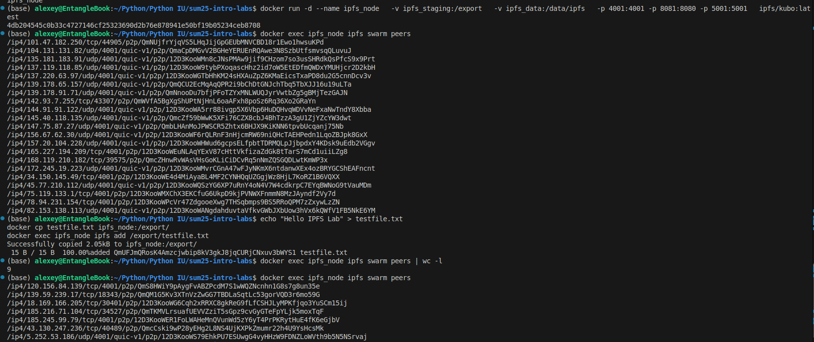

# Lab 10

## Task 1

### 0. Web UI
- IPFS Node Peer Count: 5 \

- IPFS Node Bandwidth: \

- Test File CID: QmUFJmQRosK4Amzcjwbip8kV3gkJ8jqCURjCNxuv3bWYS1
- Public Gateway URL: https://ipfs.io/ipfs/QmUFJmQRosK4Amzcjwbip8kV3gkJ8jqCURjCNxuv3bWYS1

### 1. Запуск контейнера, получение пиров

### 2. Пропускная способность

### 3. Проверка файла по CID

## Task 2

- 4EVERLAND Project URL: https://sum25-intro-labs-17-xr7x.4everland.app/
- IPFS CID from 4EVERLAND: bafybeihzarmfcsys5au2yx3mhemrowy2x4xg4pckz3s7rxbipa3etpsjzm
- Github repo: этот репозиторий по девопсу