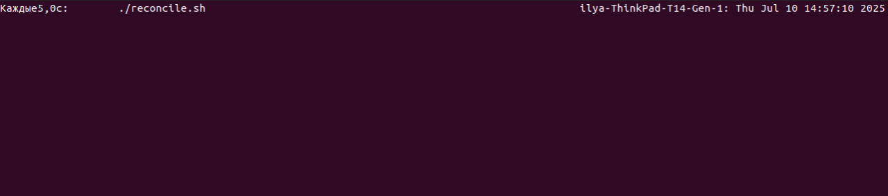

## LAB 10
Nikita Yaneev n.yaneev@innopolis.unversity

## Task 1

1. 

**Input:**
```sh
sumnios@Nikita:~$ docker run -d --name ipfs_node \
  -v ipfs_staging:/export \
  -v ipfs_data:/data/ipfs \
  -p 4001:4001 -p 8080:8080 -p 5001:5001 \
  ipfs/kubo:latest
```

2. 

**Input:**
```sh
docker exec ipfs_node ipfs swarm peers
```

**Output:**
```sh
sumnios@Nikita:~$ docker exec ipfs_node ipfs swarm peers
/ip4/136.243.38.35/tcp/9010/p2p/QmUnBmJ3shheyyQ7RdKDiFyRN9i1zbckE1gVg4RFpCBUWV
/ip4/143.244.145.209/tcp/38303/p2p/QmSGAbRbVJKFd97ESM7pvdQbeSY2FaLG8eVZfLAwd9XvkB
/ip4/150.109.84.59/tcp/46197/p2p/QmPriafej3Xu51Wf4rY2g4nqX99BX1uUvkwxGLGQeAz9XK
/ip4/152.42.231.135/tcp/46211/p2p/QmTV6vvazkMpmTbsmxMFNy2b7rSchsKzfFGycwE7RG5Dng
/ip4/152.53.142.148/tcp/41489/p2p/QmcsXGBVsUiSwaAyr2G9f6CRf6vD5EgvBGLnQAFoDBqsBY
/ip4/152.53.238.108/tcp/40471/p2p/QmcMgJeme7houUgai6isZu6cfGZG8DpFpXAzg243zmaJNK
/ip4/157.245.109.127/tcp/27353/p2p/QmZa7BS5W81hSkkNeSLpgx1naWgfQNt4ZtK6r2ksj9B3uJ
/ip4/168.119.247.70/tcp/39965/p2p/QmYrxxfeBMYwe8bq5fBnaaFDXNxG1dYNRtVBk5YBadFCPQ
/ip4/170.64.227.219/tcp/33531/p2p/QmXahZRND4EV3Yq4cBx7YNg73Mbb92p1yst4yNA8rD6Wzb
/ip4/18.211.42.63/udp/4001/quic-v1/p2p/12D3KooWSborYZzdzF7sKzFH3mXCoc3Kqqf7sfSMv1dr7WABuaQU
/ip4/185.203.216.218/tcp/34897/p2p/QmeF5g4ohW1UhJ5q5zT7tLbfAkxQYAdTHbMkCAv6eeRbnM
/ip4/194.233.67.21/tcp/4001/p2p/12D3KooWBhHkbhJm1QRPvSEP8szznyoeM9c9XLBzTF41RwhiBDQK
/ip4/209.38.16.100/tcp/14441/p2p/QmRZqw6NyiTTw1fkghusUuoZfG5zHYcMkUFTBQ2SsdSVNM
/ip4/220.80.201.187/tcp/64976/p2p/QmapRZN6J13xdyzy3fSDheZ7Zd64GZd4C9Rsv6i6fJMc43
/ip4/3.144.92.58/tcp/45599/p2p/QmVuZaGNZ5SS1oPwEpvH3ciuu5uPjoRyTrgETtdGYWbqyv
/ip4/34.171.164.194/tcp/40621/p2p/QmcTUShw6fPg6wL93NLyb32gwzT8FBVjYcr51jCGyq76kD
/ip4/34.70.33.156/tcp/33029/p2p/QmXPC5JQ9nbrZ4ca4hZ1ySuW27RDYaCHm8tDH8mWwqZFh6
/ip4/38.246.112.27/udp/4001/quic-v1/p2p/12D3KooWB1ue4gawYhFbqxgv19KGAwjnK7AY3eGVbqm9HEsZq5mj
/ip4/43.133.217.251/tcp/40459/p2p/QmeUkufDALebAcB6gVV2QLzYSSuBPpSoPzfmXY8wBJUpRn
/ip4/5.181.50.239/tcp/3429/p2p/QmdY4vkDV9kdPuFtVMm75Uo43efcCX7yjybiaWJ4kybAkg
/ip4/51.158.97.156/udp/4001/quic-v1/p2p/12D3KooWAuSWjHi7cuYHqWAKqBQXTk7Tb1TAuEcuQdmbMuWgsbwg
/ip4/54.88.79.32/tcp/35119/p2p/QmQMEN6j1kfrym5L9kV3hfPVcTHjAzeYxwHhLyVc4UDuUQ
/ip4/87.120.186.162/tcp/38475/p2p/QmQDMCKSJTRfoYR9dcQiGwX3WgtZnJ4TMxh5V2J2wegvYs
/ip4/87.121.105.156/tcp/46773/p2p/Qmba26zLQJWJLqeUWCtntae7EnCSrqJWE2vxZhxL7zB7V9
/ip4/89.58.11.155/udp/4002/quic-v1/p2p/12D3KooWEo3C5d51brdKGdcppXSDEnGcB48RtBrP9Yew1cnesj8f
/ip4/94.156.102.75/tcp/42485/p2p/QmNRHuSMHUiwVaY7KqwVf4c6K8t7K1nbmYBjdQpfXAD3Wu
```


3. 

**Input:**
```sh
echo "Hello IPFS Lab" > testfile.txt
docker cp testfile.txt ipfs_node:/export/
docker exec ipfs_node ipfs add /export/testfile.txt
```

**Output:**
```sh

sumnios@Nikita:~$ echo "Hello IPFS Lab" > testfile.txt
docker cp testfile.txt ipfs_node:/export/
docker exec ipfs_node ipfs add /export/testfile.txt
Successfully copied 2.05kB to ipfs_node:/export/
added QmUFJmQRosK4Amzcjwbip8kV3gkJ8jqCURjCNxuv3bWYS1 testfile.txt
 15 B / 15 B  100.00%

sumnios@Nikita:~$ vi testfile.txt
Hello IPFS Lab
```

4.

**Output:**





## Task 1 Results
- IPFS Node Peer Count: 326
- IPFS Node Bandwidth: Input 606 KiB/s; output 27 KiB/s
- Test File CID: `mUFJmQRosK4Amzcjwbip8kV3gkJ8jqCURjCNxuv3bWYS1`
- Public Gateway URL: https://ipfs.io/ipfs/mUFJmQRosK4Amzcjwbip8kV3gkJ8jqCURjCNxuv3bWYS1  


## Task 2


## Task 2 Results
- 4EVERLAND Project URL: https://sum25-intro-labs-10-ia1w.4everland.app/
- GitHub Repository (if you used your own app): https://github.com/adbedlam/Sum25-intro-labs/tree/lab10
- IPFS CID from 4EVERLAND: bafybeic4rk5i3mgcnl3d7ex7we544hcyxn4peunbfe5mijfeqkkmo2pa7q

