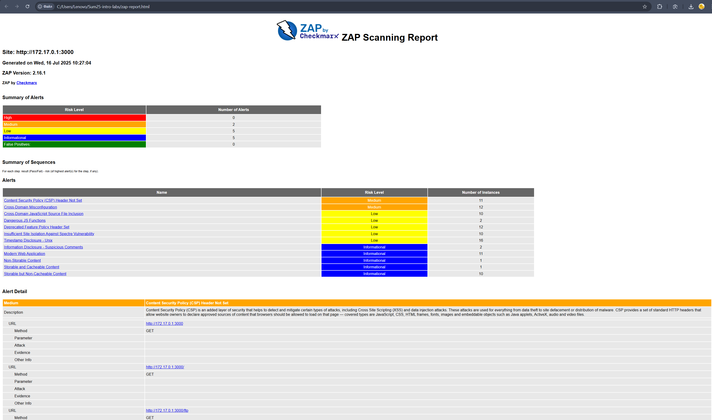

# Лабораторная работа 10. Деценрализованный хостинг 

### Задание 1

Скачали и запустили контейнер, для проверки работы использовали 

    >>docker exec ipfs_node ipfs swarm peers

    /ip410413113182udp4001quic-v1p2pQmaCpDMGvV2BGHeYERUEnRQAwe3N8SzbUtfsmvsqQLuvuJ
    /ip4/104.168.77.202/udp/4001/quic-v1/p2p/12D3KooWD4TahE6d8iKmJ94DcufTBFGmWAdLL2jEcQmaDvAsucEj
    /ip4/104.248.80.215/udp/4001/quic-v1/p2p/12D3KooWA3f1rznzFzKWsEtcMzaFJvn4KSs8jURsznBXWZNNCTGP
    /ip4/106.225.219.146/tcp/4003/p2p/12D3KooWRcJmrQE2QHaB5bPVLNuLTVPpuVTcyj8Y427eafNDBniQ
    /ip4/107.173.248.225/tcp/4001/p2p/12D3KooWBrEszMMA1r6vTKjQpSRJ8W3FUSc3sNPDoFUtS6xnAzeb
    /ip4/129.151.69.9/tcp/4001/p2p/12D3KooWFWHQnbL3FEMJTjKrhaxw5J14cdnoPn8E7nh4P7rHsNpy
    /ip4/13.250.9.10/tcp/9000/p2p/QmRXM4zuiD9ua8MxzMwfrGchH3kPKkUNnhEuD1HCvmdxaM

Добавили созданный файл в IPFS, получили CID - 
    
    QmNyiQsY3bKDLinnBWghYS6xz1gTV3W1hYiJ5j4CDfkBSw

и по ссылке 

http://localhost:8080/ipfs/QmNyiQsY3bKDLinnBWghYS6xz1gTV3W1hYiJ5j4CDfkBSw

переходим на рабочий сайт

    Пиры - 48
    CID - QmNyiQsY3bKDLinnBWghYS6xz1gTV3W1hYiJ5j4CDfkBSw
    URL - https://cloudflare-ipfs.com/ipfs/QmNyiQsY3bKDLinnBWghYS6xz1gTV3W1hYiJ5j4CDfkBSw
    Пропускная способность - 

### Задание 2

- 4EVERLAND Project URL: `https://sum25-intro-labs-fork-ujq5.4everland.app/`
- IPFS CID: `bafybeiayj5caz2ls5mepojibasc4pswvo2aotaqh7nt6iz3ah6h6zjo2gm`
- GitHub Repository: `https://github.com/der-rozanov/Sum25-intro-labs-fork`
- Скриншоты:
  
  

  

Это были очень классные лабы, Спасибо!