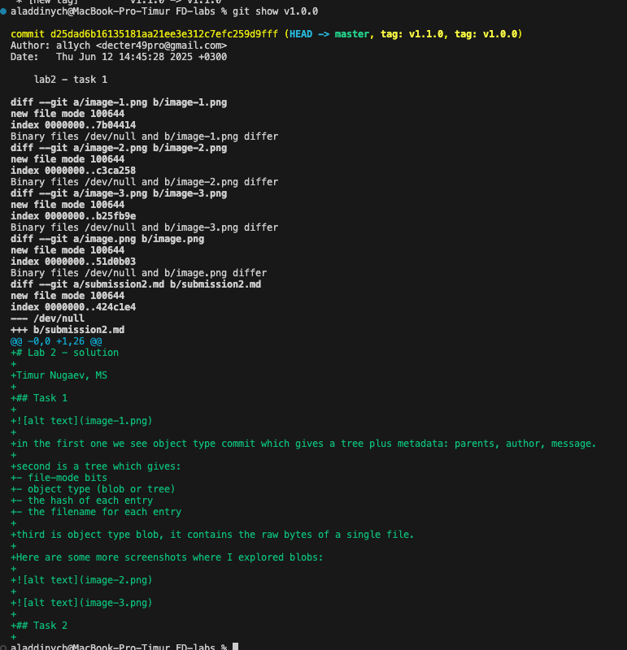
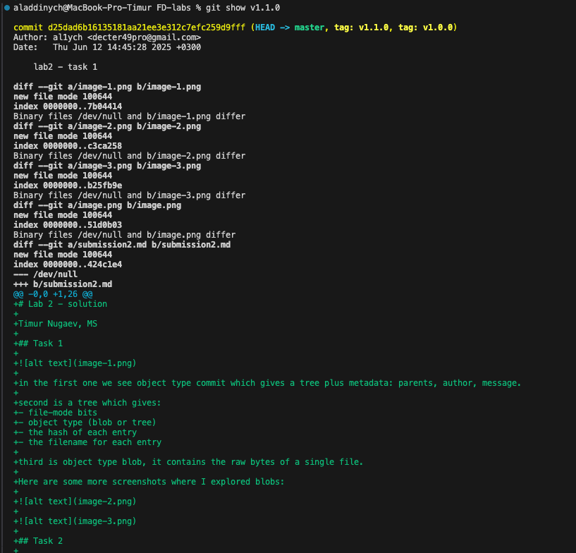

# Lab 2 - solution

Timur Nugaev, MS

## Task 1


in the first one we see object type commit which gives a tree plus metadata: parents, author, message.

second is a tree which gives:
- file-mode bits
- object type (blob or tree)
- the hash of each entry
- the filename for each entry

third is object type blob, it contains the raw bytes of a single file.

Here are some more screenshots where I explored blobs:


## Task 2


soft stages the commit, so you can still work on the code.

it leaves both the index and your working tree as they were.
this essentially undo's the commit without touching file contents.


hard clears the new changes, it deletes the code and the commit.

also moves your branch pointer back one commit, but then resets both the index and the working directory to match the older commit.


we want to first recover `a328a3b HEAD@{3}: commit: Second commit`

`git reset --hard a328a3b`

`HEAD is now at a328a3b Second commit`

at this point it moved the head and removed changes
it force-resets both the staging area and working directory to match it. commits / uncommitted changes that came after Second commit are removed from the branch but still live in reflog.


Here we can see we got our Second commit back

we want to now recover `962882b HEAD@{3}: commit: Third commit`


Same thing for Third commit.

Publish the final version: `git push -u origin git-reset-practice`

## Task 3

```bash
echo "Commit A" > history.txt
git add history.txt
git commit -m "Commit A"

echo "Commit B" >> history.txt
git add history.txt
git commit -m "Commit B"

echo "Commit C" >> history.txt
git add history.txt
git commit -m "Commit C"
```

`git log --oneline --graph --all`


```bash
git checkout -b side-branch
echo "Branch commit" >> history.txt
git add history.txt
git commit -m "Side branch commit"
git checkout main
git log --oneline --graph --all
```


The list of commit messages:

* Commit A
* Commit B
* Commit C
* Side branch commit

A short reflection (1–2 sentences) about how this visualization helps understand collaboration and branching:

Seeing the graph helps me spot where the side branch splits off and how my commits line up with it. It's helpful to see where the history splits and find the culprit and track down bugs in a real project development. The visual representation helps understand the flow of work and keep things organized.

## Task 4

```bash
git tag v1.0.0
git push origin v1.0.0
```

Published:


Optional (v110):


Documentation:
- [x] Tag names created: v1.0.0 & v1.1.0 & v1.2.0


- [x] Commands used are above in the screenshots

- [x] Commit hashes






- [x] A short sentence explaining the value of tagging in software development (e.g., versioning, CI/CD triggers, release notes).

With tags we can mark (and easily reference) specific points in history like releases, etc. We can build a CI that references the tag and build up our app whenever the tag is added, for example (build the app and put on display the release .apk for android, for example).

Also, it's a indication that something significant (of a change) happened and/or indicate a breaking change. So, with tags the primary reason we add it is to version our application and this is useful to know for our collaborators and CI/CD.

## Bonus Task: GitHub Social Interactions 🌟

- [x] Starred the repo
- [ ] Follow some classmates, but not all of them. Some TAs, too.
- [x] Follow professor.
- [x] Short essay explanation (1–2 sentences about why social features on GitHub can be useful in open source or team-based projects):

GitHub’s stars and follows help discover and keep track of useful projects and people (that's the reason for the user).

In a team or open-source community, they help to stay aware of updates, show appreciation, build connections.

```c++
// feedback 1: I love the course and how it's laid out.
// feedback 2: I wish you'd post the links to all the TAs' github handles, so I could do the bonus task easier :)
```