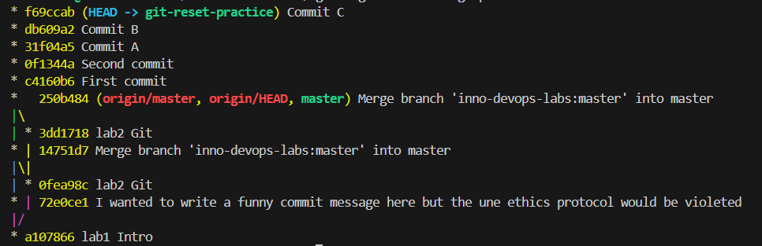

# Credentials

The work is done by M24-RO student  
Anton Kirilin  
a.kirilin@innopolis.university  

# Task 1

I already have some commits in my repo. Here is the look at all git hashed objects

```sh

computeralias:~/Sum25-intro-labs$ find .git/objects -type f
.git/objects/af/7fda8ea32b60578a1103ce061a50d7f6f09a35
.git/objects/25/0b484336bba7b6672719a872ac902e5cc6369f
.git/objects/0e/59002fd4f1c9191436fc5770205ea51bc34b01
.git/objects/3d/d1718fc2372ae838773f8f780807faa26995bd
.git/objects/2f/8463cc188ec6ca69ae7a0f98d38e132280becb
.git/objects/90/9e0bd3c6b870744345aff0393ceacadefc2357
.git/objects/55/5d83619198b6b7a1e2313e917d907c75564e6d
.git/objects/e0/aee3ad1aa3083cb0ee2ecd6ff2433cf348b8e7
.git/objects/14/751d7b73226353ea5dabba5626fee337411fc8
.git/objects/0f/ea98cc519f60820f4c54f514b1596d5bf145b5
.git/objects/72/e0ce11c57ec8e46a0dc09cdbbef45f98cb19b8
.git/objects/77/e299c4cdb01bc31607bef4e2036b56c3368515
.git/objects/pack/pack-284c7c8a10f0555ccbed72fd0114454730079b00.pack
.git/objects/pack/pack-284c7c8a10f0555ccbed72fd0114454730079b00.idx
.git/objects/0b/168419720666e2695d15f8412550e6be121b75
.git/objects/2b/436105f98eb31e52834b0bd07857cc3468efde
```


Let's see the tree hash. We could try to call id directly by the 40-symbols code by there is a better option

```sh

computeralias:~/Sum25-intro-labs$ git cat-file -p master^{tree}
100644 blob af7fda8ea32b60578a1103ce061a50d7f6f09a35    README.md
100644 blob 7a94f7af59b8968be392288ea03179a24ffc9d9e    lab1.md
100644 blob 77e299c4cdb01bc31607bef4e2036b56c3368515    lab2.md
100644 blob 555d83619198b6b7a1e2313e917d907c75564e6d    submission1.md
```

now lets see the insides of the blob

We can see what are the objects stored in there. Just combine the 2-symbol subfolder into a full 40-symbol code and cat it 

```sh

:~/Sum25-intro-labs$ git cat-file -p af7fda8ea32b60578a1103ce061a50d7f6f09a35 
# DevOps Introduction Course: Learn the Fundamentals of DevOps

Welcome to the DevOps Introduction Course, where you will gain a solid foundation in DevOps principles and practical skills. This course is designed to provide you with a comprehensive understanding of DevOps and its key components. Through hands-on labs and lectures, you will learn about various topics such as version control, software distribution, CI/CD, containers, and cloud computing.

## Course Overview

In this course, we will cover the following topics:

1. Introduction to DevOps: Understand the core principles, essential tools and concepts of DevOps.
2. Version Control: Learn about version control systems and their importance in collaborative software development. Tooling: Explore the  used in the DevOps ecosystem.
3. Networking & OS for DevOps: IP, DNS, firewalls, Linux fundamentals (shell, systemd, logs, users), permissions, basic troubleshooting, DevOps-friendly distros.
4. Virtualization: Understand the concepts and benefits of virtualization in modern IT infrastructures.
5. Containers: Dive into containerization technologies like Docker and container orchestration with Kubernetes.
6. CI/CD: Explore continuous integration and continuous deployment practices.
7. Software Distribution: Gain insights into software distribution strategies and best practices.
8. GitOps & Progressive Delivery: Git as the source of truth, FluxCD, Argo CD. Canary deployments, blue/green, feature flags, and rollbacks.
9. Site Reliability Engineering (SRE) & Resilience: SLOs, SLAs, SLIs, error budgets, incident management, chaos engineering (ChaosMesh, Litmus), and postmortems.
10. Security in DevOps (DevSecOps): Shift-left security, SAST/DAST, SBOM, container/image scanning (Trivy, Snyk), secret management (Vault, Doppler, SOPS).
11. Monitoring, Observability & Logging: Concepts of observability vs monitoring, metrics/logs/traces. Tools: Prometheus, Grafana, Loki, ELK stack, OpenTelemetry.
12. Infrastructure as Code (IaC): Automating infrastructure with Terraform, Pulumi, AWS CDK. Immutable infrastructure, state management, modularization.
13. Configuration Management: Tools like Ansible, Chef, Puppet. Declarative vs procedural, idempotency, real-world examples.
14. Cloud Fundamentals: AWS, Azure, GCP basics. IaaS, PaaS, SaaS. Regions/zones, pricing, basic services (EC2, S3, IAM, VPC). Cloud-native patterns.

## Lab Instructions and Grading

To ensure hands-on learning, this course includes practical labs. Each lab has specific tasks that need to be completed for grading purposes. The labs contribute 80% to your final grade, while a final exam accounts for the remaining 20%.

Here are some guidelines and rules for lab submissions:

- You need to submit each lab and achieve a minimum score of 6/10 to pass the course.
- Attending all lectures, practices, and submitting all lab assignments exempts you from the final exam and earns you extra points.
- To create a lab submission, create a new branch in your forked repository specifically for that lab.
- Complete the lab tasks in your branch and submit a pull request (PR) to the main branch of the course repository.
- Only the last commit of your PR before the deadline will be checked and graded.
- The deadline for lab submissions will be discussed and communicated.

## Grading and Grades Distribution

The course grading is as follows:

- Labs: 80% of the final grade.
- Final Exam: 20% of the final grade.

The grade ranges are as follows:

- [90-100] - A
- [75-90) - B
- [60-75) - C
- [0-60) - D

Each lab is marked out of 10 points. Completing the main tasks correctly will earn you the maximum of 10 points. However, if you're short on time or unable to complete all tasks, you can still achieve a minimum of 6 points by completing a subset of tasks.

## Submission Policy

It's essential to submit your lab results on time to maximize your grading. Late submissions will receive a maximum score of 6 points for the corresponding lab. Remember, submitting all labs is a requirement to pass the course successfully.

We look forward to embarking on this DevOps learning journey together and helping you build valuable skills for your career.
```

and the commits

```sh

computeralias:~/Sum25-intro-labs$ git log --oneline
250b484 (HEAD -> master, origin/master, origin/HEAD) Merge branch 'inno-devops-labs:master' into master
3dd1718 lab2 Git
14751d7 Merge branch 'inno-devops-labs:master' into master
72e0ce1 I wanted to write a funny commit message here but the une ethics protocol would be violeted
0fea98c lab2 Git
a107866 lab1 Intro
```

```sh

:~/Sum25-intro-labs$ git cat-file -p 72e0ce1
tree 0e59002fd4f1c9191436fc5770205ea51bc34b01
parent a107866e91af12c22ef78d4c7ad53ae39135ef43
author KirilinAD <a.kirilin@innopolis.university> 1749045744 +0300
committer KirilinAD <a.kirilin@innopolis.university> 1749045744 +0300
gpgsig -----BEGIN SSH SIGNATURE-----
 U1NIU0lHAAAAAQAAADMAAAALc3NoLWVkMjU1MTkAAAAgCi/3ukSDapQ4JS2ayocZ8KpWO2
 JeYlRJ/FzJnHlfzEoAAAADZ2l0AAAAAAAAAAZzaGE1MTIAAABTAAAAC3NzaC1lZDI1NTE5
 AAAAQNuwrOE0RjwQBoOGADgA5rhX4uLJRgeLQgG/Otx2n+I1myxdt13L63KS1UWEvHMxRn
 zzykDJDj2UVgfeZLJxdgo=
 -----END SSH SIGNATURE-----

I wanted to write a funny commit message here but the une ethics protocol would be violeted
```

# Task 2

I've played a little bit with resets so here's my initial reflog history of resets

```sh

:~/Sum25-intro-labs$ git reflog
5d9b776 (HEAD -> git-reset-practice) HEAD@{0}: reset: moving to 5d9b776
c4160b6 HEAD@{1}: reset: moving to HEAD
c4160b6 HEAD@{2}: reset: moving to HEAD
c4160b6 HEAD@{3}: reset: moving to HEAD~1
0f1344a HEAD@{4}: reset: moving to HEAD~1
5d9b776 (HEAD -> git-reset-practice) HEAD@{5}: commit: Third commit
0f1344a HEAD@{6}: commit: Second commit
c4160b6 HEAD@{7}: commit: First commit
250b484 (origin/master, origin/HEAD, master) HEAD@{8}: checkout: moving from master to git-reset-practice
250b484 (origin/master, origin/HEAD, master) HEAD@{9}: pull --tags origin master: Fast-forward
72e0ce1 HEAD@{10}: commit: I wanted to write a funny commit message here but the une ethics protocol would be violeted
a107866 HEAD@{11}: clone: from github.com:Lumiwarum/Sum25-intro-labs.git
```

My curretn file.txt has all 3 lines saying which commit it is.
Let's do the soft reset - when the head goes to the previous commit, but we do not change the index (staged file to be commited) and the working directory, so the content of file.txt is the same

```sh

computeralias:~/Sum25-intro-labs$ git reset --soft
computeralias:~/Sum25-intro-labs$ cat file.txt 
First commit
Second commit
Third commit
```

now let's do the hard reset where we'll change even the wroking directory and the index to the commite to wich we backtrack.

```sh

:~/Sum25-intro-labs$ git reset --hard 0f1344a
HEAD is now at 0f1344a Second commit
:~/Sum25-intro-labs$ cat file.txt
First commit
Second commit
```

Succses. Here's the whole history with some of my failures to comprehend the assignment

```sh

:~/Sum25-intro-labs$ git reflog
0f1344a (HEAD -> git-reset-practice) HEAD@{0}: reset: moving to 0f1344a
5d9b776 HEAD@{1}: reset: moving to HEAD
5d9b776 HEAD@{2}: reset: moving to HEAD
5d9b776 HEAD@{3}: reset: moving to HEAD
5d9b776 HEAD@{4}: reset: moving to HEAD
5d9b776 HEAD@{5}: reset: moving to 5d9b776
c4160b6 HEAD@{6}: reset: moving to HEAD
c4160b6 HEAD@{7}: reset: moving to HEAD
c4160b6 HEAD@{8}: reset: moving to HEAD~1
0f1344a (HEAD -> git-reset-practice) HEAD@{9}: reset: moving to HEAD~1
5d9b776 HEAD@{10}: commit: Third commit
0f1344a (HEAD -> git-reset-practice) HEAD@{11}: commit: Second commit
c4160b6 HEAD@{12}: commit: First commit
250b484 (origin/master, origin/HEAD, master) HEAD@{13}: checkout: moving from master to git-reset-practice
250b484 (origin/master, origin/HEAD, master) HEAD@{14}: pull --tags origin master: Fast-forward
72e0ce1 HEAD@{15}: commit: I wanted to write a funny commit message here but the une ethics protocol would be violeted
a107866 HEAD@{16}: clone: from github.com:Lumiwarum/Sum25-intro-labs.git
```

# Task 3

Here is the tree after the first commits



here is the tree after creating the side-branch


One funny moment in the list of commit messages - everything was smooth until it tried to checkout to the main, which is called master on my machine. 

```sh

Switched to a new branch 'side-branch'
[side-branch c003857] Side branch commit
 1 file changed, 1 insertion(+)
error: pathspec 'main' did not match any file(s) known to git
```
But in the end the visualisation is pretty much the same. At least I see how my interaction with the main repository (from which I forked) is going on. It can help to understand better how all the commits are connected and where are the cnahges that I need to consider taking into my repo.

# Task 4

So I commited the previous tasks with tag 1.0.0 and I'm going to pass the commit with this task with tag 1.1.0

The commands are as simple as in the template

```sh

git tag v1.0.0
git push origin v1.0.0
```

But those only after git add and git commit (cause we tag the current commit)

Why that important? Because the versioning is important overall, it's like names of products. Not all of the commits are some specific changes that entirely change the behaviour of the system, sometime one version is several commits. We just want to refernce them as we can. 
From my experience it's importnat to tag them to help with compatability. For example one library is working with the other one only in version 2.1.X. So when someone pulls the first library the can git clone using tags, whih helps the overall process

Here are the commits hashes

```sh

:~/Sum25-intro-labs$ git log
commit bc10fc780933a49281648cac61c1bd6ad580c7cb (HEAD -> master, tag: v1.1.0)
Author: KirilinAD <a.kirilin@innopolis.university>
Date:   Sat Jun 14 10:57:59 2025 +0300

    task 4 pre

commit da7dd4d1a6460383659929831eb4be0d3f086137 (tag: v1.0.0)
Author: KirilinAD <a.kirilin@innopolis.university>
Date:   Sat Jun 14 10:49:27 2025 +0300

    task3 lab2 completed
```

# Task 5

Like, share and subscribe. Why important? Because you cannot do the open-source projects of great size unless you are a [genius schizo](https://en.wikipedia.org/wiki/Terry_A._Davis). Because you want to know how trustable some projects. We live in society and we need to have community features that help us to interact. 