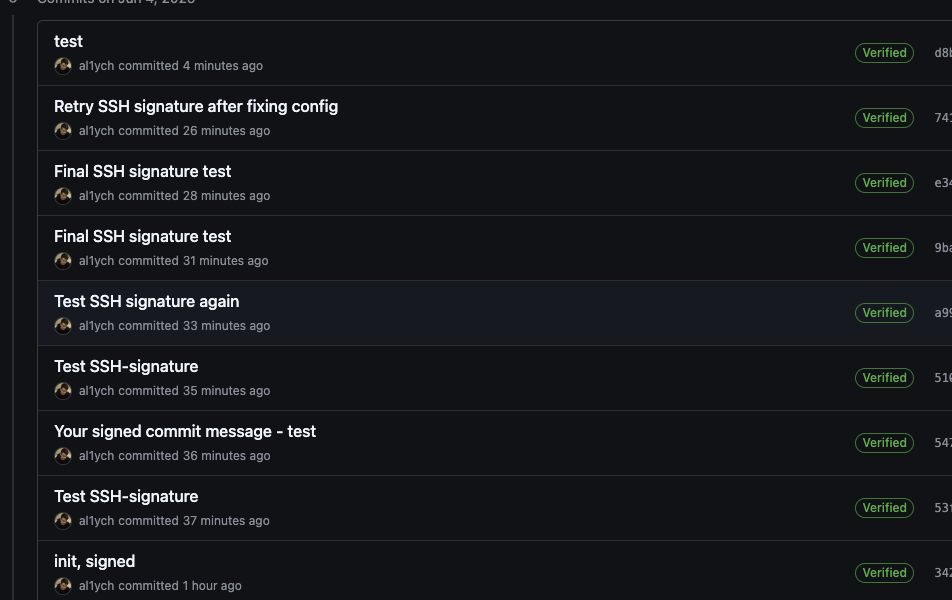
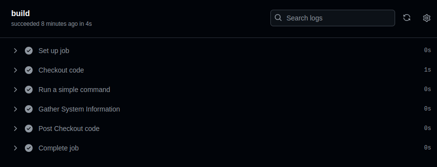
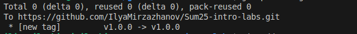

# Lab 2 Turgunboev Dadakhon

## Task 1: Understanding Version Control Systems

### Steps and Outputs

- Created a test file `test_task1.txt` and made two commits:
- First commit: "Add test file for Task 1" (hash: 9257cf6)
- Second commit: "Update test file for Task 1" (hash: f8e91c4)

- Inspected objects using `git cat-file -p`:

- **Commit Object** (e.g., `f8e91c4`):
      ```
     tree 8fd83d6e34ab96b5e7e8571e373999dad73833bc
     parent 9257cf6b18f945f38be50269164ac8e0abb316dd
     author dadaxonEnigma <voiceofenigma19@gmail.com> 1749553811 +0300
     committer dadaxonEnigma <voiceofenigma19@gmail.com> 1749553811 +0300
     gpgsig -----BEGIN SSH SIGNATURE-----
     U1NIU0lHAAAAAQAAADMAAAALc3NoLWVkMjU1MTkAAAAgE43ovcWo1vK41E3ZUoCPtX+U9Q
     fJ8xw1jCOdKHSssjIAAAADZ2l0AAAAAAAAAAZzaGE1MTIAAABTAAAAC3NzaC1lZDI1NTE5
     AAAAQGtIN2DXs+lC1ybjw+t5KhDpmQqgrUkGfE1N1Nh3J1BYTi3W9xP6AoE3y/XSHuoZeq
     xxmipgQliAC57nk0ZSUwY=
     -----END SSH SIGNATURE-----

     Update test file for Task 1
      ```

     **Explanation**: This represents the commit metadata, including the tree hash, parent commit hash, author and committer details (name, email, timestamp), SSH signature, and commit message. The timestamp (1749552721) corresponds to June 4, 2025, 17:45:21 EEST.

- **Tree Object** (e.g., `8fd83d6e34ab96b5e7e8571e373999dad73833bc`):
      ```
     100644 blob af7fda8ea32b60578a1103ce061a50d7f6f09a35    README.md
     100644 blob 7a94f7af59b8968be392288ea03179a24ffc9d9e    lab1.md
     100644 blob 2f8463cc188ec6ca69ae7a0f98d38e132280becb    lab2.md
     100644 blob cb9cabe4b4336f314946b70d4fdb9ba770468c55    submission1.md
     100644 blob fda1ef79ebf3ba05137ce948ee6bc186c91bcc26    submission2.md
     100644 blob 3fa1dad2609a5b8f43224d51a530cd4564b52373    test_task1.txt
      ```
     **Explanation**: This represents the directory structure, listing files and their corresponding blob hashes.

- **Blob Object** (e.g., `3fa1dad2609a5b8f43224d51a530cd4564b52373`):
      ```
     ÿþThis is a test file for Lab 2 Task 1
     Second line for Task 1
      ```
     **Explanation**: This represents the raw content of the file `test_task1.txt`.

### Conclusion

 Git stores data as a series of objects: commits (metadata), trees (directory structure), and blobs (file contents), all identified by unique SHA-1 hashess

## Task 2: Practice with Git Reset Command

### Steps and outputs
* Crated a series of commits:
     * First commit: 'First commit' (hash:e916d3)
     * Second commit: 'Second commit' (hash:61f27db)
     * Third commit: 'Third commit' (hash:b4c9c04)
* Used *git reset --soft HEAD~1*:
     This reset moved the HEAD to the previous commit (61f27db), keeping changes from "Third commit" in the staging area.
* Used *git reflog* to recover
     e91b6d3 HEAD@{0}: reset --hard HEAD~1: moving to e91b6d3
     b4c9c04 HEAD@{1}: commit: Third commit
     61f27db HEAD@{2}: commit: Second commit
     e91b6d3 HEAD@{3}: commit: First commit
showed the history of HEAD movements, allowing recovery of the "Third commit" state by resetting to b4c9c04.
* Used *git log *
     b4c9c04 (HEAD -> lab2) Third commit
     61f27db Second commit
     e91b6d3 First commit

**Conclusion**
git reset --soft keeps changes in the staging area, git reset --hard discards them, and git reflog helps recover lost commits.

## Task 3: Visualizing Git Commit History

### Steps and Outputs

* Created a series of commits on branch lab2:
     * Commit A (hash: 34ffeb3)
     * Commit B (hash: 8f8ff35)
     * Commit C (hash: 5c7db52)

* Created a new branch side-branch and made a commit:
     * Side branch commit (1cc3d77)


* 5c7db52 (HEAD -> lab2) Commit C
* 8f8ff35 Commit B
* 34ffeb3 Commit A
* 8d129c9 (origin/lab2) Update submission2.md with Task 2 steps
* 9f44fad Update submission2.md with Task 2 steps
* b4c9c04 Third commit
* 61f27db Second commit
* e91b6d3 First commit


* 1cc3d77 (side-branch) Side branch commit
* 5c7db52 (HEAD -> lab2) Commit C
* 8f8ff35 Commit B
* 34ffeb3 Commit A
* 8d129c9 (origin/lab2) Update submission2.md with Task 2 steps
* 9f44fad Update submission2.md with Task 2 steps

* List of Commit Messages

     * Commit A
     * Commit B
     * Commit C
     * Side branch commit

Reflection
Visualizing the commit graph helps understand the branching structure and collaboration flow, making it easier to track contributions and resolve merge conflicts in team projects.

## Task 4: Tagging a Commit

* Steps and Outputs
     * Tagged the latest commit as v1.0.0:
     Tag name: v1.0.0 Associated commit hash: b4c9c04
* Created an additional commit and tagged as v1.1.0:
     * Tag name: v1.1.0 Associated commit hash: 8d53549

v1.0.0
v1.1.0
Explanation
Tagging is valuable in software development for versioning releases, triggering CI/CD pipelines, and maintaining clear release notes.

## Bonus Task: GitHub Social Interactions 🌟

* Steps and Outputs

     * Starred the course repository inno-devops-labs/Sum25-intro.
     * Followed the professor, TAs, and at least 3 classmates on GitHub.

Reflection
GitHub's social features, like starring and following, foster collaboration by connecting developers, helping discover projects, and building a community in open source or team-based projects.