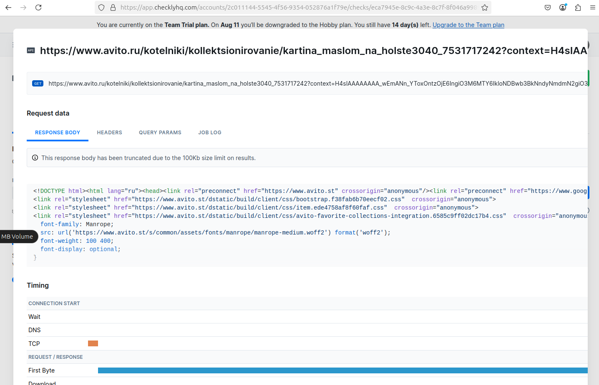

# Lab 2 - solution

Timur Nugaev, MS

## Task 1

in the first one we see object type commit which gives a tree plus metadata: parents, author, message.

second is a tree which gives:
- file-mode bits
- object type (blob or tree)
- the hash of each entry
- the filename for each entry

third is object type blob, it contains the raw bytes of a single file.

Here are some more screenshots where I explored blobs:

## Task 2

soft stages the commit, so you can still work on the code.

it leaves both the index and your working tree as they were.
this essentially undo's the commit without touching file contents.

hard clears the new changes, it deletes the code and the commit.

also moves your branch pointer back one commit, but then resets both the index and the working directory to match the older commit.

we want to first recover `a328a3b HEAD@{3}: commit: Second commit`

`git reset --hard a328a3b`

`HEAD is now at a328a3b Second commit`

at this point it moved the head and removed changes
it force-resets both the staging area and working directory to match it. commits / uncommitted changes that came after Second commit are removed from the branch but still live in reflog.

Here we can see we got our Second commit back

we want to now recover `962882b HEAD@{3}: commit: Third commit`

Same thing for Third commit.

