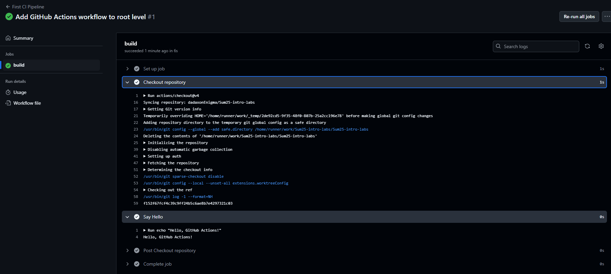
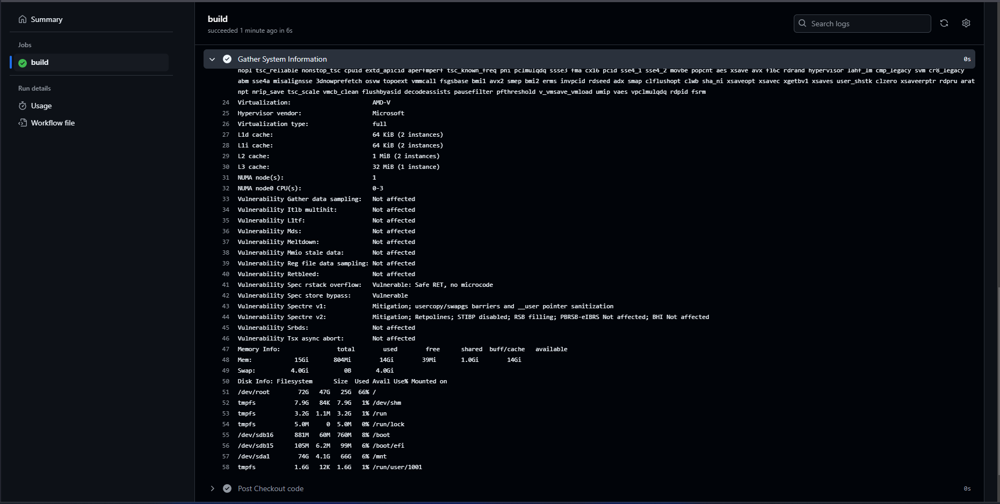

# CI/CD Lab - GitHub Actions Submission

## Task 1: Create Your First GitHub Actions Pipeline

### Steps Followed
1. Created the file `.github/workflows/basic-ci.yml`.
2. Configured the workflow to trigger on `push` to the `lab3` branch.
3. Added a step with the command `echo "Hello, GitHub Actions!"`.

### Workflow Execution Output
- Output: `Hello, GitHub Actions!`
- No errors encountered.
- Additional details:
  - Current runner version: `2.325.0`
  - Runner Image: `ubuntu-24.04`, Version: `20250602.3.0`
  - Operating System: `Ubuntu 24.04.2 LTS`

### Observations
- The workflow executed automatically upon push.
- The `ubuntu-latest` runner worked reliably.
- Runner image and version details were confirmed in the logs.



---

## Task 2: Gathering System Information and Manual Triggering

### Manual Trigger Configuration
- Added the `workflow_dispatch` event to enable manual workflow execution.
- The workflow was successfully triggered manually using the GitHub Actions interface.



### System Information Gathering
- Commands used:
  ```bash
  echo "Runner OS: $RUNNER_OS"
  echo "CPU Info: $(lscpu)"
  echo "Memory Info: $(free -h)"
  echo "Disk Info: $(df -h)"
