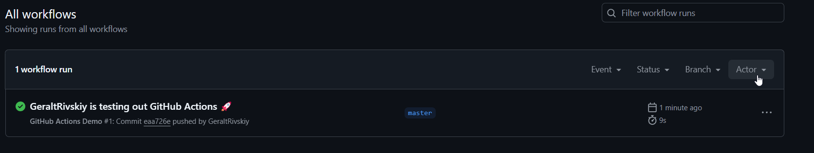
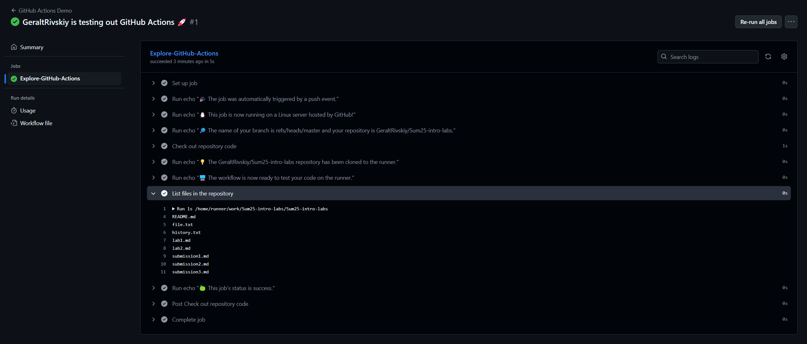
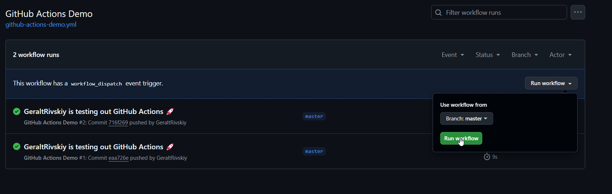
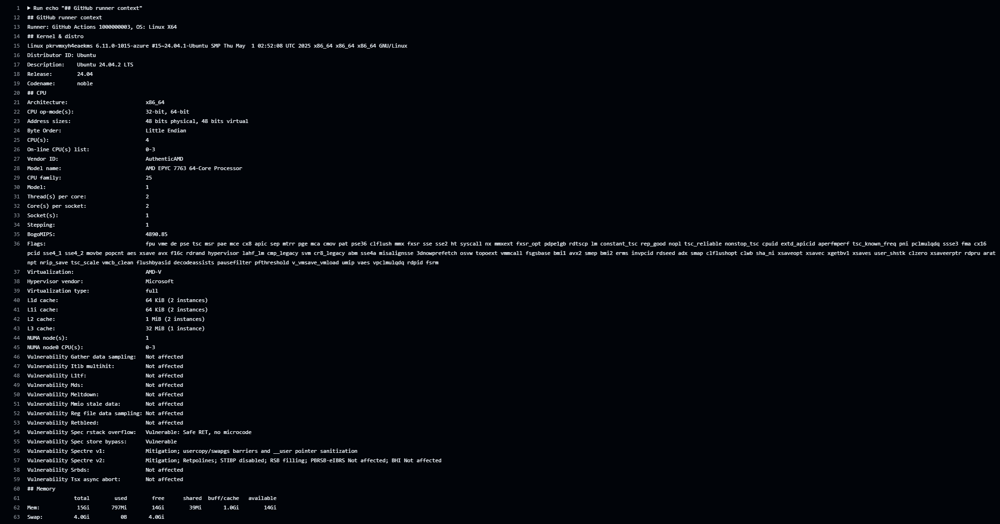

# Lab 3 - CI/CD

## Task 1 - Create your first github actions pipeline

Github action - платформа для автоматизации билда, тестов и доставки кода

Сначала я объединил ветки из прошлой лабы, чтобы было меньше путанницы, затем создал файл `.github/workflows/github-actions-demo.yml`

После, я скопировал текст, представленный в статье, которую нужно было изучить, в созданный файл, а затем произвел коммит.

При коммите workflow файлов автоматически производится их выполнение, его результат можно проверить на вкладке Actions. Никаких ошибок не произошло, значит, все выполнено верно.



## Task 2 - Gathering System Information and Manual Triggering

Сначала я включил ручной запуск workflow путем добавления в раздел `on` `.yml` файла раздела `workflow_dispatch`.



Для получения системной информации о запуске был добавлен ряд команд в файл workflow:
```
echo "## GitHub runner context"
echo "Runner: ${{ runner.name }}, OS: ${{ runner.os }} ${{ runner.arch }}"
echo "## Kernel & distro"
uname -a
lsb_release -a || true     # не на всех дистрибутивах есть
echo "## CPU"
lscpu
echo "## Memory"
free -h
```

Вывод дает информацию о процессоре, памяти, ядре и самом runner
