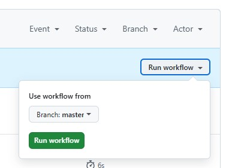

## Task 1: Create Your First GitHub Actions Pipeline

1. **Steps to set up GitHub Actions**:
   - Create new file, and name the file `.github/workflows/github-actions-demo.yml.` This creates the `.github` and `workflows` directories and the `github-actions-demo.yml` file in a single step.

   - Insert into `.yaml` file code:

        ```yaml
        name: GitHub Actions Demo
        run-name: ${{ github.actor }} is testing out GitHub Actions 🚀
        on: [push]
        jobs:
        Explore-GitHub-Actions:
            runs-on: ubuntu-latest
            steps:
            - run: echo "🎉 The job was automatically triggered by a ${{ github.event_name }} event."
            - run: echo "🐧 This job is now running on a ${{ runner.os }} server hosted by GitHub!"
            - run: echo "🔎 The name of your branch is ${{ github.ref }} and your repository is ${{ github.repository }}."
            - name: Check out repository code
                uses: actions/checkout@v4
            - run: echo "💡 The ${{ github.repository }} repository has been cloned to the runner."
            - run: echo "🖥️ The workflow is now ready to test your code on the runner."
            - name: List files in the repository
                run: |
                ls ${{ github.workspace }}
            - run: echo "🍏 This job's status is ${{ job.status }}."
        ```

    - Create commit

    - Now, when creating a commit, this written script will be executed.

2. **Observe the Workflow Execution**:

    - On GitHub, navigate to the main page of the repository.

    - Click **Actions**.

    - We can see the completed action there: 
        

    - After opening a certain action, we can see the results of individual tests:
        


## Task 2: Gathering System Information and Manual Triggering

**Objective**: Extend your workflow to include manual triggering and system information gathering.

1. **Configure a Manual Trigger**:

    - To add a manual trigger, add the following lines to the workflow file:

        ```
        on:
            push:
            workflow_dispatch:
        ```
    - Now in actions we can run this workflow:

        

2. **Gather System Information**:
   - For gathering system information add the following lines:
        ```
        - name: Gather system information
        run: |
          echo "🖥️ Hostname: $(hostname)"
          echo "🧠 CPU Info:"
          lscpu
          echo "💾 Memory Info:"
          free -h
          echo "📀 Disk Info:"
          df -h
          echo "🧰 OS Info:"
          uname -a
        ```
   - After executing the code, we can look at the output of the system information:
        ```
        🖥️ Hostname: pkrvmxyh4eaekms
        🧠 CPU Info:
        Architecture:                         x86_64
        CPU op-mode(s):                       32-bit, 64-bit
        Address sizes:                        48 bits physical, 48 bits virtual
        Byte Order:                           Little Endian
        CPU(s):                               4
        On-line CPU(s) list:                  0-3
        Vendor ID:                            AuthenticAMD
        Model name:                           AMD EPYC 7763 64-Core Processor
        CPU family:                           25
        Model:                                1
        Thread(s) per core:                   2
        Core(s) per socket:                   2
        Socket(s):                            1
        Stepping:                             1
        BogoMIPS:                             4890.85
        Flags:                                fpu vme de pse tsc msr pae mce cx8 apic sep mtrr pge mca cmov pat pse36 clflush mmx fxsr sse sse2 ht syscall nx mmxext fxsr_opt pdpe1gb rdtscp lm constant_tsc rep_good nopl tsc_reliable nonstop_tsc cpuid extd_apicid aperfmperf tsc_known_freq pni pclmulqdq ssse3 fma cx16 pcid sse4_1 sse4_2 movbe popcnt aes xsave avx f16c rdrand hypervisor lahf_lm cmp_legacy svm cr8_legacy abm sse4a misalignsse 3dnowprefetch osvw topoext vmmcall fsgsbase bmi1 avx2 smep bmi2 erms invpcid rdseed adx smap clflushopt clwb sha_ni xsaveopt xsavec xgetbv1 xsaves user_shstk clzero xsaveerptr rdpru arat npt nrip_save tsc_scale vmcb_clean flushbyasid decodeassists pausefilter pfthreshold v_vmsave_vmload umip vaes vpclmulqdq rdpid fsrm
        Virtualization:                       AMD-V
        Hypervisor vendor:                    Microsoft
        Virtualization type:                  full
        L1d cache:                            64 KiB (2 instances)
        L1i cache:                            64 KiB (2 instances)
        L2 cache:                             1 MiB (2 instances)
        L3 cache:                             32 MiB (1 instance)
        NUMA node(s):                         1
        NUMA node0 CPU(s):                    0-3
        Vulnerability Gather data sampling:   Not affected
        Vulnerability Itlb multihit:          Not affected
        Vulnerability L1tf:                   Not affected
        Vulnerability Mds:                    Not affected
        Vulnerability Meltdown:               Not affected
        Vulnerability Mmio stale data:        Not affected
        Vulnerability Reg file data sampling: Not affected
        Vulnerability Retbleed:               Not affected
        Vulnerability Spec rstack overflow:   Vulnerable: Safe RET, no microcode
        Vulnerability Spec store bypass:      Vulnerable
        Vulnerability Spectre v1:             Mitigation; usercopy/swapgs barriers and __user pointer sanitization
        Vulnerability Spectre v2:             Mitigation; Retpolines; STIBP disabled; RSB filling; PBRSB-eIBRS Not affected; BHI Not affected
        Vulnerability Srbds:                  Not affected
        Vulnerability Tsx async abort:        Not affected
        💾 Memory Info:
                    total        used        free      shared  buff/cache   available
        Mem:            15Gi       864Mi        14Gi        39Mi       1.0Gi        14Gi
        Swap:          4.0Gi          0B       4.0Gi
        📀 Disk Info:
        Filesystem      Size  Used Avail Use% Mounted on
        /dev/root        72G   47G   25G  66% /
        tmpfs           7.9G   84K  7.9G   1% /dev/shm
        tmpfs           3.2G  1.1M  3.2G   1% /run
        tmpfs           5.0M     0  5.0M   0% /run/lock
        /dev/sda16      881M   60M  760M   8% /boot
        /dev/sda15      105M  6.2M   99M   6% /boot/efi
        /dev/sdb1        74G  4.1G   66G   6% /mnt
        tmpfs           1.6G   12K  1.6G   1% /run/user/1001
        🧰 OS Info:
        Linux pkrvmxyh4eaekms 6.11.0-1015-azure #15~24.04.1-Ubuntu SMP Thu May  1 02:52:08 UTC 2025 x86_64 x86_64 x86_64 GNU/Linux
        ```