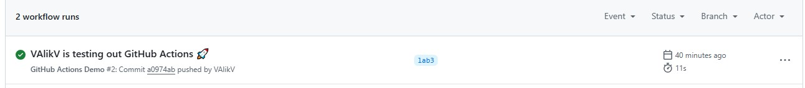
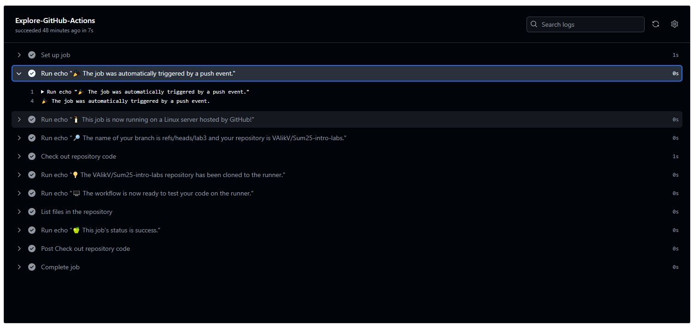

## Task 1: Create Your First GitHub Actions Pipeline

1. **Steps to set up GitHub Actions**:
   - Create new file, and name the file `.github/workflows/github-actions-demo.yml.` This creates the `.github` and `workflows` directories and the `github-actions-demo.yml` file in a single step.

   - Insert into `.yaml` file code:

        ```yaml
        name: GitHub Actions Demo
        run-name: ${{ github.actor }} is testing out GitHub Actions 🚀
        on: [push]
        jobs:
        Explore-GitHub-Actions:
            runs-on: ubuntu-latest
            steps:
            - run: echo "🎉 The job was automatically triggered by a ${{ github.event_name }} event."
            - run: echo "🐧 This job is now running on a ${{ runner.os }} server hosted by GitHub!"
            - run: echo "🔎 The name of your branch is ${{ github.ref }} and your repository is ${{ github.repository }}."
            - name: Check out repository code
                uses: actions/checkout@v4
            - run: echo "💡 The ${{ github.repository }} repository has been cloned to the runner."
            - run: echo "🖥️ The workflow is now ready to test your code on the runner."
            - name: List files in the repository
                run: |
                ls ${{ github.workspace }}
            - run: echo "🍏 This job's status is ${{ job.status }}."
        ```

    - Create commit

    - Now, when creating a commit, this written script will be executed.

2. **Observe the Workflow Execution**:

    - On GitHub, navigate to the main page of the repository.

    - Click **Actions**.

    - We can see the completed action there: 
        

    - After opening a certain action, we can see the results of individual tests:
        

