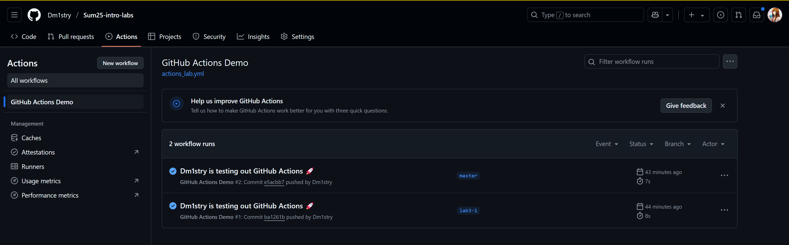
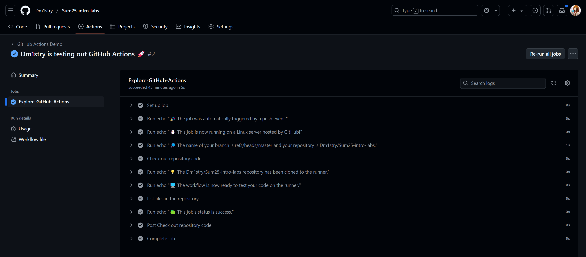

# Lab 3
## Task 1
1) First of all I created a new branch:
```bash
$ git checkout -b lab3-1
Switched to a new branch 'lab3-1'
```

2) Created a file `actions_lab.yml` and moved it to `.github/workflows/actions_lab.yml`

3) Observed actions in action





4) Inspected each action

## Task 2
1) Followed official documentation
2) Added new yaml file with name `.github\workflows\manual_trigger.yml`
3) Placed here code for manually triggered code. Keep one input argument from example just to see, how it looks like
4) Copied job from task 1 to gather system information
5) Triggered workflow manually by:

6) Info showed up in all workflows
