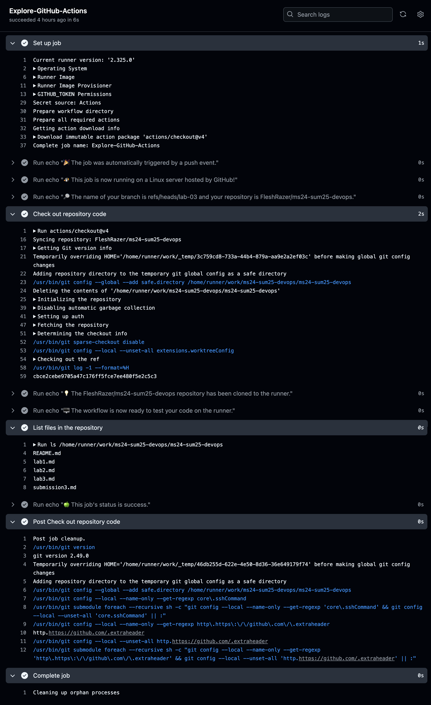
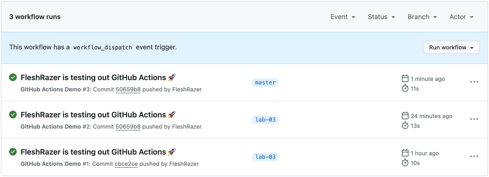
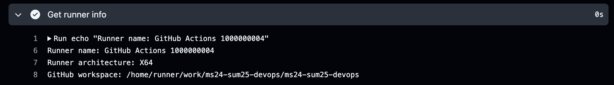
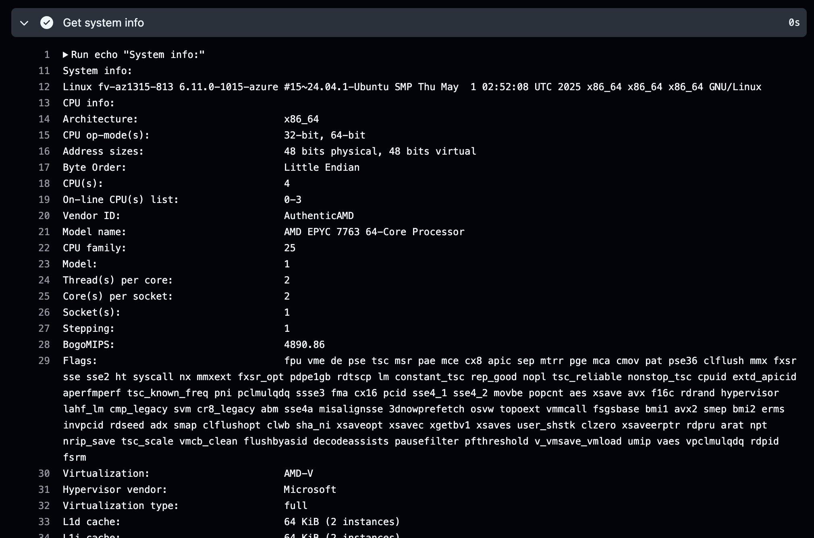
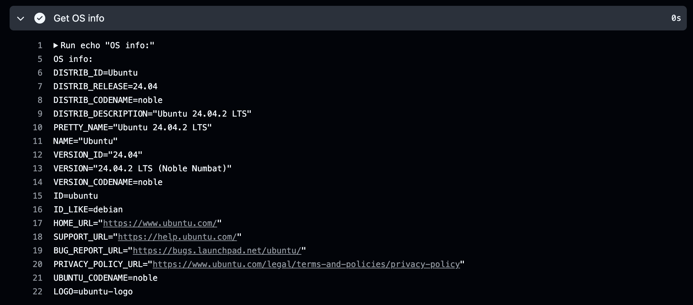

# Lab 2: Version Control

## Task 1: Create Your First GitHub Actions Pipeline

### Key concepts

- Workflows: Automated YAML files in .github/workflows/ directory
- Runners: Servers that execute workflows (GitHub-hosted or self-hosted)
- Events: Triggers that start workflows (e.g. push, PR, schedule)
- Steps: Individual tasks that run commands or actions
- Jobs: Sets of steps that execute on the same runner
- Actions: Reusable units of code (can be GitHub's or community-built)

### Creating the workflow

Create a workflow dir:
```bash
mkdir -p .github/workflows
touch .github/workflows/github-actions-demo.yaml
```

Paste a demo workflow from the GitHub quickstart guide:
```yaml
name: GitHub Actions Demo
run-name: ${{ github.actor }} is testing out GitHub Actions 🚀
on: [push]
jobs:
  Explore-GitHub-Actions:
    runs-on: ubuntu-latest
    steps:
      - run: echo "🎉 The job was automatically triggered by a ${{ github.event_name }} event."
      - run: echo "🐧 This job is now running on a ${{ runner.os }} server hosted by GitHub!"
      - run: echo "🔎 The name of your branch is ${{ github.ref }} and your repository is ${{ github.repository }}."
      - name: Check out repository code
        uses: actions/checkout@v4
      - run: echo "💡 The ${{ github.repository }} repository has been cloned to the runner."
      - run: echo "🖥️ The workflow is now ready to test your code on the runner."
      - name: List files in the repository
        run: |
          ls ${{ github.workspace }}
      - run: echo "🍏 This job's status is ${{ job.status }}."
```

### Workflow output

The workflow finished successfully with no errors:



## Task 2: Gathering System Information and Manual Triggering

### Configure manual trigger

Add `workflow_dispatch` to the event list:
```yaml
on: [push, workflow_dispatch]
```

Merge into master to make manual run available:
```bash
git switch master
git merge lab-03
```



### New workflow steps and their outputs

Add step to print runner info:
```yaml
- name: Get runner info
  run: |
    echo "Runner name: ${{ runner.name }}"
    echo "Runner architecture: ${{ runner.arch }}"
    echo "GitHub workspace: ${{ github.workspace }}"
```



Add step to print system info:
```yaml
- name: Get system info
  run: |
    echo "System info:"
    uname -a
    echo "CPU info:"
    lscpu
    echo "Memory info:"
    free -h
    echo "Disk info"
    df -h
```



Add step to print OS info:
```yaml
- name: Get OS info
  run: |
    echo "OS info"
    cat /etc/*release*
```


