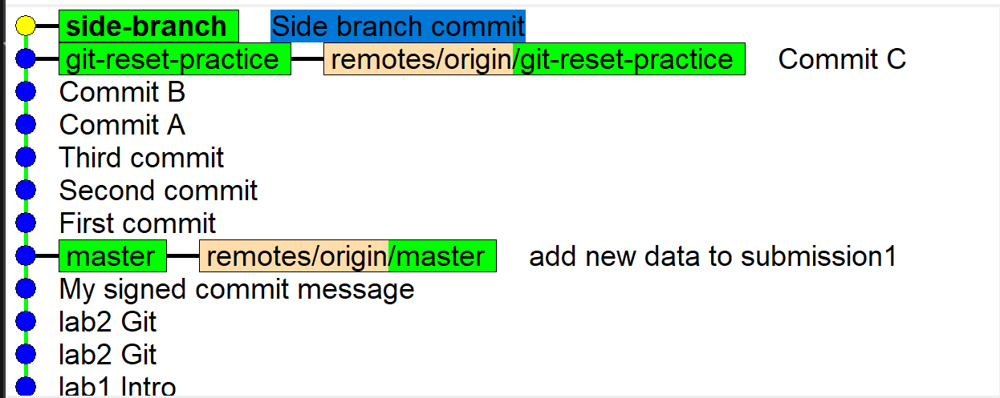

# GitHub Actions Pipeline Observations

## Task 1: Basic Workflow Implementation

**Steps Taken:**
1. Created `.github/workflows/github-actions-manual.yml` following GitHub's quickstart guide
2. Configured workflow to trigger on push to lab3 branch
3. Committed and pushed changes to repository

**Observations:**
- Workflow executed automatically after push
- Status indicator showed green checkmark upon success
- Detailed logs available in Actions tab for each step
- Initial setup was straightforward with good documentation

## Task 2: Enhanced Workflow Features

### Manual Trigger Configuration
This is base construction for the task in github-actions-manual.yml:

```
on:
  push:
    branches:
      - lab3
  workflow_dispatch:
```
Here's the results:


and pipeline inner structure:


System info:

