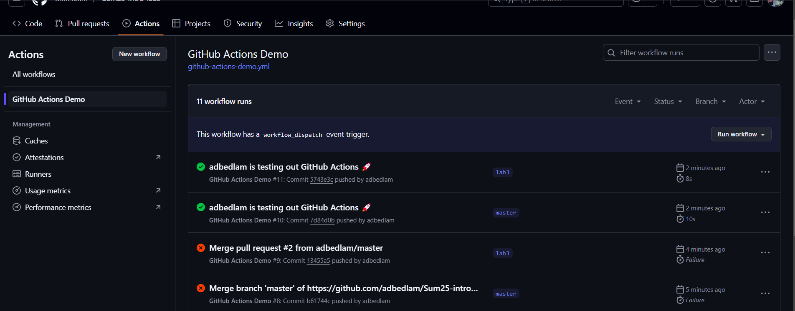
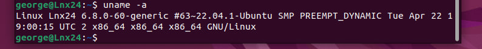
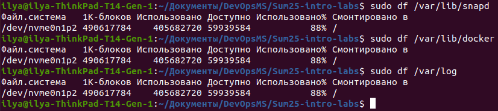
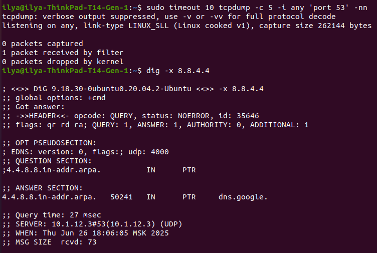
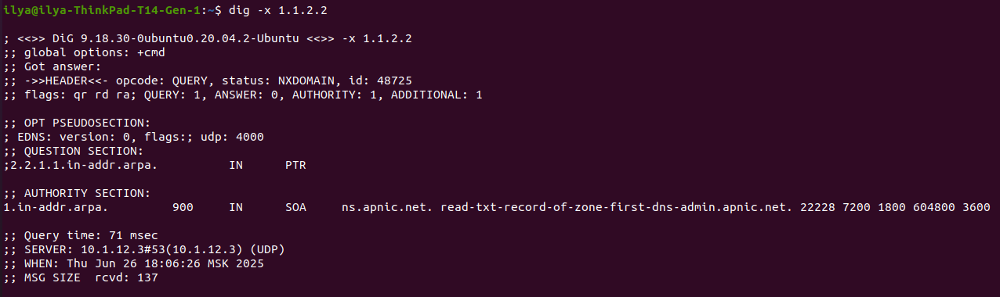

# Boot Performance

systemd-analyze

```
Startup finished in 9.220s (firmware) + 6.002s (loader) + 3.166s (kernel) + 10.573s (userspace) = 28.963s 
graphical.target reached after 10.566s in userspace
```

systemd-analyze blame

```
21min 17.557s apt-daily-upgrade.service                                        >
       6.458s NetworkManager-wait-online.service                               >
       3.215s plymouth-quit-wait.service                                       >
       2.255s postgresql@12-main.service                                       >
       2.063s dev-nvme0n1p2.device                                             >
       1.738s snapd.seeded.service                                             >
       1.650s snapd.service                                                    >
       1.549s fwupd.service                                                    >
       1.226s mysql.service                                                    >
       1.103s nfs-server.service                                               >
        963ms docker.service                                                   >
        735ms proc-fs-nfsd.mount                                               >
        707ms systemd-udev-trigger.service                                     >
        663ms systemd-sysctl.service                                           >
        661ms dev-loop36.device                                                >
        654ms systemd-journal-flush.service                                    >
        649ms dev-loop62.device                                                >
        649ms bolt.service                                                     >
        649ms dev-loop22.device                                                >
        647ms snap-bare-5.mount                                                >
        647ms snap-chromium\x2dffmpeg-76.mount                                 >
        647ms snap-code-184.mount                                              >
        646ms snap-code-188.mount                                              >

```

# Process Forensics


# Service Dependencies


# User Sessions


# Memory Analysis


# System Performance Analysis

## Boot Performance (`systemd-analyze`)
- Total boot time: **28.963s** (firmware 9.2s, userspace 10.6s)  
- Critical delay: `apt-daily-upgrade.service` taking **21min** (likely background updates)

## Process Analysis (`ps`)
- **Top memory consumer**: `/home/ilya/Загрузки` (PID 6079) - **3.9% MEM**, **11.4% CPU**  
- **Top CPU consumer**: VSCode (snap) (PID 86712) - **17.5% CPU**, **2% MEM**  
- Notable: Yandex Browser and GNOME Shell also consuming significant resources

## Service Dependencies (`systemctl`)
- **Multi-user target** runs **45+ services** including Docker, MySQL, PostgreSQL  
- Redundant services detected: Both `apport` and `hddtemp` appear in multiple targets

## Memory Status (`free`, `/proc/meminfo`)
- **15GB RAM**: 4.1GB used, **10GB available** (healthy utilization)  
- **Swap**: 2GB total, only 2MB used (minimal swapping activity)

## User Sessions (`who`, `last`)
- Single active session: `ilya` on `:0` since **2025-06-26 16:44**  
- Recent uptime pattern: Very short sessions (3min, 1min) before current session

# Task 2







# Network Analysis Report

## Traceroute to GitHub (`traceroute`)
- Extreme latency spikes (**40,000ms+**) at hops 10-11 (83.169.204.XX, 194.68.123.XX)  
- Multiple timeouts (hops 6-9) suggest firewall filtering or network congestion

## DNS Resolution (`dig github.com`)
- Successful resolution to **140.82.121.3** in **27ms**  
- Uses local DNS server **10.1.12.3** with EDNS (UDP 4000) support

## Reverse DNS Comparison (`dig -x`)
- **8.8.4.4** correctly resolves to `dns.google` (Google DNS)  
- **1.1.2.2** returns NXDOMAIN (no PTR record), handled by APNIC nameserver

## DNS Traffic Capture (`tcpdump`)
- No DNS packets captured despite active queries  
- Suggests local caching (systemd-resolved) or non-standard DNS port usage
