# Lab 4: Operating Systems & Networking

## Task 1: Operating System Analysis

### Boot Performance

Analyze system boot time:

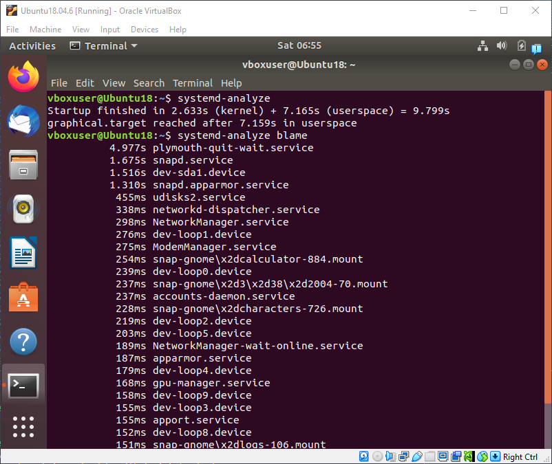

> The system boots in 9.799 seconds, with the plymouth-quit-wait.service (4.977s) being the most time-consuming service during startup.

Check system load:

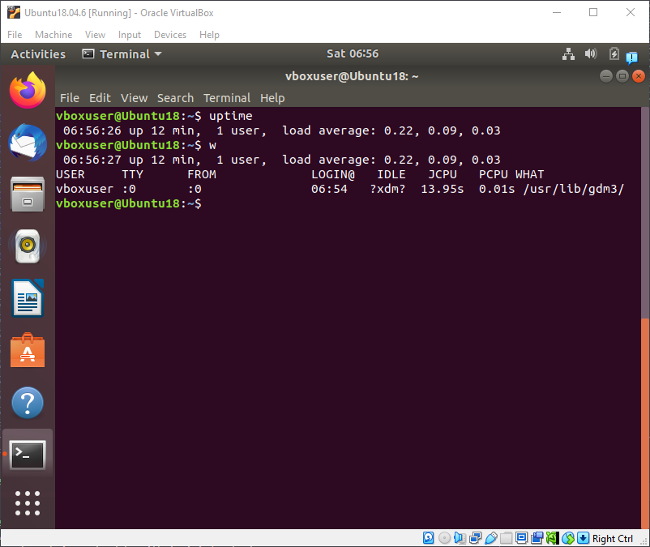

> The system has been running for 12 minutes with a light load average (0.22, 0.09, 0.03) and only one active user `vboxuser` logged in via a graphical session.

### Process Forensics

Identify resource-intensive processes:

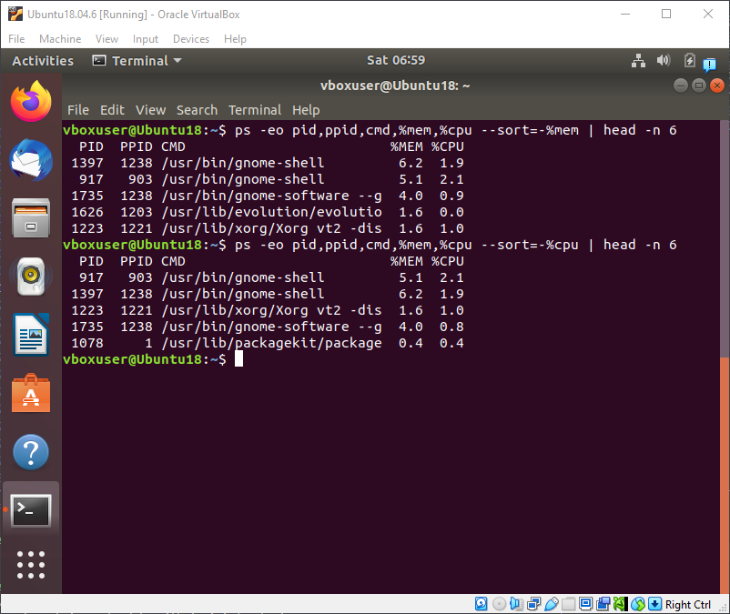

> Processes of `gnome-shell` (PID 917 and 1397) are consuming the most memory (6.2% and 5.1%) and CPU (2.1% and 1.9%).

### Service Dependencies

Map service relationships:

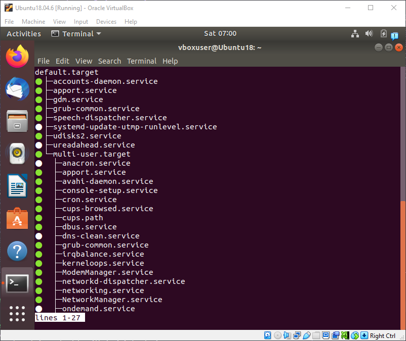

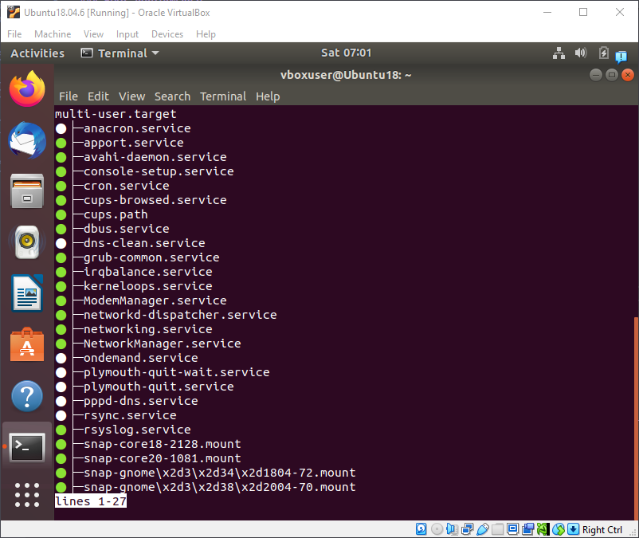

> Output shows services in different states and dependencies between them. Default target outputs all services including those that are required by GUI, `multi-user.target` focuses on core system services.

### User Sessions

Audit login activity:

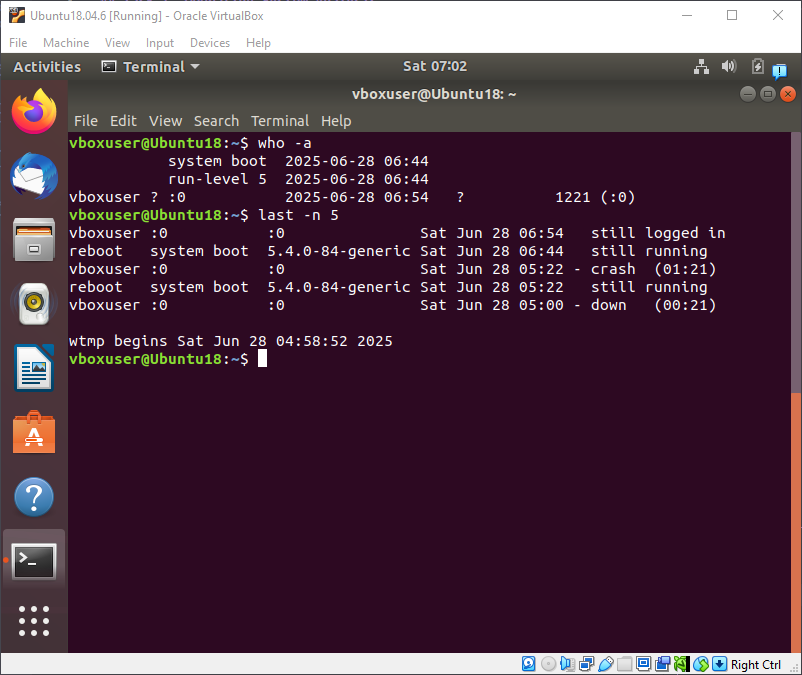

> The system was rebooted twice on June 28 (06:44 and 06:54), with vboxuser being the only active user.

### Memory Analysis

Inspect memory allocation:

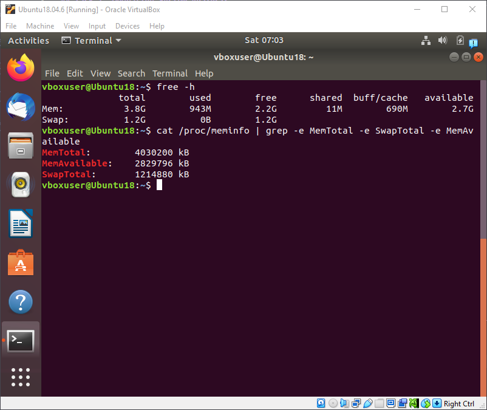

> The system has 3.8GB total RAM with 2.2GB currently free and 2.7GB available, while swap space (1.2GB) is completely unused.

## Task 2: Networking Analysis

### Network Path Tracing

Traceroute execution:

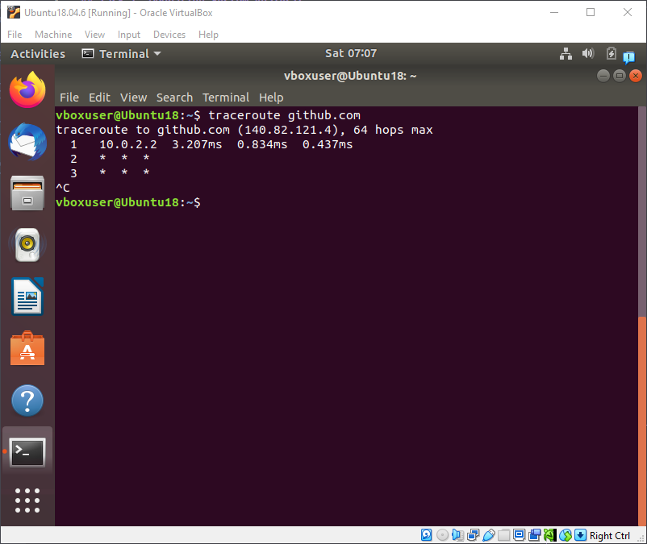

> The connection to GitHub (`140.82.121.4`) stops after the first hop (`10.0.2.2`, likely the VirtualBox NAT gateway).

DNS resolution check:

> The `dig` output confirms successful DNS resolution for `github.com`, returning the IP `140.82.121.4` via local resolver `127.0.0.53`.

### Packet Capture

Capture DNS traffic:

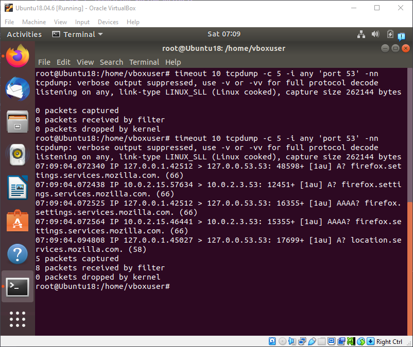

> The output shows DNS query activity on port 53, showing both IPv4 (A) and IPv6 (AAAA) requests for Mozilla-related domains (`firefox.settings.services.mozilla.com`), with traffic routed between localhost (`127.0.0.53`) and the gateway (`10.0.2.3`).
>
> DNS query explanation:
>
> `07:09:04.072340 IP 127.0.0.1.42512 > 127.0.0.53.53: 48598+ A? firefox.settings.services.mozilla.com. (66)`
> - Source: `127.0.0.1` (local resolver stub)
> - Destination: `127.0.0.53` (systemd-resolved)
> - Type: A (IPv4 lookup)
> - Domain: `firefox.settings.services.mozilla.com`
> - Flags: + (recursion desired)

### Reverse DNS

Perform PTR lookups:

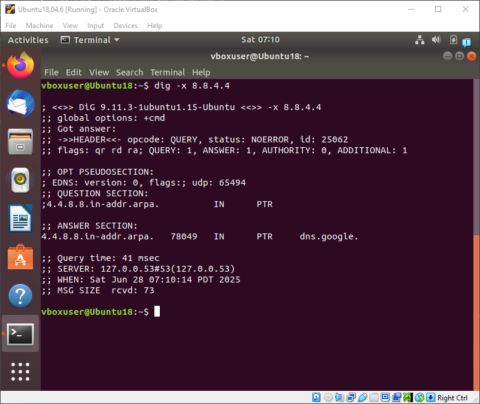

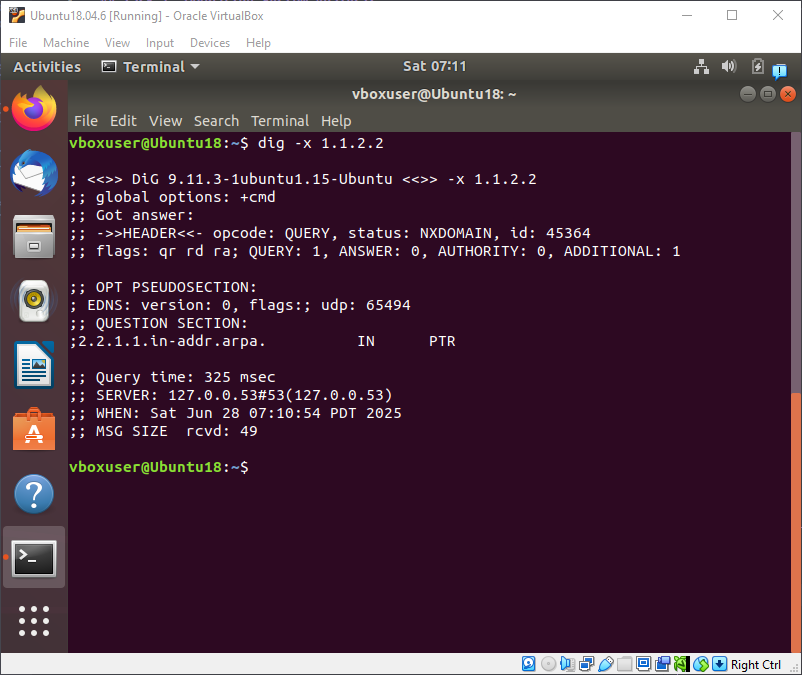

> The outputs demonstrate successful reverse DNS lookup for `8.8.4.4` (resolving to `dns.google`), and a failing one for `1.1.2.2` (`NXDOMAIN` status).
