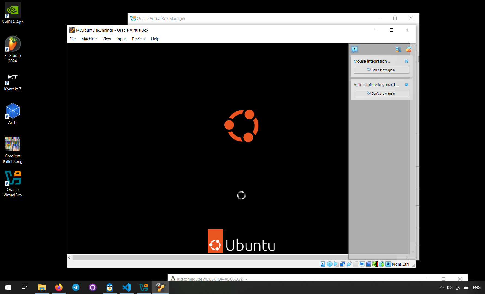
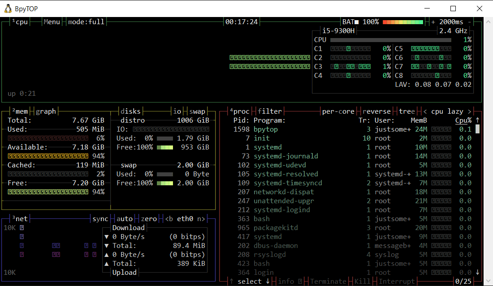
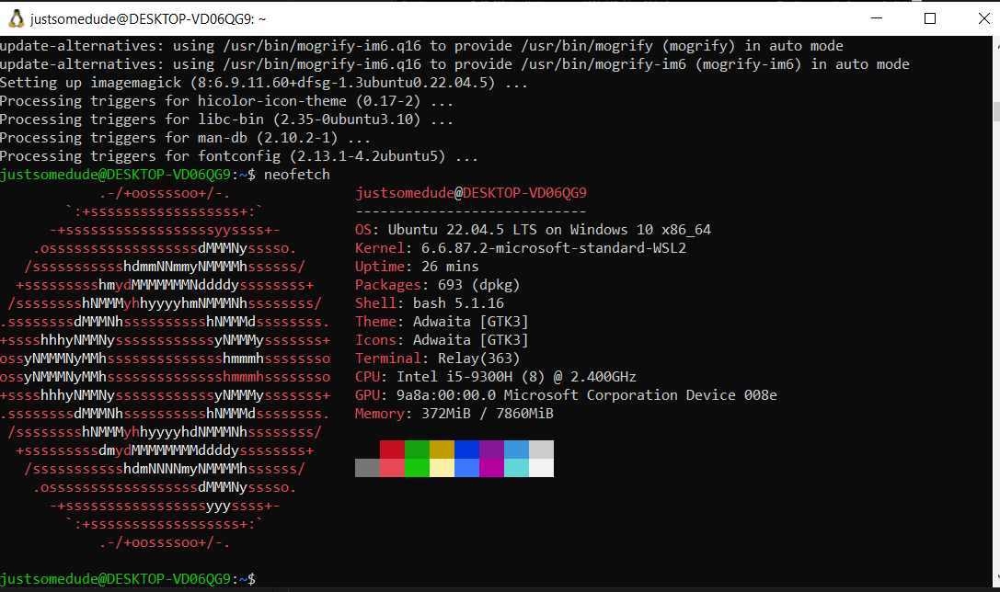

# Virtualization Lab

In this lab, you will learn how to deploy a Virtual Machine (VM) using VirtualBox and customize its settings. Follow the tasks below to complete the lab assignment.

## Task 1: VM Deployment

**Objective**: Install VirtualBox and deploy a new VM using Ubuntu.

1. **Install VirtualBox**:
   - Installed Oracle VirtualBox Manager. VMWare 2, VirtualBox GUI 7.1.10 r169112 (Qt6.5.3)

2. **Deploy a Virtual Machine**:
   - Created new VM with Ubuntu 22 LTS version
   - First downloaded ISO from official website
   - Then chose it in GUI and filled out information in all subsequent context menus
       - Set up username and password
       - Allocated resources and disk space - I could only allocate 2GB of ram, 1 core, and 16GB of disk space.
   - VM started as soon as I powered it up.

It managed to boot up, but running a VM on my computer is extremelly laggy, so I will be using a WSL for the rest of this task - the differences should not be significant.

## Task 2: System Information Tools

**Objective**: Discover and use command-line tools to display system information of the VM.

Note: Running a VM on my computer is extremely laggy, so I will be using a WSL. It is essentially a VM already, but a bit more optimized and in console-only.

1. **Processor, RAM, and Network Information**:
   - I installed bpytop on my WSL. Here is how I did it:
   ```
   sudo pip3 install bpytop
   bpytop
   ```
   Output:


Note: I needed to install pip first.
```
sudo apt-get update
sudo apt-get install pip
```

2. **Operating System Specifications**:
- For that task I installed neofetch.
```
sudo apt-get install neofetch
```
- Calling neofetch yields the following:

