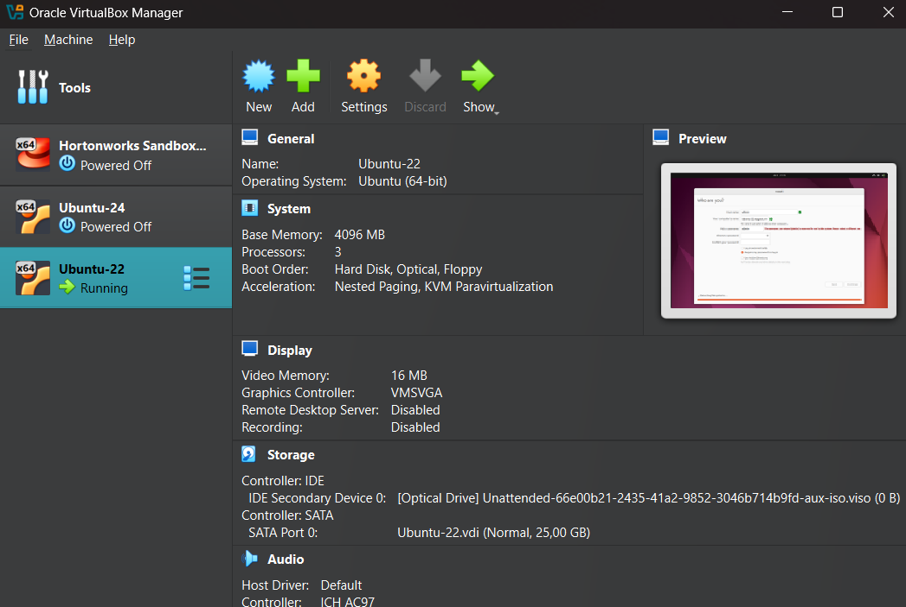

# Solution to Lab 6

by Dmitry Beresnev <d.beresnev@innopolis.university>

The tasks are done under **Windows 11**

## Task 1: VM Deployment

VirtualBax version: **7.1.10**

**Deployment steps:**

1. Install Virtual Box
2. Download [Ubuntu 22.04.5 official ISO image](https://ubuntu.com/download/desktop)
3. In the VirtualBox Manager click the **"New"** button
4. Name and Operating System:
   - Name VM as `Ubuntu-22`.
   - The downloaded Ubuntu ISO was selected in the "ISO Image" field.
   - VirtualBox automatically detected the OS Type as `Linux` and Version as `Ubuntu (64-bit)`.
5. Resources Allocation:
   - Base Memory: 4096 MB
   - Processors: 3 CPU cores
   - Disk Size: 25 GB
6. Launch the VM and follow the Ubuntu installation steps

**Screenshot of VM Configuration:**


**Screenshot of Running VM:**


## Task 2: System Information Tools

### 1. Processor, RAM, and Network Information

**Tool:** `inxi`
**Installation Command:**

```bash
sudo apt update && sudo apt install inxi
```

#### Processor Information

**Command:**

```bash
inxi -C
```

**Output:**

```text
CPU:
   Info: triple core model: Intel Core i7-8750H bits: 64 type: MCP cache:
      L2 768 KiB
   Speed (MHz): avg: 2208 min/max: N/A cores: 1: 2208 2: 2208 3: 2208
```

#### RAM Information

**Command:**

```bash
sudo inxi -m
```

**Output:**

```text
Memory:
  RAM: total: 3.82 GiB used: 1009.3 MiB (25.8%)
  RAM Report: message: No RAM data found.
```

#### Network Information

**Command:**

```bash
inxi -n
```

**Output:**

```text
Network:
  Device-1: Intel 82540EM Gigabit Ethernet driver: e1000
  IF: enp0s3 state: up speed: 1000 Mbps duplex: full mac: 08:00:27:73:e5:59
  Device-2: Intel 82371AB/EB/MB PIIX4 ACPI type: network bridge
      driver: piix4_smbus
```

### 2. Operating System Specifications

**Tool:** `lsb_release`

**Command:**

```bash
lsb_release -a
```

**Output:**

```text
No LSB modules are available.
Distributor ID: Ubuntu
Description:    Ubuntu 22.04.5 LTS
Release:        22.04
Codename:       jammy
```
