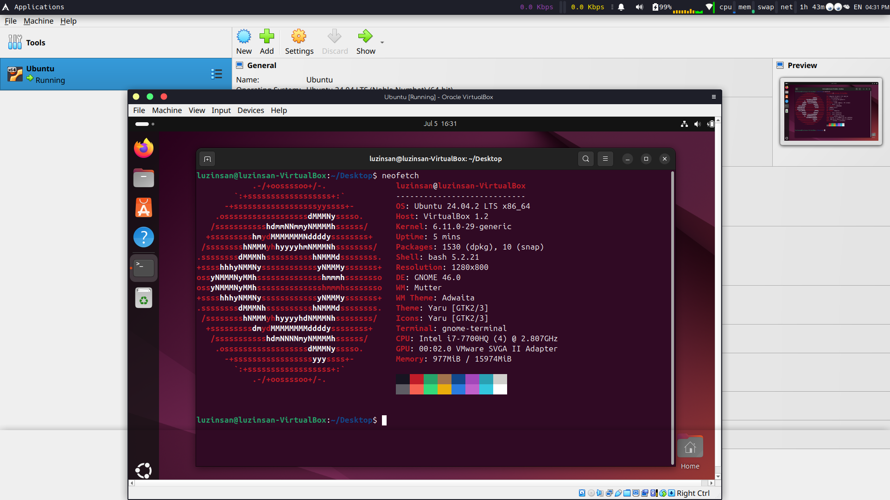

# Virtualization Lab Report

## Task 1: VM Deployment

### VirtualBox Installation and Version

I have successfully installed VirtualBox on my system. The version information is as follows:

**VirtualBox Version:** 7.1.10r169112

### VM Deployment Process

I created a new Virtual Machine using VirtualBox with the following specifications:

1. **Operating System:** Ubuntu 24.04.2 LTS
2. **Architecture:** x86_64
3. **Memory Configuration:** 1.5 GB RAM allocated
4. **CPU Configuration:** 4 CPU cores allocated
5. **Network Configuration:** Default NAT configuration

### VM Configuration Details

The VM was successfully deployed with Ubuntu 24.04.2 LTS. The deployment process included:

- Creating a new VM in VirtualBox
- Allocating system resources (RAM, CPU cores)
- Installing Ubuntu operating system
- Configuring network settings
- Verifying successful boot and operation

### Screenshot


*Screenshot showing the Ubuntu VM running successfully in VirtualBox*

## Task 2: System Information Tools

### Processor Information

**Tool Used:** `lscpu`

**Command:** `lscpu`

**Output:**
```
Architecture:                         x86_64
CPU op-mode(s):                      32-bit, 64-bit
Address sizes:                       39 bits physical, 48 bits virtual
Byte Order:                          Little Endian
CPU(s):                              4
On-line CPU(s) list:                 0-3
Vendor ID:                           GenuineIntel
Model name:                          Intel(R) Core(TM) i7-7700HQ CPU @ 2.80GHz
CPU family:                          6
Model:                               158
Thread(s) per core:                  1
Core(s) per socket:                  4
Socket(s):                           1
Stepping:                            9
BogoMIPS:                            5615.99
Flags:                               fpu vme de pse tsc msr pae mce cx8 apic sep mtrr pge mca cmov pat pse36 clflush mmx fxsr sse sse2 ht syscall nx rdtscp lm constant_tsc rep_good nopl xtopology nonstop_tsc cpuid tsc_known_freq pni pclmulqdq ssse3 fma cx16 pcid sse4_1 sse4_2 x2apic movbe popcnt aes xsave avx f16c rdrand hypervisor lahf_lm abm 3dnowprefetch pti fsgsbase bmi1 avx2 bmi2 invpcid rdseed adx clflushopt arat md_clear flush_l1d arch_capabilities
Virtualization features:
  Hypervisor vendor:                 KVM
  Virtualization type:               full
Caches (sum of all):
  L1d:                               128 KiB (4 instances)
  L1i:                               128 KiB (4 instances)
  L2:                                1 MiB (4 instances)
  L3:                                24 MiB (4 instances)
NUMA:
  NUMA node(s):                      1
  NUMA node0 CPU(s):                 0-3
Vulnerabilities:
  Gather data sampling:              Unknown: Dependent on hypervisor status
  Itlb multihit:                     KVM: Mitigation: VMX unsupported
  L1tf:                              Mitigation: PTE Inversion
  Mds:                               Mitigation: Clear CPU buffers; SMT Host state unknown
  Meltdown:                          Mitigation: PTI
  Mmio stale data:                   Mitigation: Clear CPU buffers; SMT Host state unknown
  Reg file data sampling:            Not affected
  Retbleed:                          Vulnerable
  Spec rstack overflow:              Not affected
  Spec store bypass:                 Vulnerable
  Spectre v1:                        Mitigation: usercopy/swapgs barriers and __user pointer sanitization
  Spectre v2:                        Mitigation: Retpolines; STIBP disabled; RSB filling; PBRSB-eIP
  Srbds:                             Unknown: Dependent on hypervisor status
  Tsx async abort:                   Not affected
```

### RAM Information

**Tool Used:** `free`

**Command:** `free -h`

**Output:**
```
               total        used        free      shared  buff/cache   available
Mem:           1.5Gi       1.2Gi        131Mi        37Mi       1.7Gi        146i
Swap:          4.0Gi          0B       4.0Gi
```

### Network Information

**Tool Used:** `ip addr`

**Command:** `ip addr show`

**Output:**
```
1: lo: <LOOPBACK,UP,LOWER_UP> mtu 65536 qdisc noqueue state UNKNOWN group default qlen 1000
    link/loopback 00:00:00:00:00:00 brd 00:00:00:00:00:00
    inet 127.0.0.1/8 scope host lo
       valid_lft forever preferred_lft forever
    inet6 ::1/128 scope host noprefixroute
       valid_lft forever preferred_lft forever
2: enp0s3: <BROADCAST,MULTICAST,UP,LOWER_UP> mtu 1500 qdisc fq_codel state UP group default qlen 1000
    link/ether 08:00:27:94:fe:f0 brd ff:ff:ff:ff:ff:ff
    inet 10.0.2.15/24 brd 10.0.2.255 scope global dynamic noprefixroute enp0s3
       valid_lft 86295sec preferred_lft 86295sec
    inet6 fd17:625c:f037:2:a00:27ff:fe94:fef0/64 scope global dynamic mngtmpaddr noprefixroute
       valid_lft 86295sec preferred_lft 86295sec
    inet6 fd17:625c:f037:2:a00:27ff:fe94:fef0/64 scope global dynamic mngtmpaddr noprefixroute
       valid_lft 86295sec preferred_lft 86295sec
    inet6 fe80::a00:27ff:fe94:fef0/64 scope link noprefixroute
       valid_lft forever preferred_lft forever
```

### Operating System Information

**Tool Used:** `lsb_release`

**Command:** `lsb_release -a`

**Output:**
```
No LSB modules are available.
Distributor ID: Ubuntu
Description:    Ubuntu 24.04.2 LTS
Release:        24.04
Codename:       noble
```

**Tool Used:** `uname`

**Command:** `uname -a`

**Output:**
```
Linux luzinsan-VirtualBox 6.11.0-29-generic #29-24.04.1-Ubuntu SMP PREEMPT_DYNAMIC Thu Jun 26 14:16:59 UTC 2 x86_64 x86_64 x86_64 GNU/Linux
```

### Additional System Information

**Tool Used:** `neofetch`

**Command:** `neofetch`

**Output:**
```
                          luzinsan@luzinsan-VirtualBox
                          ----------------------------
OS: Ubuntu 24.04.2 LTS x86_64
Host: VirtualBox 1.2
Kernel: 6.11.0-29-generic
Uptime: 5 mins
Packages: 1530 (dpkg), 10 (snap)
Shell: bash 5.2.21
Resolution: 1280x800
DE: GNOME 46.0
WM: Mutter
WM Theme: Adwaita
Theme: Yaru [GTK2/3]
Icons: Yaru [GTK2/3]
Terminal: gnome-terminal
CPU: Intel i7-7700HQ (4) @ 2.807GHz
GPU: 00:02.0 VMware SVGA II Adapter
Memory: 977MiB / 1574MiB
```

## Summary

This lab successfully demonstrated the deployment and configuration of a virtual machine using VirtualBox. The VM was configured with Ubuntu 24.04.2 LTS and various system information tools were used to gather detailed information about the virtual hardware and operating system specifications.

### Key Findings:

1. **VirtualBox Version:** 7.1.10r169112 was successfully installed and used
2. **VM Specifications:** 4 CPU cores, 1.5GB RAM, x86_64 architecture
3. **Operating System:** Ubuntu 24.04.2 LTS with kernel 6.11.0-29-generic
4. **Network Configuration:** Default NAT with IP 10.0.2.15/24
5. **System Tools:** Successfully used `lscpu`, `free`, `ip addr`, `lsb_release`, `uname`, and `neofetch` for system information gathering

