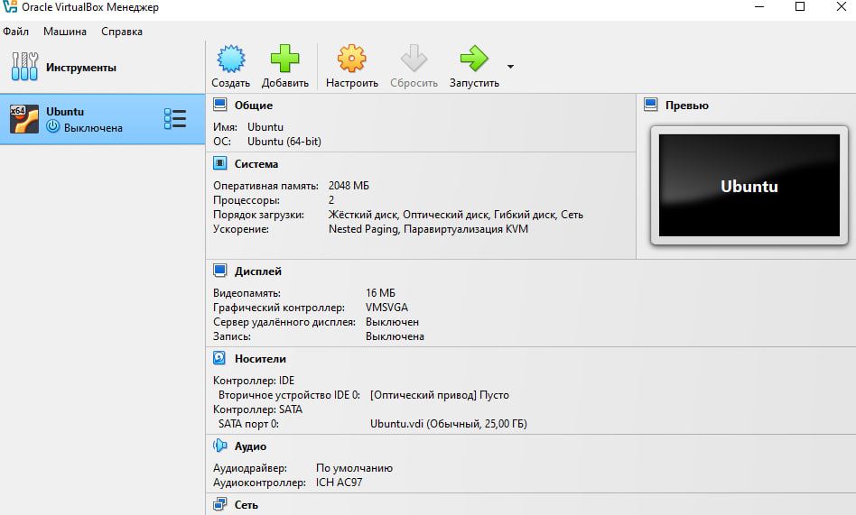
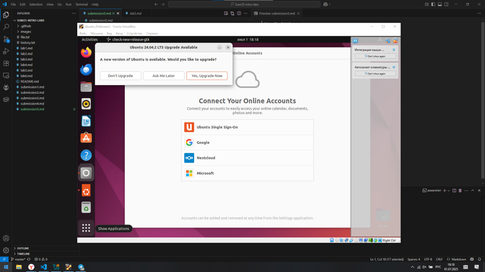

VirtualBox 7.1.10

# Virtualization Lab

## Task 1: VM Deployment

1. **Install VirtualBox**:

    VirtualBox version 7.1.10 is installed

    

2. **Deploy a Virtual Machine**:

    A virtual machine with ubuntu 22, 2 GB of RAM and 2 CPU cores has been created

    

    

## Task 2: System Information Tools

1. **Processor, RAM, and Network Information**:

    ### CPU

    We can use the `lscpu` for the processor

    ```bash
    Architecture:             x86_64
    CPU op-mode(s):         32-bit, 64-bit
    Address sizes:          39 bits physical, 48 bits virtual
    Byte Order:             Little Endian
    CPU(s):                   2
    On-line CPU(s) list:    0,1
    Vendor ID:                GenuineIntel
    Model name:             Intel(R) Core(TM) i5-10210U CPU @ 1.60GHz
        CPU family:           6
        Model:                142
        Thread(s) per core:   1
        Core(s) per socket:   2
        Socket(s):            1
        Stepping:             12
        BogoMIPS:             4223.59
        Flags:                fpu vme de pse tsc msr pae mce cx8 apic sep mtrr pge m
                            ca cmov pat pse36 clflush mmx fxsr sse sse2 ht syscall
                            nx rdtscp lm constant_tsc rep_good nopl xtopology non
                            stop_tsc cpuid tsc_known_freq pni pclmulqdq ssse3 cx16
                            pcid sse4_1 sse4_2 movbe popcnt aes rdrand hypervisor
                            lahf_lm abm 3dnowprefetch ibrs_enhanced fsgsbase bmi1
                            bmi2 invpcid rdseed adx clflushopt arat md_clear flus
                            h_l1d arch_capabilities
    Virtualization features:  
    Hypervisor vendor:      KVM
    Virtualization type:    full
    Caches (sum of all):      
    L1d:                    64 KiB (2 instances)
    L1i:                    64 KiB (2 instances)
    L2:                     512 KiB (2 instances)
    L3:                     12 MiB (2 instances)
    NUMA:                     
    NUMA node(s):           1
    NUMA node0 CPU(s):      0,1
    Vulnerabilities:          
    Gather data sampling:   Not affected
    Itlb multihit:          KVM: Mitigation: VMX unsupported
    L1tf:                   Not affected
    Mds:                    Not affected
    Meltdown:               Not affected
    Mmio stale data:        Vulnerable: Clear CPU buffers attempted, no microcode;
                            SMT Host state unknown
    Reg file data sampling: Not affected
    Retbleed:               Mitigation; Enhanced IBRS
    Spec rstack overflow:   Not affected
    Spec store bypass:      Vulnerable
    Spectre v1:             Mitigation; usercopy/swapgs barriers and __user pointe
                            r sanitization
    Spectre v2:             Mitigation; Enhanced / Automatic IBRS; RSB filling; PB
                            RSB-eIBRS SW sequence; BHI SW loop, KVM SW loop
    Srbds:                  Unknown: Dependent on hypervisor status
    Tsx async abort:        Not affected
    ```

    The output shows that there are 2 cores

    ### RAM

    To display information about RAM - `free`

    ```bash
                   total        used        free      shared  buff/cache   available
    Mem:         2015476      870396       75592       44060     1069488      946876
    Swap:        2744316        1292     2743024
    ```

    It shows 2 GB of RAM

    ### Network

    To see the network information, we can use the `ip a` (to avoid installing anything)

    ```bash
    1: lo: <LOOPBACK,UP,LOWER_UP> mtu 65536 qdisc noqueue state UNKNOWN group default qlen 1000
        link/loopback 00:00:00:00:00:00 brd 00:00:00:00:00:00
        inet 127.0.0.1/8 scope host lo
        valid_lft forever preferred_lft forever
        inet6 ::1/128 scope host 
        valid_lft forever preferred_lft forever
    2: enp0s3: <BROADCAST,MULTICAST,UP,LOWER_UP> mtu 1500 qdisc fq_codel state UP group default qlen 1000
        link/ether 08:00:27:06:ba:2a brd ff:ff:ff:ff:ff:ff
        inet 10.0.2.15/24 brd 10.0.2.255 scope global dynamic noprefixroute enp0s3
        valid_lft 85969sec preferred_lft 85969sec
        inet6 fd17:625c:f037:2:120b:8b7f:3900:d61f/64 scope global temporary dynamic 
        valid_lft 86281sec preferred_lft 14281sec
        inet6 fd17:625c:f037:2:cab2:1b9a:b219:8935/64 scope global dynamic mngtmpaddr noprefixroute 
        valid_lft 86281sec preferred_lft 14281sec
        inet6 fe80::ad46:6e4c:abad:16ce/64 scope link noprefixroute 
        valid_lft forever preferred_lft forever
    ```

2. **Operating System Specifications**:

    To see information about the operating system, I used the commands: `lsb_release -a`, `uname -a`.

    ```bash
    No LSB modules are available.
    Distributor ID:	Ubuntu
    Description:	Ubuntu 22.04.5 LTS
    Release:	22.04
    Codename:	jammy
    ```

    ```bash
    Linux Ubuntu 6.8.0-60-generic #63~22.04.1-Ubuntu SMP PREEMPT_DYNAMIC Tue Apr 22 19:00:15 UTC 2 x86_64 x86_64 x86_64 GNU/Linux
    ```

    From this information, it can be seen that Ubuntu is indeed 22 :-)

