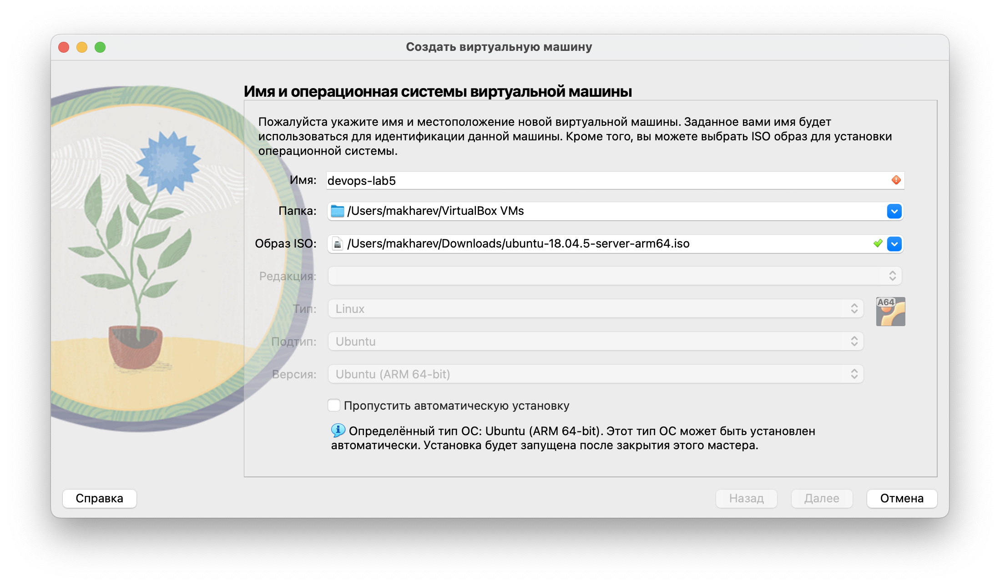
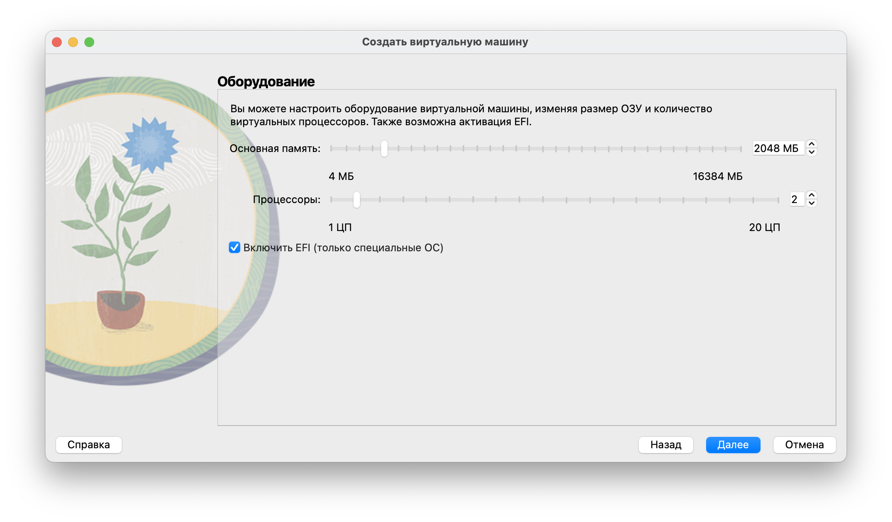
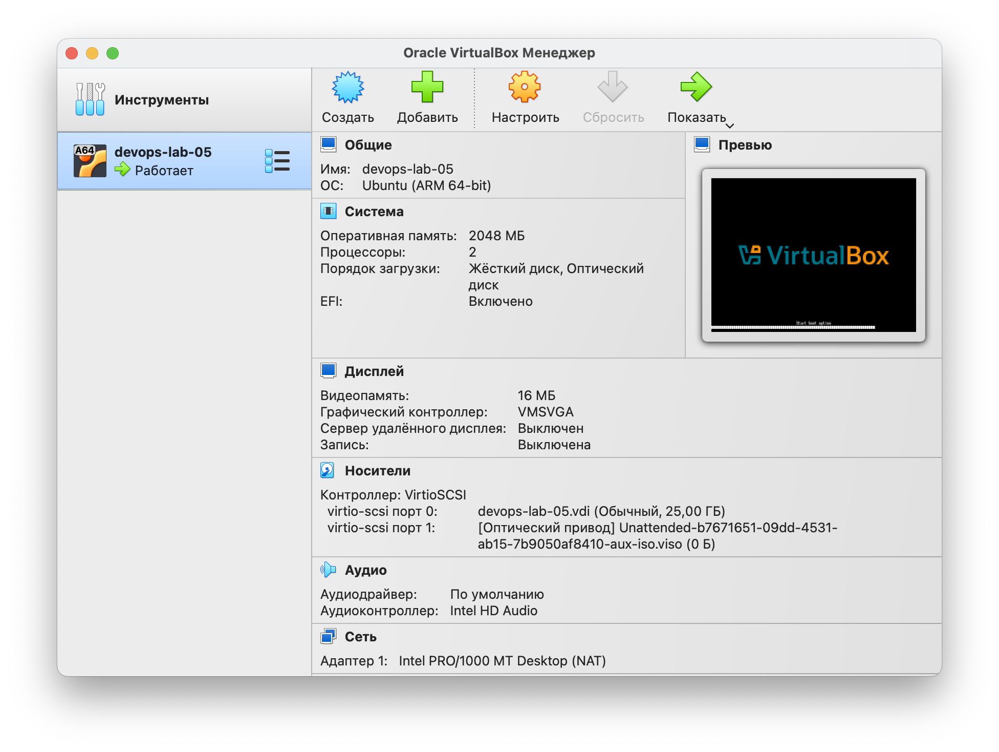
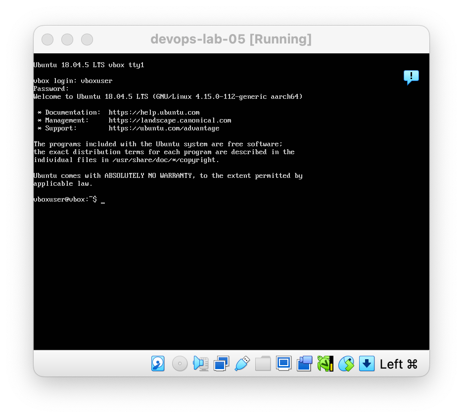
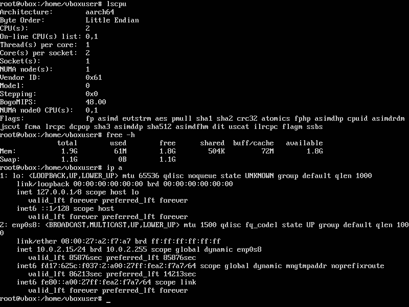
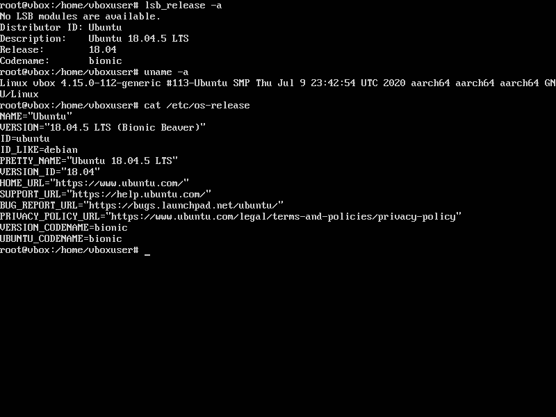

# Lab 05

## Task 1

1. Downloaded and installed VirtualBox 7.1.12-169651-maсOSArm64.

2. I downloaded ISO image of Ubuntu 18.04 from the internet and configured the VM with it including 2 GB RAM, 2 CPU cores, and 25 GB disk space.






## Task 2

1. **`lscpu`** → Displays detailed CPU architecture information (cores, threads, vendor, etc.).  
2. **`free -h`** → Shows system memory usage (RAM and swap) in a human-readable format.  
3. **`ip a`** → Lists all network interfaces and their IP addresses.  
4. **`lsb_release -a`** → Prints Linux distribution details (e.g., Ubuntu version, codename).  
5. **`uname -a`** → Outputs kernel and system information (kernel version, hostname, hardware architecture).  
6. **`cat /etc/os-release`** → Displays OS identification data (ID, version, name) in a standardized format.  

### CPU, Memory, Network
```bash
lscpu
free -h
ip a
```



### Distribution, Kernel, OS Details
```bash
lsb_release -a
uname -a
cat /etc/os-release
```
