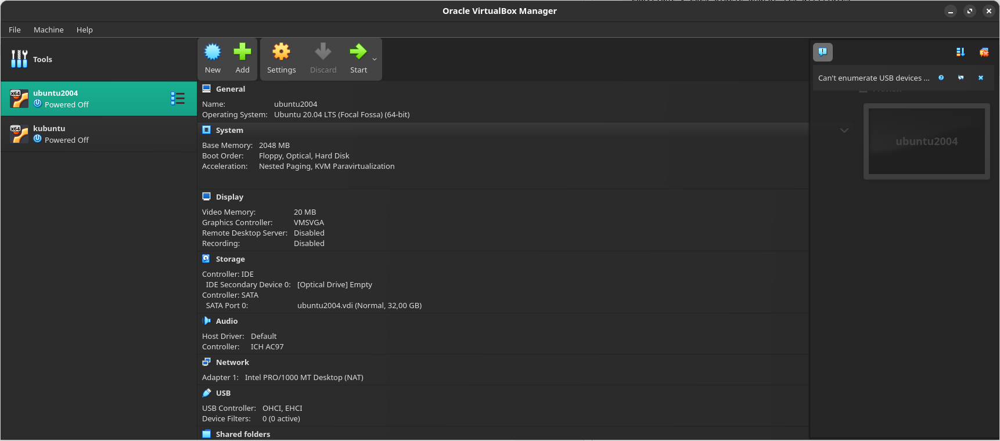

## Task 1

Virtual Box Virsion:

~~~bash
VirtualBox Graphical User Interface Version 7.1.6 r167084
© 2004-2025 Oracle and/or its affiliates (Qt6.8.1)
Copyright © 2025 Oracle and/or its affiliates
~~~

Installation ubuntu ( I already have this system for ROS solutions):

## Task 2

Tools used for the information: `glances` (requires installation).
Commands used for the information: `glances`.

On the image we can see separately presented information about:
1. `CPU`: Total **processor** usage (user 1.0% - time spent on user-space processes, system 0.6% - kernel space CPU usage, idle 99.0% - mostly free CPU).
2. `MEM`: 13.8% of **RAM** used (9.48 GB total, 1.31 GB used, 8.17 GB free)
3. `SWAP`: 0.0% swap usage (good news, memory is sufficient to avoid swapping to disk)
4. `ctx_sw`: 858 context switches per second, measures how often the CPU swicthes tasks
5. `LOAD`: system load averages (0.20 (1 min), 0.37 (5 min), 0.26 (15 min))
6. `guest`: no virtualization CPU usage
7. `enp0s3`: **network** data, `Rx/s` (Receive) and `Tx/s` (Transmit) show bytes per second. Currently, there is no network traffic.
8. `TASKS`: outlines the current processes running, their CPU/RAM consumption and other useful statistics.