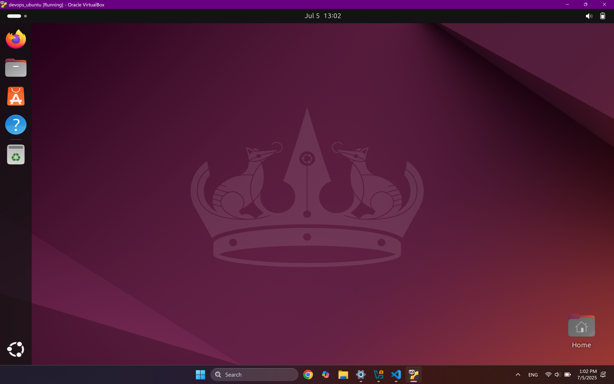
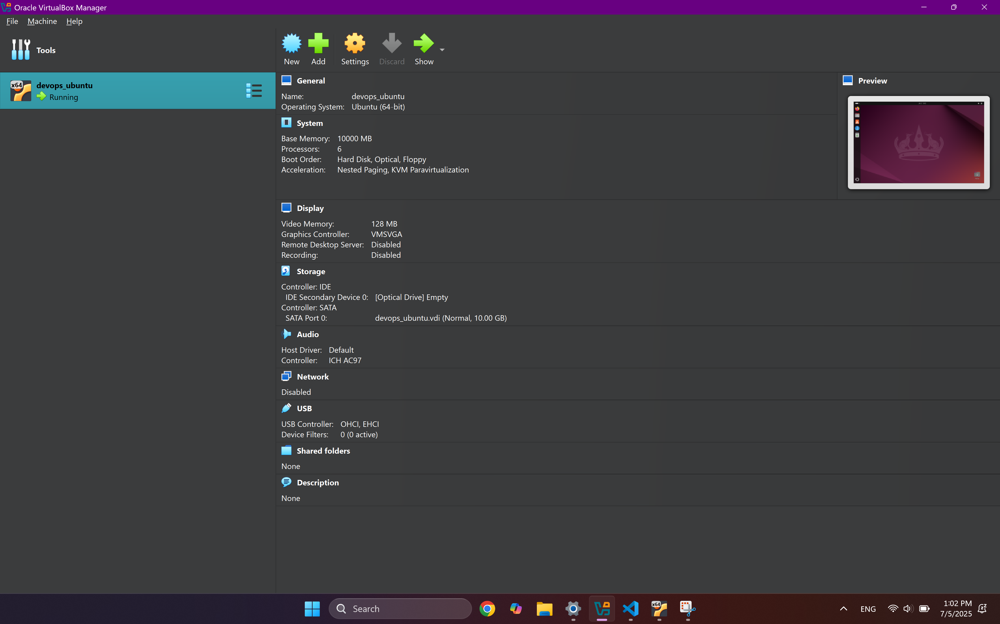
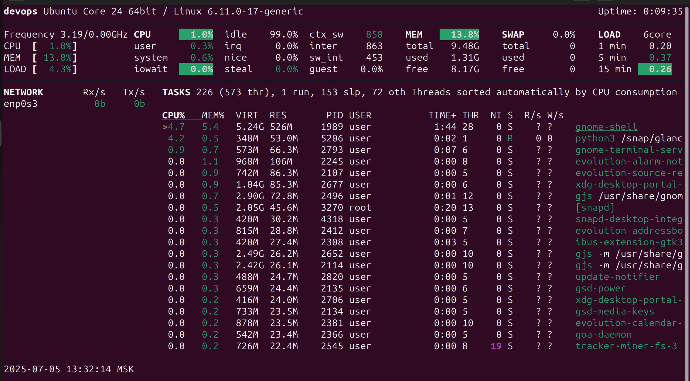
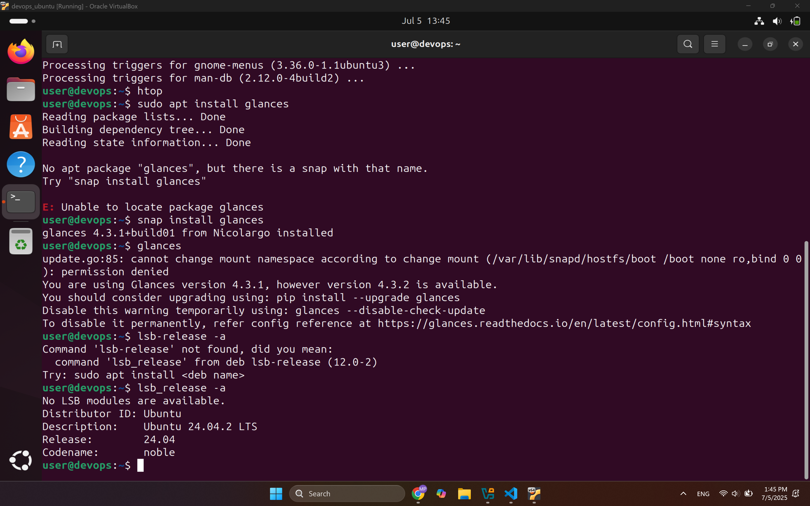

# Lab 5
## Task 1: VM Deployment

### 1. VirtualBox version number

7.1.10 r169112 (Qt6.5.3)

### 2. VM Deployment

1. Download an Ubuntu .iso file, I used the [following link](https://ubuntu.com/download/desktop/thank-you?version=24.04.2&architecture=amd64&lts=true).
2. Open installed Oracle VirtualBox.
3. Click `New`.
4. Configure the VM. My configuration:
```
Name: devops_ubuntu
Folder: C:\Users\user\VirtualBox VMs
ISO Image: C:\Users\user\Downloads\ubuntu-24.04.2-desktop-amd64.iso
Edition:
Type: Linux
Subtype: Ubuntu
Version: Ubuntu (64-bit)
□ Skip Unattended Installation
```
5. Click `Next`.
6. Configure username, password, hostname and domain name for the guest OS.
7. Accept to install guest additions and select the correct path to VBoxGuestAdditions.iso file.
8. Configure hardware resources. My choice:
```
Base Memory: 10000 MB
Processors: 6
✓ Enable EFI (special OSes only)
```
9. Click `Next`
10. Configure virtual hard disk. My choice:
```
Create a Virtual Hard Disk Now
Disk Size: 10 GB
```
11. Click `Next`
12. Click `Finish`
13. To configure the network manually, I first select the newly-created `devops_ubuntu` in the left tab.
14. Click on `Settings`
15. Select `Network` and turn on Enable Network Adapter, choosing NAT, so the guest OS will have its own access to the Internet.
16. Select `Display` and increase allocated memory to 128 MB.
17. Click `OK`
18. Launch the VM and select `Try or install Ubuntu`
19. Wait untill the unattended installation finishes installing it.

### 3. Screenshots of the Running VM





## Task 2: System Information Tools

### 1. Processor, RAM, and Network Information

Tools used for the information: `glances` (requires installation).
Commands used for the information: `glances`.
Command output:


On the image we can see separately presented information about:
1. `CPU`: Total **processor** usage (user 1.0% - time spent on user-space processes, system 0.6% - kernel space CPU usage, idle 99.0% - mostly free CPU).
2. `MEM`: 13.8% of **RAM** used (9.48 GB total, 1.31 GB used, 8.17 GB free)
3. `SWAP`: 0.0% swap usage (good news, memory is sufficient to avoid swapping to disk)
4. `ctx_sw`: 858 context switches per second, measures how often the CPU swicthes tasks
5. `LOAD`: system load averages (0.20 (1 min), 0.37 (5 min), 0.26 (15 min))
6. `guest`: no virtualization CPU usage
7. `enp0s3`: **network** data, `Rx/s` (Receive) and `Tx/s` (Transmit) show bytes per second. Currently, there is no network traffic.
8. `TASKS`: outlines the current processes running, their CPU/RAM consumption and other useful statistics.

### 2. Operating System Specifications

Tools used for the information: `lsb_release` (installed by default).
Commands used for the information: `lsb_release -a`.
Command output:


On the image we can see the OS name, version, and codename.