# Lab 5: Virtualization

## Task 1: VM Deployment

### Install VirtualBox

Installed version:

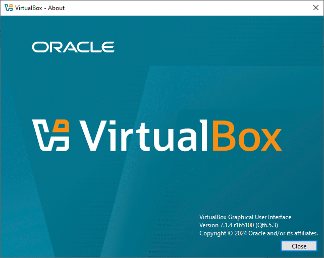

### Deploy a Virtual Machine

1. Download ISO Image of Ubuntu. I had Ubuntu 18 already downloaded.
2. Create a new virtual machine.

Select ISO file and set the name to `Ubuntu18.04.6`:

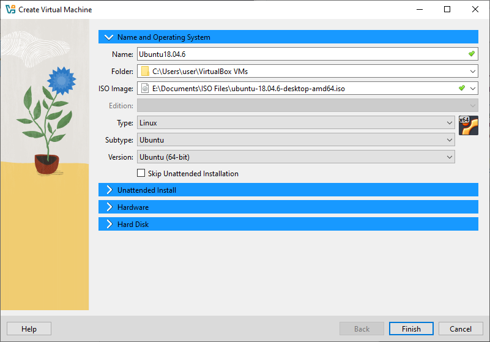

Keep suggested user configuration:

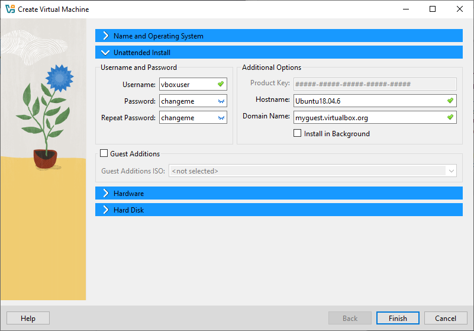

Set RAM to 4 GB and CPU to 4:

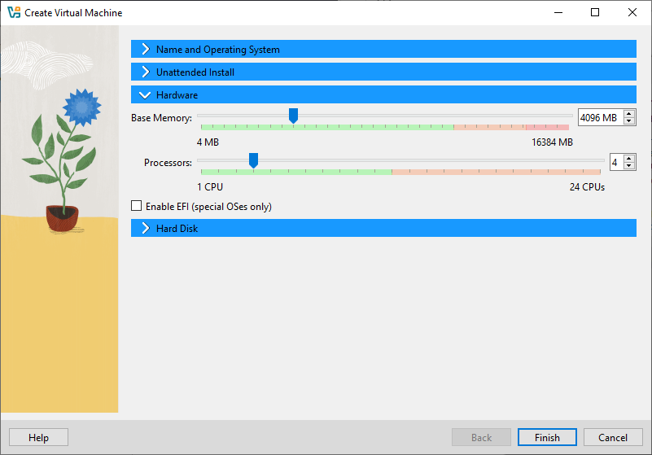

Keep suggested disk configuration:

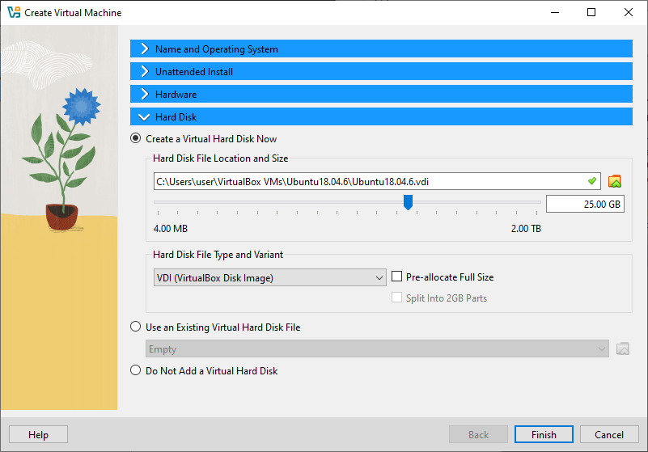

Finish:

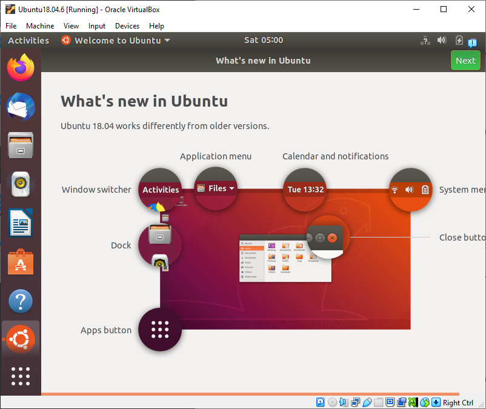

## Task 2: System Information Tools

### Processor, RAM, and Network Information

For displaying CPU, RAM, and network information I decided to use `lshw` which was pre-installed:

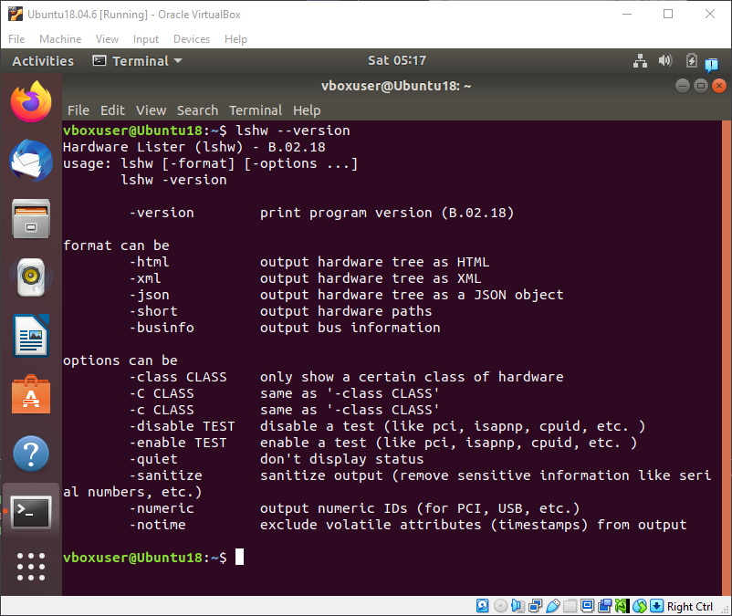

Login as root for `lshw` to display complete information:

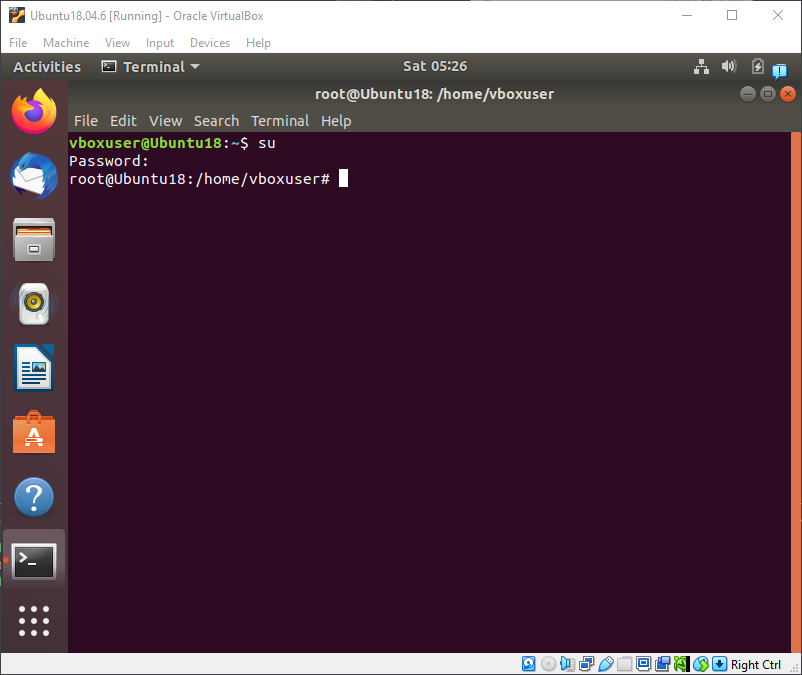

Display CPU info:

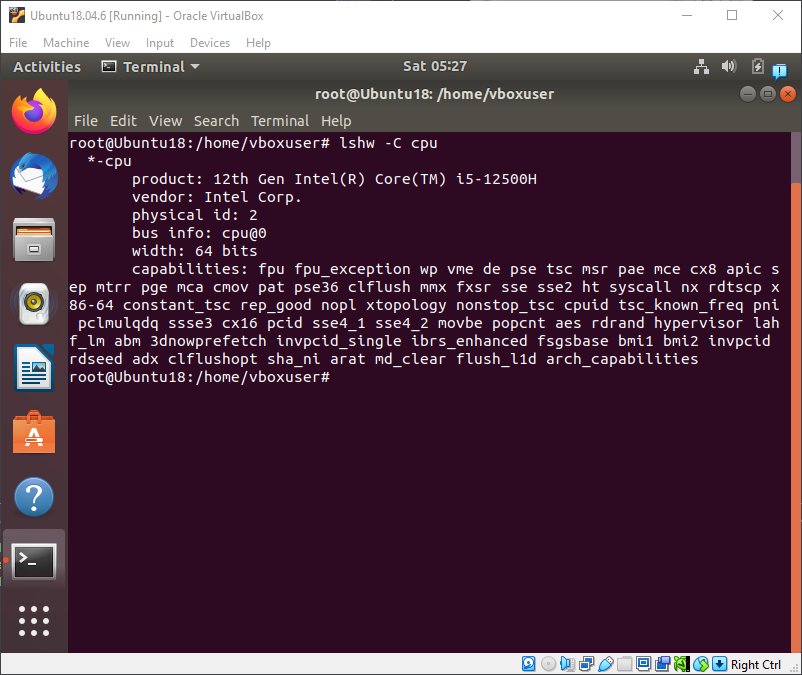

Display RAM info:

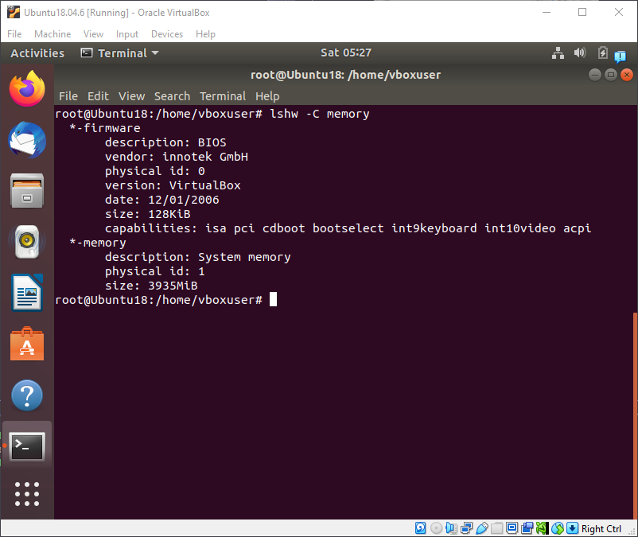

Display network info:

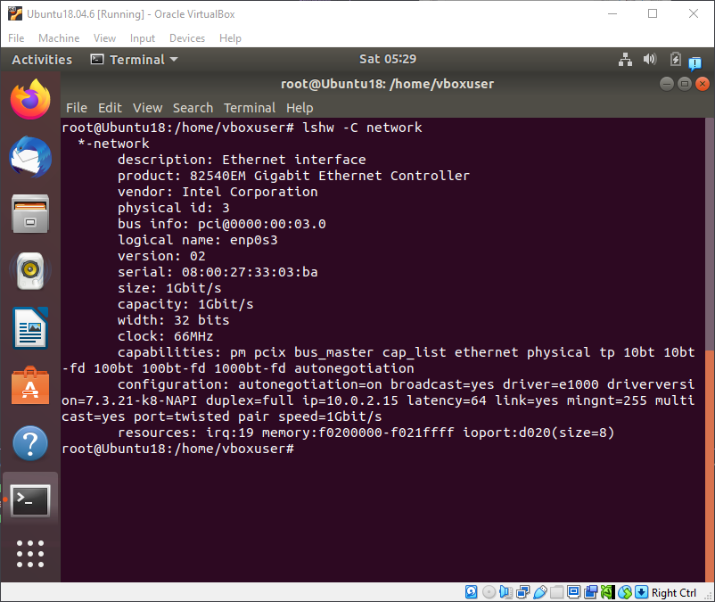

### Operating System Specifications

For OS specifications I decided to use `neofetch` which has very appealing output formatting.

Install `neofetch`:

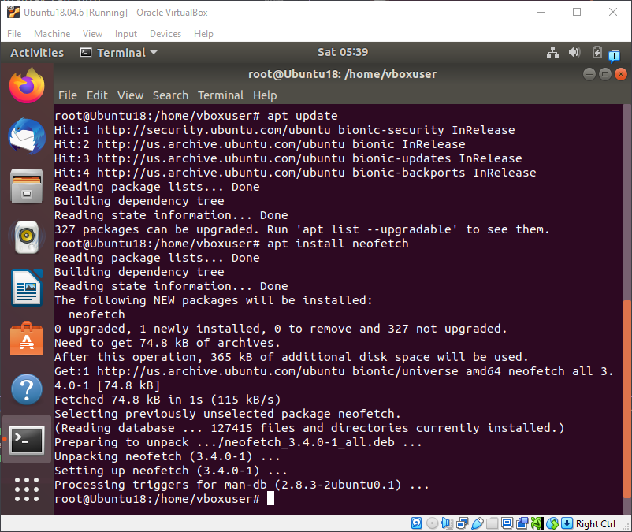

Display OS info:

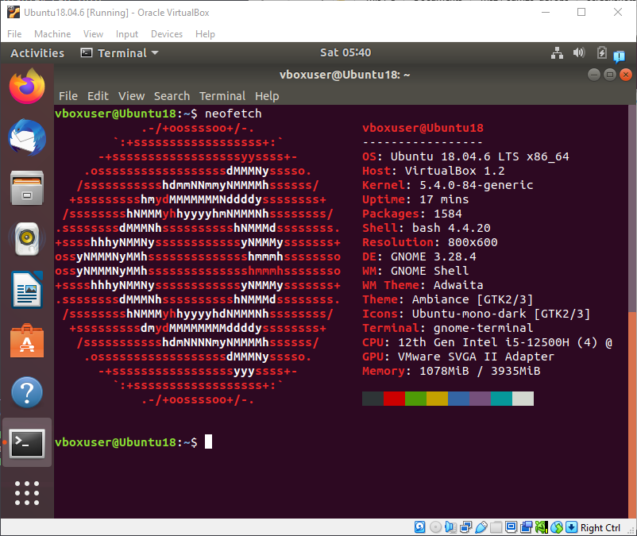
