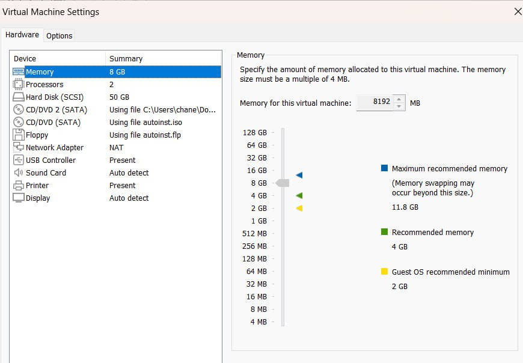
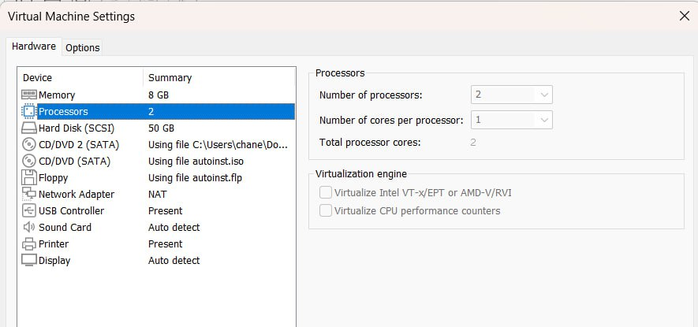
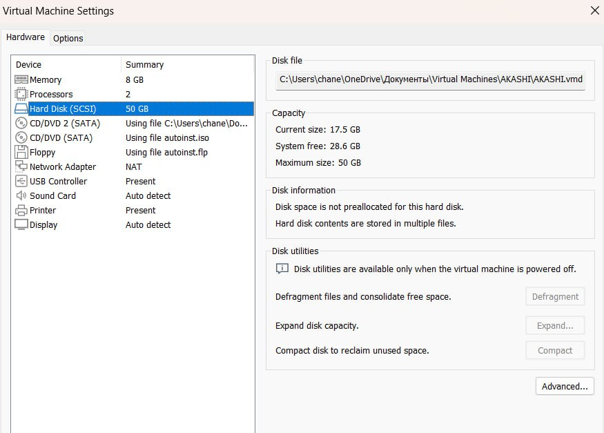
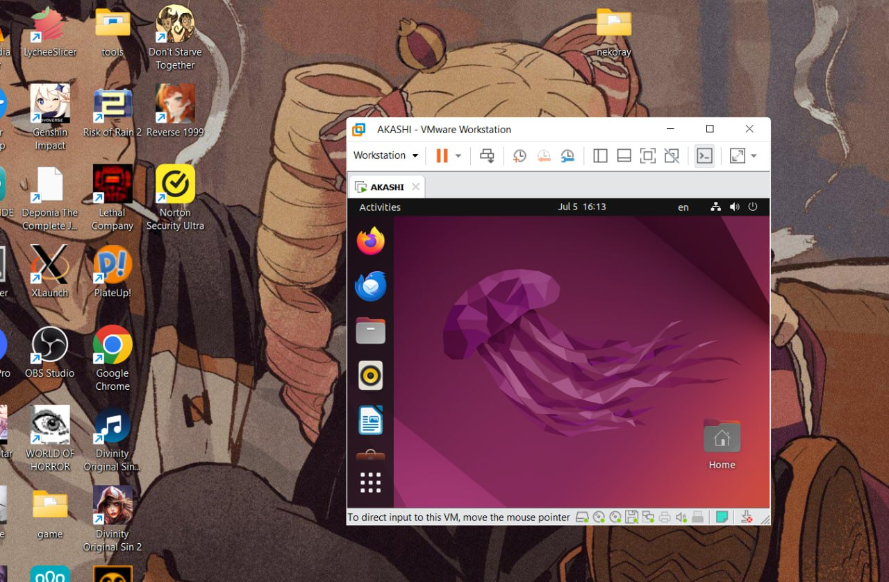
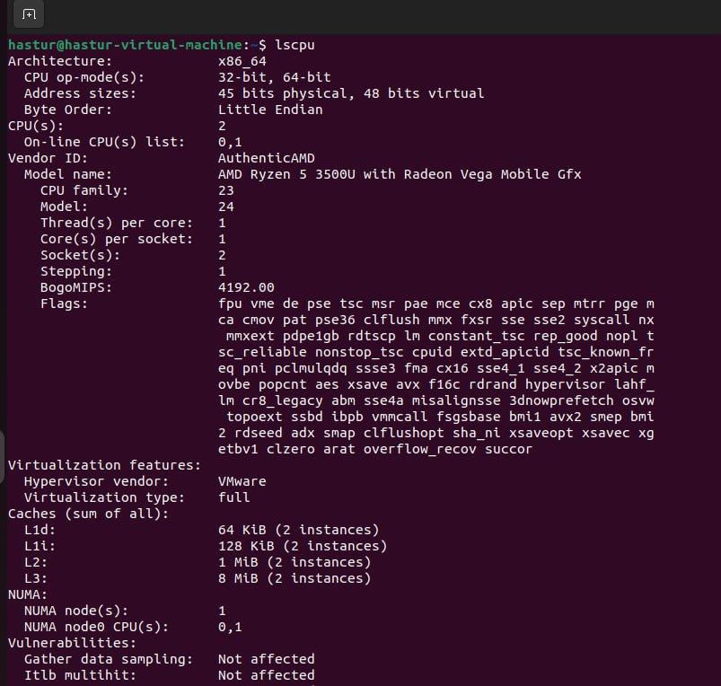
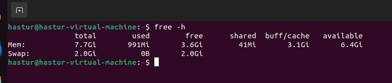
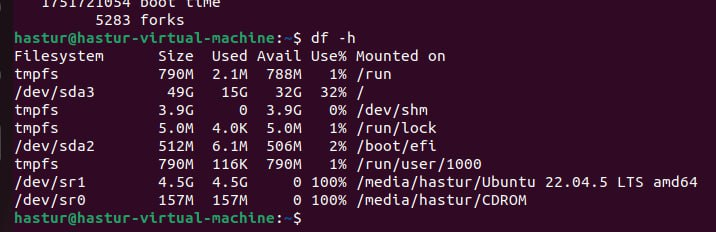
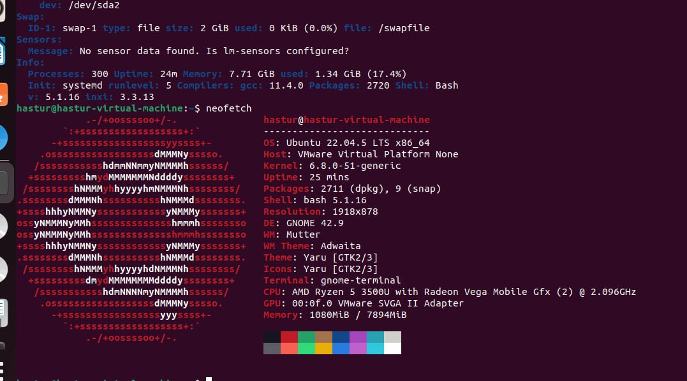

# Credentials

The work is done by M24-RO student  
Anton Kirilin  
a.kirilin@innopolis.university  

# Task 1  

I prefer to use vmware, since their software is more powerfull, less laggy and is easy to work with.  
I am using 17.0.0 version of VMware Workstation pro.

Let me show you the current setting of a fresh virtual machine that I have created.  

Personally I care rn only about the main charateristics such as memory, cpu and RAM  

Here is the running virtual machine

# Task 2

Let's use the basic tools, since lshw shows a lot of cpu cores and all the caches. Probably has something to do with how the vritualisation in vmware works, but I did not dive deep into that. So here we are.

Now let's show the netwrok and os info here is the first detailed option

hree is a more fashionable way to view that with ascii logo

