# Lab 5 - Virtualization

## Task 1 - VM Deployment
 
Я привык к VMware, поэтому буду использовать его вместо виртуалбокса \
Он у меня уже установлен, версия 17.5.1

### Установка и настройка виртуалки
В VMware перехожу к созданию виртуальной машины, выбираю обычный процесс без продвинутых фич
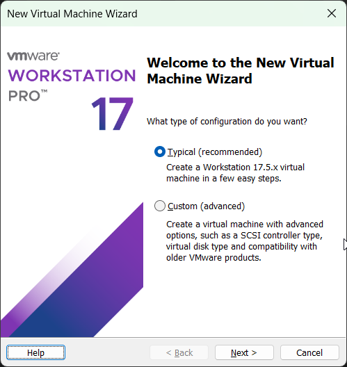

Выбираю образ системы, в моем случае это убунту 22.04. Также выбираю имя машины и ее расположение на физическом диске.
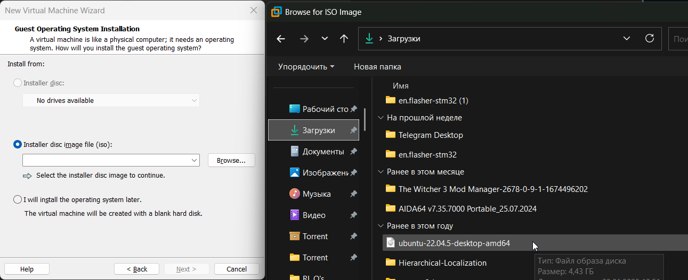
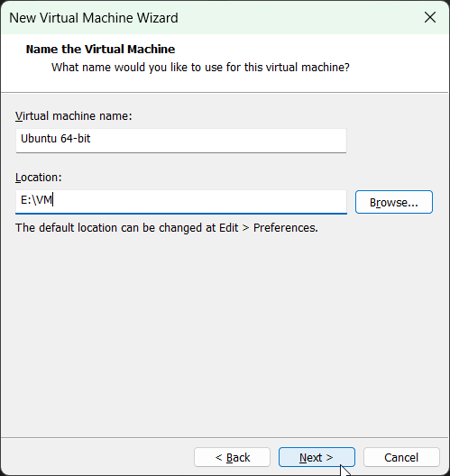

Выбираю размер виртуального диска, не ставил большой для этой машины
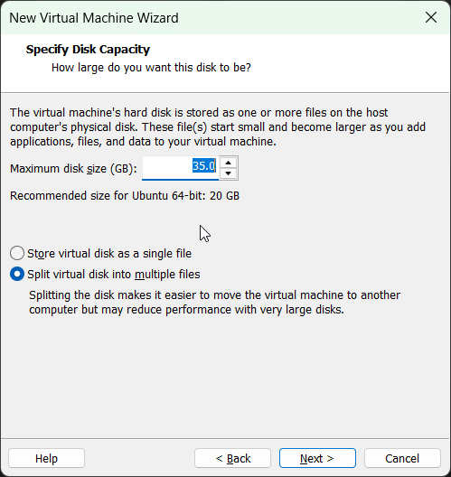

Изменил параметры, вместо стандартных 4гб оперативной памяти выделил 17, а также 4 ядра процессора вместо двух.
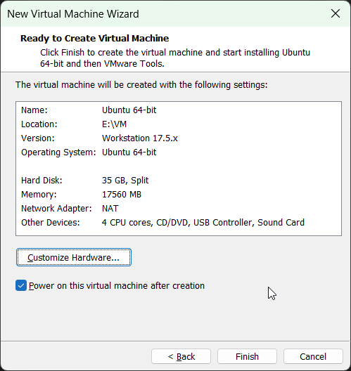

После этого машина создалась, процесс установки системы забыл скринить, к сожалению.
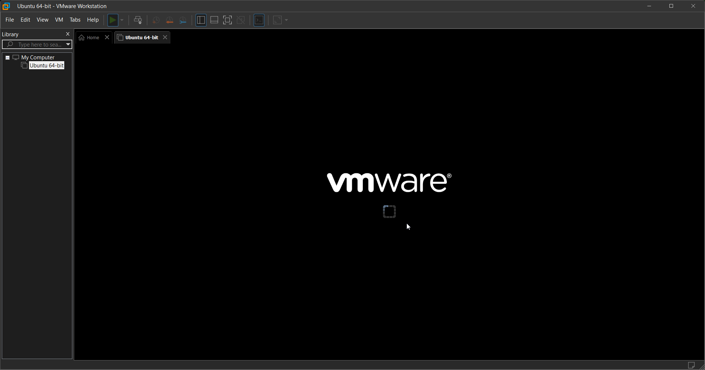

### Исследование системной информации машины

Для получения информации, запрашиваемой в условии задания, можно воспользоваться разными инструментами

#### 1. Встроенные в систему
Для их использования ничего не нужно устанавливать, но все они имеют разный вид и надо их помнить. Вывод объемный и не слишком удобно читаемый
* Процессор: `lscpu`
* Оперативная память: `free -h`
* Сетевые интерфейсы: `ip addr show`
* Ядро и архитектура: `uname -a`
* Дистрибутив и версия: `cat /etc/os-release`
* Прошлые два пункта, но красивее: `lsb_release -a`

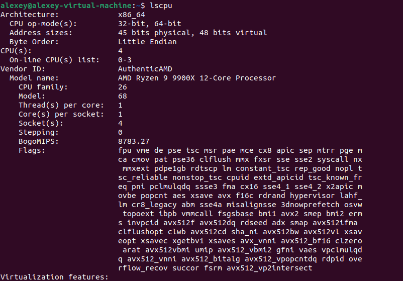 \
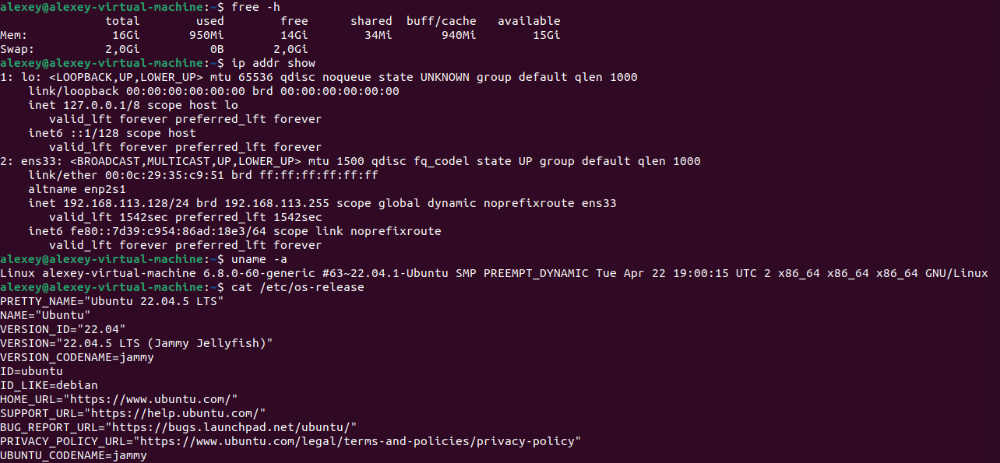 \
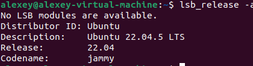 

#### 2. `lshw` один инструмент для разных классов оборудования
Отдельный инструмент, который может быть предустановлен в дистрибутиве. Но если нет, устанавливается через `sudo apt install lshw`. В нем через одну понятную команду с указанием класса оборудования можем смотреть информацию о нем. \
Расписывается еще более подробно и менее читаемо, чем в прошлый командах, также отсутствует команда для системной информации

* Процессор: `lshw -class processor`
* Оперативная память: `lshw -class memory`
* Сетевые интерфейсы: `sudo lshw -class network`
* ОС: -
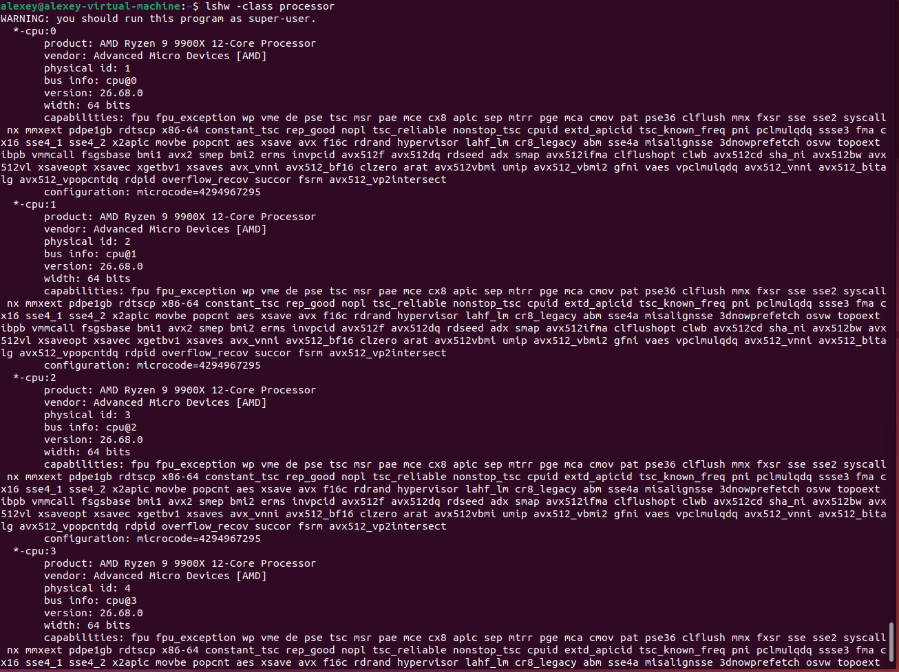 \
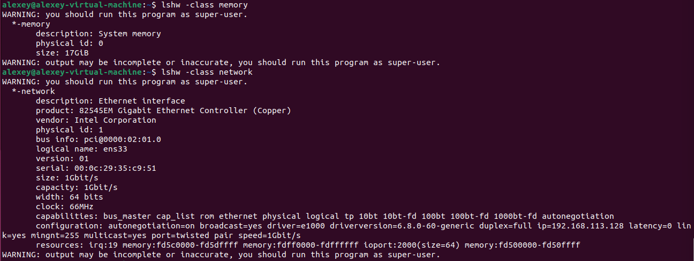

#### 2. `inxi` один инструмент для всего
Отдельный инструмент, в моем дистрибутиве его не было, не знаю, предустанавливается ли где-то. Устанавливается через `sudo apt install inxi`. В нем также одна команда с соответствующими параметрами используется для просмотра всей желаемой информации. \
Наиболее емкий и читаемый вывод из всех, при желании можно вывести подробнее с параметром `-v7`

* Процессор: `inxi -C`
* Оперативная память: `inxi -m`
* Сетевые интерфейсы: `inxi -n`
* ОС: `inxi -S`

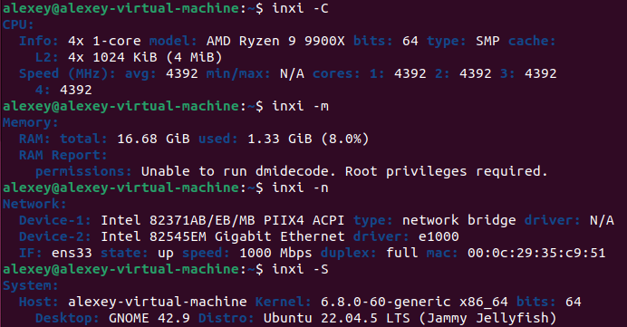