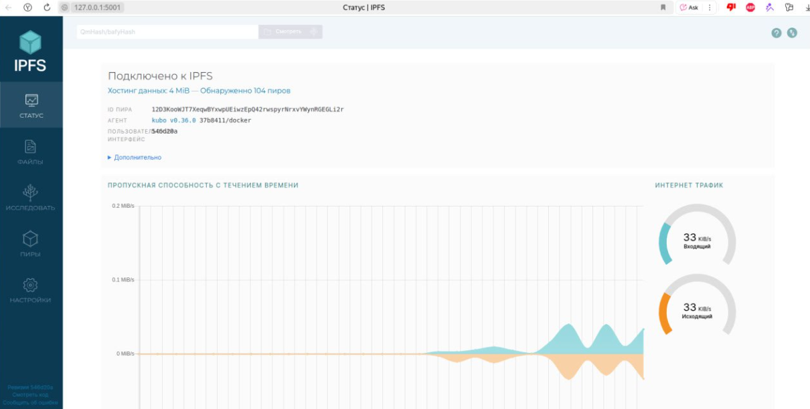

# Лабораторная работа 5

## Задание 1
В рамках работы установил VirtualBox 7.1.10 и ububtu22. 

Настройки создания виртуальной машины: 
    
    - Версия ubunu22
    - 16Gb RAM
    - 8 Cores
    - 100Gb размер дискового пространства

Нюансы: 

    - Необходмо руками включить аппаратную виртуализацию в BIOS, иначе виртуальная машина будет сильно тормозить 
    - Необзодиом руками ставить дополнительный плагин что бы работал полныэкранный режим 

## Задание 2

    uname -a - информация о системе
    lscpu – детали CPU (архитектура, ядра, потоки, кэш).
    free -h - использование RAM
    ifconfig – сетевые интерфейсы. (что бы работало надо исполнить apt install net-tools)

