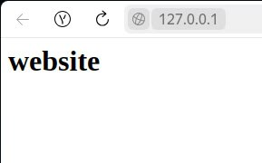

# Containers Lab - Docker

## Task 0: Image Exporting

**Objective**: Exporting images.

1. **Export Image**

   ```sh
   docker pull ubuntu:latest
   docker save -o ubuntu_image.tar ubuntu:latest
   ```

   To find out the size of the image, we can use `sudo docker images ubuntu:latest`

   Output:
   ```sh
   REPOSITORY   TAG       IMAGE ID       CREATED       SIZE
   ubuntu       latest    f9248aac10f2   12 days ago   78.1MB
   ```

   To determine the archive size - `ls -lh ubuntu_image.tar`

   Output:

   ```bash
   -rw------- 1 root root 77M июл  2 14:49 ubuntu_image.tar
   ```

   Although in this case the image size turned out to be larger than the archive size (78.1 vs. 77), .tar may be larger, since Docker stores images as compressed layers. docker save exports uncompressed content.a tar containing all the layers in raw format.

## Task 1: Core Container Operations

1. **List Containers**

   ```sh
   docker ps -a
   ```

   Output:

   ```sh
    CONTAINER ID   IMAGE     COMMAND   CREATED   STATUS    PORTS     NAMES
   ```

   There is nothing, as no container is running.

2. **Pull Ubuntu Image**

   ```sh
   docker pull ubuntu:latest
   ```
   Output

   ```sh
   latest: Pulling from library/ubuntu
   b08e2ff4391e: Pull complete 
   Digest: sha256:440dcf6a5640b2ae5c77724e68787a906afb8ddee98bf86db94eea8528c2c076
   Status: Downloaded newer image for ubuntu:latest
   docker.io/library/ubuntu:latest
   ```

   Now the Ubuntu image has appeared in the list of images (`sudo docker images ubuntu:latest`).

   ```bash
   REPOSITORY   TAG       IMAGE ID       CREATED       SIZE
   ubuntu       latest    f9248aac10f2   12 days ago   78.1MB
   ```

   The image size is 78.1MB

3. **Run Interactive Container**
  
   ```sh
   docker run -it --name ubuntu_container ubuntu:latest
   ```

   After executing the command, we enter the container interactively.

   Output:

   ```sh
   root@4224a5078dff:/# exit
   exit
   ```

   ```sh
   CONTAINER ID   IMAGE           COMMAND       CREATED              STATUS                          PORTS     NAMES
   4224a5078dff   ubuntu:latest   "/bin/bash"   About a minute ago   Exited (0) About a minute ago             ubuntu_container
   ```

   Exit container with `exit`.

4. **Remove Image**

   ```sh
   docker rmi ubuntu:latest
   ```

   Output:

   ```sh
   Error response from daemon: conflict: unable to remove repository reference "ubuntu:latest" (must force) - container 4224a5078dff is using its referenced image f9248aac10f2
   ```
   We cannot delete the `ubuntu:latest` image as long as the container created from this image exists. Docker does not delete an image as long as at least one container (even a stopped one) references it.


   Delete container:

   ```sh 
   sudo docker rm 4224a5078dff
   ```

   And again `sudo docker rmi ubuntu:latest`

   ```sh
   Untagged: ubuntu:latest
   Untagged: ubuntu@sha256:440dcf6a5640b2ae5c77724e68787a906afb8ddee98bf86db94eea8528c2c076
   Deleted: sha256:f9248aac10f2f82e0970222e36cc7b71215b88e974e001282e5cd89797a82218
   Deleted: sha256:45a01f98e78ce09e335b30d7a3080eecab7f50dfa0b38ca44a9dee2654ac0530
   ```

   Now image has been deleted

## Task 2: Image Customization

**Objective**: Create and deploy custom images.

1. **Deploy Nginx**

   ```sh
   docker run -d -p 80:80 --name nginx_container nginx
   ```

   Output:

   ```sh
   Unable to find image 'nginx:latest' locally
   latest: Pulling from library/nginx
   3da95a905ed5: Pull complete 
   6c8e51cf0087: Pull complete 
   9bbbd7ee45b7: Pull complete 
   48670a58a68f: Pull complete 
   ce7132063a56: Pull complete 
   23e05839d684: Pull complete 
   ee95256df030: Pull complete 
   Digest: sha256:93230cd54060f497430c7a120e2347894846a81b6a5dd2110f7362c5423b4abc
   Status: Downloaded newer image for nginx:latest
   263fc03b65546cbd362c5c5a4ed4de5d7fefa6dd35de4f4caa0cb00d77bbbc96
   ```
   The image was not found locally, so it was downloaded. This is a system image with a web server installed.
   
   Curl will make HTTP requests to the localhost (`curl localhost`)

   Output:

   ```sh
   <!DOCTYPE html>
   <html>
   <head>
   <title>Welcome to nginx!</title>
   <style>
   html { color-scheme: light dark; }
   body { width: 35em; margin: 0 auto;
   font-family: Tahoma, Verdana, Arial, sans-serif; }
   </style>
   </head>
   <body>
   <h1>Welcome to nginx!</h1>
   <p>If you see this page, the nginx web server is successfully installed and
   working. Further configuration is required.</p>

   <p>For online documentation and support please refer to
   <a href="http://nginx.org/">nginx.org</a>.<br/>
   Commercial support is available at
   <a href="http://nginx.com/">nginx.com</a>.</p>

   <p><em>Thank you for using nginx.</em></p>
   </body>
   </html>
   ```

2. **Customize Website**

   - Created an HTML file with the specified content:

   ```html
   <html>
      <head>
         <title>The best</title>
      </head>
      <body>
         <h1>website</h1>
      </body>
   </html>
   ```

   - Copy the HTML file to the container:

   ```sh
   docker cp index.html nginx_container:/usr/share/nginx/html/
   ```

   Output:

   ```sh
   Successfully copied 2.05kB to nginx_container:/usr/share/nginx/html/
   ```

   Thus, we copied the created file with the HTML code of the page into the running container.

3. **Create Custom Image**

   ```sh
   docker commit nginx_container my_website:latest
   ```

   Output:

   ```sh
   sha256:d87905e04339cf345a7de1071e653a282141b9f9bf60af322b4d6e6714335484
   ```

   This command creates a new image based on the current state of the `nginx_container` container.

4. **Remove Original Container**:
   - Remove the original container `nginx_container`

     ```sh
     docker rm -f nginx_container
     ```

5. **Create New Container**:
   - Create a new container using the custom image you've created (the same way as the original container).

      ```sh
      docker run -d -p 80:80 --name my_website_container my_website:latest
      ```

      Output:

      ```sh
      a8d11b71d3718fbd8864a0c0790135831c9e904e63e7c4385163def952f1788c
      ```

      Thus, we create a new container based on the modified image (another page index.html )


6. **Test Web Server**:
   - Use the `curl` command to access the web server at `127.0.0.1:80`.

      ```sh
      curl http://127.0.0.1:80
      ```

      Output:

      ```sh
      <html>
         <head>
            <title>The best</title>
         </head>
         <body>
            <h1>website</h1>
         </body>
      </html>
      ```

      Now on the main page of the web server is the code that we downloaded manually.

      

7. **Analyze Image Changes**:
   - Use the `docker diff` command to analyze the changes made to the new image.

      ```sh
      docker diff my_website_container
      ```

      Output

      ```sh
      C /etc
      C /etc/nginx
      C /etc/nginx/conf.d
      C /etc/nginx/conf.d/default.conf
      C /run
      C /run/nginx.pid
      ```

      This command shows all the changes in the file system of the `my_website_container` container compared to the original image from which it was created. It does not show the file being added index.html since it was added not to the container, but to the original image.

## Task 3: Container Networking

**Objective**: Explore Docker networking fundamentals.

1. **Create Network**:
   - Create a bridge network named `lab_network`

   ```sh
   docker network create lab_network
   ```

   Output

   ```sh
   189b854d06d215e9e55c126bafa5d7619bedecf171cb6386656382f65e2a2cca
   ```

   This command creates an isolated internal network into which containers can be launched so that they see each other by name and do not conflict with external networks.

2. **Run Connected Containers**:
   - Start two Alpine containers attached to the network:

   ```sh
   docker run -dit --network lab_network --name container1 alpine ash
   docker run -dit --network lab_network --name container2 alpine ash
   ```

   Output

   ```sh
   66f2c6cbebc837a5db00dc0b663e04115d9245909b59ab005d267d7e2777c3b5

   cecbdb7697a102a33f6dc56b46d0923f66cafdcc80f77d69213a9438a40b62e2
   ```

3. **Test Connectivity**:
   - From `container1`, ping `container2` by name:

   ```sh
   docker exec container1 ping -c 3 container2
   ```

   Output

   ```sh
   PING container2 (172.18.0.3): 56 data bytes
   64 bytes from 172.18.0.3: seq=0 ttl=64 time=0.079 ms
   64 bytes from 172.18.0.3: seq=1 ttl=64 time=0.051 ms
   64 bytes from 172.18.0.3: seq=2 ttl=64 time=0.057 ms

   --- container2 ping statistics ---
   3 packets transmitted, 3 packets received, 0% packet loss
   round-trip min/avg/max = 0.051/0.062/0.079 ms
   ```

   The `docker exec` command runs the command inside an already running container.

   Docker's internal DNS resolution allows containers to address each other by name, not just by IP addresses. This works thanks to the built-in Docker DNS server, which serves user networks (in our case, lab_network)


## Task 4: Volume Persistence

**Objective**: Understand data persistence in containers.

1. **Create Volume**:
   - Create a named volume `app_data`:

      ```sh
      docker volume create app_data
      ```
      
      Output

      ```sh
      app_data
      ```

      Command creates a Docker volume that allows you to save data outside of the container lifecycle so that it is not deleted when the container is stopped.

2. **Run Container with Volume**:
   - Start Nginx with volume mounted:

   ```sh
   docker run -d -v app_data:/usr/share/nginx/html --name web nginx
   ```

3. **Modify Content**:
   
   Copying a previously created file `index.html` to a dedicated volume

   ```sh
   docker cp index.html web:/usr/share/nginx/html/
   ```

4. **Verify Persistence**:
   - Stop and remove container:

      ```sh
      docker stop web && docker rm web
      ```

   - Create new container with same volume:

      ```sh
      docker run -d -v app_data:/usr/share/nginx/html --name web_new nginx
      ```

   - Checking the content using `curl localhost`

      Output:

      ```sh 
      <html>
         <head>
            <title>The best</title>
         </head>
         <body>
            <h1>website</h1>
         </body>
      </html>
      ```
   When starting the container `index.html` was taken from `app_data`

## Task 5: Container Inspection

**Objective**: Examine container internals.

1. **Run Redis Container**:

   ```sh
   docker run -d --name redis_container redis
   ```

   Output:

   ```sh
   Unable to find image 'redis:latest' locally
   latest: Pulling from library/redis
   3da95a905ed5: Already exists 
   db655ba2dcca: Pull complete 
   4ef8fa7693bb: Pull complete 
   881b4a6fb2ec: Pull complete 
   6d7393f5b310: Pull complete 
   4f4fb700ef54: Pull complete 
   ab22bb3606ca: Pull complete 
   Digest: sha256:b43d2dcbbdb1f9e1582e3a0f37e53bf79038522ccffb56a25858969d7a9b6c11
   Status: Downloaded newer image for redis:latest
   14a5d645746e947a8b2f845aad10775de8c12fd1110df39306c788565cc2bdc0
   ```

2. **Inspect Processes**:
   - Find Redis server process:

   ```sh
   docker exec redis_container ps aux
   ```

   Output

   ```sh
   OCI runtime exec failed: exec failed: unable to start container process: exec: "ps": executable file not found in $PATH: unknown
   ```
   Since the ps command is not installed inside the container, which is usually used to view processes, an error appears. 

   We can view the processes associated with the container using the host's system tools.

   ```sh
   docker top redis_container
   ```
   Output

   ```sh
   UID                 PID                 PPID                C                   STIME               TTY                 TIME                CMD
   999                 7387                7364                0                   12:27               ?                   00:00:00            redis-server *:6379
   ```

3. **Network Inspection**:
   - Get container IP address:

      ```sh
      docker inspect -f '{{range.NetworkSettings.Networks}}{{.IPAddress}}{{end}}' redis_container
      ```

      ```sh
      172.17.0.2
      ```

4. **Compare `docker exec` vs `docker attach`**

   `docker exec`:
   
   - Starts a new process inside an already running container.
   - The command is executed in a parallel session.
   - It does not affect the main process.

   `docker attach`:

   - Connects terminal to the stdin/stdout of the container's main process.
   - It's like "joining" the console of an already running program.

   It is recommended to use docker exec for debugging, and docker attach only when interacting with the main process.


## Task 6: Cleanup Operations

1. **Verify Cleanup**:
   - Check disk usage:

   ```sh
   docker system df
   ```

   Output:

   ```sh
   TYPE            TOTAL     ACTIVE    SIZE      RECLAIMABLE
   Images          5         4         1.21GB    1.148GB (94%)
   Containers      5         1         2.19kB    2.19kB (100%)
   Local Volumes   2         2         614B      0B (0%)
   Build Cache     0         0         0B        0B
   ```

   The command shows how many images, containers, and local volumes are in the system and how many of them are in use

2. **Create Test Objects**:
   - Create 3 stopped containers:

   ```sh
   for i in {1..3}; do docker run --name temp$i alpine echo "hello"; done
   ```

   Output:

   ```sh
   hello
   hello
   hello
   ```

   - Create 2 dangling images:

   ```sh
   docker build -t temp-image . && docker rmi temp-image
   ```

3. **Remove Stopped Containers**:

   ```sh
   docker container prune -f
   ```

   Output:
   ```sh
   Deleted Containers:
   e2dfa749db1434a99858912f814364a466e647e164aabfed052a336aacd49949
   faad4994b23aac56e43b05df491005e7a18f5bded05a83942ad4470539041834
   355b7c56129be7d22c6051b39ec305f4e217c546601265694e2bb38148684e33
   ea926f0bfbd0c3029f7edd08abd15ac5f5feb657a330118640f0b892158f7356
   cecbdb7697a102a33f6dc56b46d0923f66cafdcc80f77d69213a9438a40b62e2
   66f2c6cbebc837a5db00dc0b663e04115d9245909b59ab005d267d7e2777c3b5
   a8d11b71d3718fbd8864a0c0790135831c9e904e63e7c4385163def952f1788c

   Total reclaimed space: 2.19kB
   ```

4. **Remove Unused Images**:

   ```sh
   docker image prune -a -f
   ```

   Output

   ```sh
   Deleted Images:
   untagged: alpine:latest
   untagged: alpine@sha256:8a1f59ffb675680d47db6337b49d22281a139e9d709335b492be023728e11715
   deleted: sha256:cea2ff433c610f5363017404ce989632e12b953114fefc6f597a58e813c15d61
   deleted: sha256:fd2758d7a50e2b78d275ee7d1c218489f2439084449d895fa17eede6c61ab2c4
   untagged: my_website:latest
   deleted: sha256:d87905e04339cf345a7de1071e653a282141b9f9bf60af322b4d6e6714335484
   deleted: sha256:ccad055b43883baa6729e2ab9e44742ba4ceb5b73108d8633faa374a49e247da
   untagged: sdkmanager:2.3.0.12617-Ubuntu_20.04
   untagged: sdkmanager:latest
   deleted: sha256:fbf42e05c4104a1385b4345eca7f9275f182f6204756a843ef8c2853d409ed24
   deleted: sha256:e060c505852f717af9fec45aba4956a552d147f99cb8a93da677ee9e774aff58
   deleted: sha256:5b8330b733715afb3ea89ae226102fe969c3dc8d51b4a8fff1b82183eae7c11e
   deleted: sha256:1790de494bca4b53950997c6602a0bee9a7ac63e0b77dabfcb7934642e8081a6
   deleted: sha256:954dc147307806a2bc0518dbeb0cf0b7755d990286a12a1d5f9fb7429c7ff76c
   deleted: sha256:a78dab5f9c1b7a0e1338ebb32e9d60dd74a58e9580fe9fc5f7916b07e81d6d5d
   deleted: sha256:86b9720e7a69cb8c2fbf436257e9f79be9ab7a2e4db640346f62cc8c8957a6c3
   deleted: sha256:cd39b1c36fa047be70eca125a6f3367eff4a519d13da2ef00aab40d05cb23881
   deleted: sha256:67d654c5ad680a8bacf1ff96bbe4c47a0c68c5d6e67223c81b748af62eb1cce6
   deleted: sha256:4c3d04e1068f55bef668d6436ec9895a568c907dbc43cd398cc2b85e737c3ffd
   deleted: sha256:9ff902d369ff2343a68373c92d79beaa6d0291ca25e553c00d45cecb1a83d934
   deleted: sha256:bb366665018b89c19539492d2301d5e4931d5214e9dea0be275d95975546b5f0
   deleted: sha256:9a5ea7c53a01a808514ffe8556d267e536f8696789557171072c7f85a1bfa919
   deleted: sha256:98551577a2308a28191b3a7ce8ae4fd603e460cc0a0a15402eec58971731d8d9
   deleted: sha256:06af1d61dd865671fd08400879304edf2e5040e0848dc4b24c705d7ddc8fec9b
   deleted: sha256:1b64f176b5cc46bb10b008c5365a52fa3d999420294b3c9e814a44bc9c59067a
   deleted: sha256:6850e2005c60788bcf4c7e5be0dfa20fb9757b8fef654e343a025ab86cb408af
   deleted: sha256:be3f6530bea0d4944147e94acd44565286ebf302b566e23a48054365c47cde93
   deleted: sha256:2c270588b028901c2c261b2eb5047ac3ad20e453a5a23e4c525112333426cdf9
   deleted: sha256:1c71790f7eef6d1662534aa06a99f2132ed76e5e4e67197b807b2c388621f182
   deleted: sha256:2eabda997e64d60abff39d28a5326e41fa9dcbe9bd863d33871c7cbb5732d654
   deleted: sha256:470b66ea5123c93b0d5606e4213bf9e47d3d426b640d32472e4ac213186c4bb6
   untagged: nginx:latest
   untagged: nginx@sha256:93230cd54060f497430c7a120e2347894846a81b6a5dd2110f7362c5423b4abc
   deleted: sha256:9592f5595f2b12c2ede5d2ce9ec936b33fc328225a00b3901b96019e3dd83528
   deleted: sha256:8f3a28fb15e024be11bb5558f29adeaa18f2087363187d7dbb3ea58140f9887c
   deleted: sha256:350738d51ca51436ab482da48a1ff31e39e0b76e06b301205e458e500dc14fd0
   deleted: sha256:d914f296dd7dad8fee558cc14bf984bb569a301f95c757e77b1e59d0d3a4e640
   deleted: sha256:2e79d5623eaa2cfc931d9903695f10d0b9def9208f5558a0d5a76af319fe2e02
   deleted: sha256:cbc33e4b574314612fab56ecbe98b5b00d5f9a60865ad833dccacbf0110bb9f3
   deleted: sha256:74127feb282ee904f7c10e10c2d86f6b27db8421c361813546a8da7f351ef64a

   Total reclaimed space: 1.082GB
   ```

5. **Verify Cleanup**:
   - Check disk usage after cleanup:

   ```sh
   docker system df
   ```

   Output:

   ```sh
   TYPE            TOTAL     ACTIVE    SIZE      RECLAIMABLE
   Images          1         1         127.9MB   0B (0%)
   Containers      1         1         0B        0B
   Local Volumes   2         1         614B      614B (100%)
   Build Cache     1         0         0B        0B
   ```

   1 container and 1 image were not deleted, as the container is still running and this prevents both it and the image on which it is based from being deleted.

   We can find out the list of containers using `sudo docker ps -a`
   
   Output:

   ```sh
   CONTAINER ID   IMAGE     COMMAND                  CREATED          STATUS          PORTS      NAMES
   14a5d645746e   redis     "docker-entrypoint.s…"   11 minutes ago   Up 11 minutes   6379/tcp   redis_container
   ```

   Now you can stop container by ID:

   ```sh
   sudo docker stop 14a5d645746e
   ```

   And now we can delete the remaining containers, images and volumes:

   ```sh
   sudo docker container prune -f
   ```
   ```sh
   Deleted Containers:
   14a5d645746e947a8b2f845aad10775de8c12fd1110df39306c788565cc2bdc0
   ```
   ```sh
   sudo docker image prune -a -f
   ```
   ```sh
   Deleted Images:
   untagged: redis:latest
   untagged: redis@sha256:b43d2dcbbdb1f9e1582e3a0f37e53bf79038522ccffb56a25858969d7a9b6c11
   deleted: sha256:ed3a2af6d0d46ba343b13c99d5f410d5b5db5470712ec6f404fb3442665f7490
   deleted: sha256:790365dd7a7df02c7a8cbafe96e39a67aafd2a30e80224428a228276c47e82c3
   deleted: sha256:a9d60cdf032c33bafe2f02ab87f992873bf03e5651b401bfcce96f9aa79f1371
   deleted: sha256:9f6332e5846c42c9fcbaf21d2c34f97d620e7aea7038c7316aa2c45407abd9ad
   deleted: sha256:d0733542a16bbf95d4443e2c6c82b6711a5600e60f5947720a4042a6628158db
   deleted: sha256:3c7b0ebe1a438257dfe1b426dcd8a58ef1875d8363840530b44f0281188809d0
   deleted: sha256:3490e7b67ce4f4b7ebe6ee4830fdcfc999f66d2c64453fe331296d0c3dde2fa1
   deleted: sha256:1bb35e8b4de116e84b2ccf614cce4e309b6043bf2cd35543d8394edeaeb587e3

   Total reclaimed space: 127.9MB
   ```
   ```sh
   sudo docker volume prune
   ```
   ```sh
   WARNING! This will remove anonymous local volumes not used by at least one container.
   Are you sure you want to continue? [y/N] y
   Deleted Volumes:
   2cdf512536e53d5f513929fc635bc74a201454f576c926a53fba7994b18c11de

   Total reclaimed space: 88B
   ```

   Check:

   ```sh
   sudo docker system df
   ```

   ```sh
   TYPE            TOTAL     ACTIVE    SIZE      RECLAIMABLE
   Images          0         0         0B        0B
   Containers      0         0         0B        0B
   Local Volumes   1         0         614B      614B (100%)
   Build Cache     0         0         0B        0B
   ```
