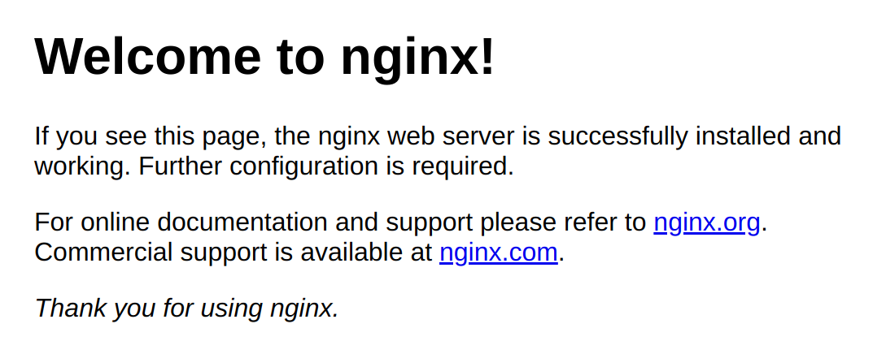

# Containers Lab - Docker

## Task 1: Core Container Operations

### 1) List Containers
I kinda already have some containers:

```bash
$ docker ps -a
CONTAINER ID   IMAGE                     COMMAND                  CREATED        STATUS                             PORTS                                                                                      NAMES
c631de40830b   lab-airflow-webserver     "/usr/bin/dumb-init …"   2 weeks ago    Up 40 seconds (health: starting)   0.0.0.0:8080->8080/tcp, [::]:8080->8080/tcp                                                lab-airflow-webserver-1
4862ff37aac0   lab-airflow-scheduler     "/usr/bin/dumb-init …"   2 weeks ago    Up 40 seconds (health: starting)   8080/tcp                                                                                   lab-airflow-scheduler-1
07e72e5fd14b   lab-airflow-init          "/bin/bash -c 'if [[…"   2 weeks ago    Exited (0) 2 weeks ago                                                                                                        lab-airflow-init-1
5c338a89b518   apache/spark:3.5.5        "/opt/entrypoint.sh …"   2 weeks ago    Exited (255) 10 days ago           0.0.0.0:7000->7000/tcp, [::]:7000->7000/tcp                                                spark-worker
533067670f29   apache/spark:3.5.5        "/opt/entrypoint.sh …"   2 weeks ago    Exited (255) 10 days ago           0.0.0.0:7077->7077/tcp, [::]:7077->7077/tcp, 0.0.0.0:4040->8080/tcp, [::]:4040->8080/tcp   spark-master
55f06a01d50d   postgres:13               "docker-entrypoint.s…"   2 weeks ago    Up 3 minutes (healthy)             5432/tcp                                                                                   lab-postgres-1
5733e852260a   ros2-gazebo-docker-ros2   "/ros_entrypoint.sh …"   3 months ago   Exited (255) 3 months ago                                                                                                     ros2-gazebo-docker-ros2-1
```

### 2) Pull Ubuntu Image

```bash
$ docker pull ubuntu:latest
latest: Pulling from library/ubuntu
b08e2ff4391e: Pull complete 
Digest: sha256:440dcf6a5640b2ae5c77724e68787a906afb8ddee98bf86db94eea8528c2c076
Status: Downloaded newer image for ubuntu:latest
docker.io/library/ubuntu:latest
```

Pulled the latest Ubuntu image from Docker Hub.

### 3) Run Interactive Container

```bash
$ docker run -it --name ubuntu_container ubuntu:latest
root@d1dea0cf4505:/# ls  
bin  boot  dev  etc  home  lib  lib64  media  mnt  opt  proc  root  run  sbin  srv  sys  tmp  usr  var
root@d1dea0cf4505:/# uname -a
Linux d1dea0cf4505 6.11.0-14-generic #15-Ubuntu SMP PREEMPT_DYNAMIC Fri Jan 10 23:48:25 UTC 2025 x86_64 x86_64 x86_64 GNU/Linux
root@d1dea0cf4505:/# exit
exit
```
Started an interactive Ubuntu container and explored its file system and system name

### 4) Remove Image

```bash
$ docker rmi ubuntu:latest
Error response from daemon: conflict: unable to remove repository reference "ubuntu:latest" (must force) - container d1dea0cf4505 is using its referenced image f9248aac10f2
```

Before image removal we need to remove container itself like this:

```bash
$ docker ps -a
CONTAINER ID   IMAGE                     COMMAND                  CREATED              STATUS                             PORTS                                                                                      NAMES
d1dea0cf4505   ubuntu:latest             "/bin/bash"              About a minute ago   Exited (0) 52 seconds ago                                                                                                     ubuntu_container
```

Here we get container hash, then we need to rm container using it's hash:

```bash
$ docker rm d1dea0cf4505
d1dea0cf4505
```

Then we can succesfully remove image itself:

```bash
$ docker rmi ubuntu:latest
Untagged: ubuntu:latest
Untagged: ubuntu@sha256:440dcf6a5640b2ae5c77724e68787a906afb8ddee98bf86db94eea8528c2c076
Deleted: sha256:f9248aac10f2f82e0970222e36cc7b71215b88e974e001282e5cd89797a82218
Deleted: sha256:45a01f98e78ce09e335b30d7a3080eecab7f50dfa0b38ca44a9dee2654ac0530
```

## Task 2: Image Customization

### 1) Deploy Nginx

80 port was in use so i changet it to 8087

```bash
$ docker run -d -p 8087:80 --name nginx_container nginx
Unable to find image 'nginx:latest' locally
latest: Pulling from library/nginx
3da95a905ed5: Pull complete 
6c8e51cf0087: Pull complete 
9bbbd7ee45b7: Pull complete 
48670a58a68f: Pull complete 
ce7132063a56: Pull complete 
23e05839d684: Pull complete 
ee95256df030: Pull complete 
Digest: sha256:93230cd54060f497430c7a120e2347894846a81b6a5dd2110f7362c5423b4abc
Status: Downloaded newer image for nginx:latest

cf84ac82f239f39d92bbbbc224452eecbf5d1807e7a6796fd2211c4c954ac3b1
```

Image automatically pulled and runned.

```bash
$ curl localhost:8081
```
```html
<!DOCTYPE html>
<html>
<head>
<title>Welcome to nginx!</title>
<style>
html { color-scheme: light dark; }
body { width: 35em; margin: 0 auto;
font-family: Tahoma, Verdana, Arial, sans-serif; }
</style>
</head>
<body>
<h1>Welcome to nginx!</h1>
<p>If you see this page, the nginx web server is successfully installed and
working. Further configuration is required.</p>

<p>For online documentation and support please refer to
<a href="http://nginx.org/">nginx.org</a>.<br/>
Commercial support is available at
<a href="http://nginx.com/">nginx.com</a>.</p>

<p><em>Thank you for using nginx.</em></p>
</body>
</html>
```

So we've got some web page html

And web page itself:



### 2) Customize Website

I've created index.html page in my home dir, and then moved it to container using:

```bash
docker cp ~/index.html nginx_container:/usr/share/nginx/html/

Successfully copied 2.05kB to nginx_container:/usr/share/nginx/html/
```

### 3) Create Custom Image

```bash
$ docker commit nginx_container my_website:latest

sha256:90359a93432c7d89f045d7b1204795dff70fd2ba70256f68c97207d9a425c530
```
Saved the current state of the container as a new image.

### 4) Remove Original Container:

```bash
$ docker rm -f nginx_container
nginx_container
```
Deleted the original container to avoid port conflicts and keep things clean.

### 5) Create New Container:

```bash
$ docker run -d -p 8081:80 --name my_website_container my_website:latest
ca0aced3d0bb369362309b3a0224b021619e09d063b935250f16052984809450
```
Launched a new container using the custom image to verify the changes.

### 6) Test Web Server:

```bash
$ docker diff my_website_container

C /usr
C /usr/share
C /usr/share/nginx
C /usr/share/nginx/html
A /usr/share/nginx/html/index.html
```

Here we cam see the diff between new image and source image

## Task 3: Container Networking

### 1) Created network 

```bash
$ docker network create lab_network
363076f209773d715ff0d0d443c1ca31fe3b8287802f82e4c89661220acda689
```
Set up a custom Docker bridge network called `lab_network`

### 2) Run Connected Containers:

```bash
$ docker run -dit --network lab_network --name container1 alpine ash
Unable to find image 'alpine:latest' locally
latest: Pulling from library/alpine
fe07684b16b8: Pull complete 
Digest: sha256:8a1f59ffb675680d47db6337b49d22281a139e9d709335b492be023728e11715
Status: Downloaded newer image for alpine:latest
25db695bd2add9539f786f32dc399f53c8730563f7ff6b931b394ca68bc1a7b7

$ docker run -dit --network lab_network --name container2 alpine ash
bbca7275361d6c0cdb4923db4720f80acc56d13bfcc8911915e280a41176c8e4
```
Started two Alpine containers and connected them to the same network.

### 3) Test Connectivity:

```bash
$ docker exec container1 ping -c 3 container2
PING container2 (172.21.0.3): 56 data bytes
64 bytes from 172.21.0.3: seq=0 ttl=64 time=0.127 ms
64 bytes from 172.21.0.3: seq=1 ttl=64 time=0.208 ms
64 bytes from 172.21.0.3: seq=2 ttl=64 time=0.196 ms

--- container2 ping statistics ---
3 packets transmitted, 3 packets received, 0% packet loss
round-trip min/avg/max = 0.127/0.177/0.208 ms
```
Successfully pinged one container from the other using its name.

## Task 4: Volume Persistence

### 1) Create Volume:

```bash
$ docker volume create app_data
app_data
```
Created a Docker volume named "app_data" to persist data across containers.

### 2) Run Container with Volume:

```bash
$ docker run -d -v app_data:/usr/share/nginx/html --name web nginx
b546472dcd0e3a63b94c6f3630b1e3440662884316e435c0f7f82bc15e7c9546
```
Ran Nginx with the volume mounted to the web root.

### 3) Modify Content:

```bash
$ docker cp ~/index.html web:/usr/share/nginx/html/
Successfully copied 2.05kB to web:/usr/share/nginx/html/
```
Copied custom HTML content into the mounted volume.


### 4) Verify Persistence:

```bash
$ docker stop web && docker rm web
web
web
```


Still workind in new container with old volume

## Task 5: Container Inspection

### 1) Run Redis Container:

```bash
$ docker run -d --name redis_container redis
Unable to find image 'redis:latest' locally
latest: Pulling from library/redis
3da95a905ed5: Already exists 
fb940e68fdcf: Pull complete 
944aad9f1ff7: Pull complete 
574052bfcd56: Pull complete 
bae11d176099: Pull complete 
4f4fb700ef54: Pull complete 
58f72891ca70: Pull complete 
Digest: sha256:a1e0a3b3a6cedd74d8ba44805b2497b93851a296f08a44962fedc03f1c490b47
Status: Downloaded newer image for redis:latest
13f1f2ce04d7809d87469ecc250a838790a3c04f9781ce78cc45bb0ee08a773d
```
Started a Redis container to inspect its internal state

### 2) Inspect Processes:

```bash
$ docker exec redis_container ps
OCI runtime exec failed: exec failed: unable to start container process: exec: "ps": executable file not found in $PATH: unknown
```
Idk why, can't find a reason

### 3) Network Inspection:

```bash
$ docker inspect -f '{{range.NetworkSettings.Networks}}{{.IPAddress}}{{end}}' 
redis_container
172.17.0.4
```
Retrieved the internal IP address (172.17.0.4) of the Redis container.

## Task 6: Cleanup Operations

### 1) Verify Cleanup:

```bash
$ docker system df
TYPE            TOTAL     ACTIVE    SIZE      RECLAIMABLE
Images          25        4         25.94GB   25.88GB (99%)
Containers      5         5         2.19kB    0B (0%)
Local Volumes   3         2         51.57MB   51.57MB (99%)
Build Cache     139       0         802.6MB   802.6MB
```
Checked disk usage to see how much space is being consumed.

### 2) Create Test Objects:

```bash
$ for i in {1..3}; do docker run --name temp$i alpine echo "hello"; done
hello
hello
hello
```

```bash
$ docker build -t temp-image . && docker rmi temp-image
[+] Building 0.1s (1/1) FINISHED                                                                                                   docker:default
 => [internal] load build definition from Dockerfile                                                                                         0.0s
 => => transferring dockerfile: 2B                                                                                                           0.0s
ERROR: failed to solve: failed to read dockerfile: open Dockerfile: no such file or directory
```
Created temporary containers and tried building a dummy image.

### 3) Remove Stopped Containers:

```bash
$ docker container prune -f
Deleted Containers:
13f1f2ce04d7809d87469ecc250a838790a3c04f9781ce78cc45bb0ee08a773d
04bc95f73a75d45c1971fc663ee12138545f197ba3bffb9c1045d783d326ca62
bbca7275361d6c0cdb4923db4720f80acc56d13bfcc8911915e280a41176c8e4
25db695bd2add9539f786f32dc399f53c8730563f7ff6b931b394ca68bc1a7b7
ca0aced3d0bb369362309b3a0224b021619e09d063b935250f16052984809450

Total reclaimed space: 2.19kB
```
Used `docker container prune` to delete all stopped containers.

### 4) Remove Unused Images:

```bash
$ docker image prune -a -f
Deleted Images:
untagged: postgres:13
untagged: postgres@sha256:e1195666dc3edf6c8447bea6df9d7bccfdda66ab927d1f68b1b6e0cc2262c232
deleted: sha256:c3e3ebe369ec13c362abbaf2ceee26538ed31e2cb08ae12d7f00acfac094b072
deleted: sha256:c29508fe6a50bc09d6bb8b5e42e6ade624a452f881ece1a672134050bbd4be1f
deleted: sha256:22d8c64f43b3d5c3ec4bb4007962081595d12815bdd3dc69ea74faa694c523e8
deleted: sha256:38e87f71a41a8d7a92f57fdb8e1428f8cff59b713d2173061832c0771d36b7c1
deleted: sha256:5a0b041deea2d2261b9d45f8e77adc69f7a6cf546713414ddd0bcc0a7cfae1b7
deleted: sha256:a96d64ce2fb703a52f356ba0b5f2738c8a7366774498a4c9050d3ca27dd7e3c5
deleted: sha256:b3ccf759d8425fefd455b52a47f164548e2b9506ca95020693d2dee504a7f302
deleted: sha256:2b2db472af0294b60f3022304b8f89ff89503425ce1bf5b8e49658ebc8c7f9ba
deleted: sha256:4b76ab03d623dfd6bce59e84eea2306716f3bf33d0e1705eab63011eded665ae
deleted: sha256:5be5ba8a279a46e53a138ded0ee09607c23a84ecbca609c041136fe30d5c61a5
deleted: sha256:d28829a1c6cef4f33dc21199bbf8c90497f77dc0a5e2560e438f1362c5eb9842
deleted: sha256:f0cc16d913307c8b5b85300bd2bbd5e5efa41e8137516175a7b0d8d573685a07
deleted: sha256:7bbe35ff6a9722de5c8e5ef16996bed7825431613fe696b8e696a16c9ffe11c5
deleted: sha256:0473a09f0f1fa71c005234875f327529b75ca349c0c3449a30d2a6fab1438bc9
deleted: sha256:7fb72a7d1a8e984ccd01277432de660162a547a00de77151518dc9033cfb8cb4
deleted: sha256:954d9ba1a3340ce46effc326b67bd209fb1a9182f3ea4dea43f4061ab87340a1
deleted: sha256:5514e1f80837462ce0125287529490cac9c72f7024bd01f9506816e5843c7068
deleted: sha256:3f1c131cbaa0a09aad166a79cad7bfdc174e743ae6f51ff0de0d3bd92ecec957
untagged: sdkmanager:2.2.0.12028-Ubuntu_18.04
deleted: sha256:7ad7100fa7dc8e2a16f787b0f863324c76c103a4a22a0ab0c482b22696a11cfb
deleted: sha256:d08cce1ff00de5800450e216ddc9807bbf11b57a9a86bf3e164da0fee6ca0a8e
deleted: sha256:134878f70a722e0005435f8bb524a8502e1cf7e5d0c1115ccd38fc4fbc610d8b
deleted: sha256:3578d755b006f426aac2592f26db5a1a9a58a18dcfdcaa3ac5d1d80335e40e03
deleted: sha256:c85e716c44afd7f911c2f4dd4f4e9365b82bde602590f51b1e2dd2627a653fda
deleted: sha256:43350c14bfff017014ede7e612551a36b4044aea38cd2c9217e67e56871c1778
deleted: sha256:990c79448d22865913d395ae29952b009bb2cbd88656b2457939ea35c0c6e140
deleted: sha256:3af56d498c109105140b5c8f34b0fec968ec6dacfc99904fe5ef0ea44fac9cd3
deleted: sha256:5f18ae519a2adfaa1958e5e2a39f8a38770b6e7e2cf2fc8f0672f61e67e44617
deleted: sha256:4b23e2fc39c24a863e5a2278041e7144f158dba0bdcaa0a25ec07829f7c8f39a
deleted: sha256:e59f070e0a90d9fadb4c3aa57a3a72616f35da21f225e41e6a4135dd4aa0ad81
deleted: sha256:78552eb2def6096d7c5c417fbbf7241cc36873c2d830bfea60992f022b8d2336
deleted: sha256:1726fc8ed8f2f61ccdc6327470d9e1508e75d5db34f4d295b2c4fc10315745a4
deleted: sha256:2d6624685b74126f0ad0b0ed45c94211e9015d0a9d684f6b2283364bab607fd7
deleted: sha256:50935d88e9a6da9938c68210c6bb9d1593aebc3a7a1172b6d4107ae10d7116d5
deleted: sha256:a86633ee901e3ed39df3833e6ce8fe88fd21abc6e9d1a7552d0a9b2ac5c9dbf5
deleted: sha256:00f05ca10d2db356ac275e7db95f95d4896d94402fccb8a7ec49a82f6c802cf6
deleted: sha256:d16c79013d83bedd257bb44f16474f21ff222c0de0e6062055e2d8ef9df0a142
deleted: sha256:a48e0b363ab6f8043816caf076621eacce015c4625046a0a21a3536cfc7d2091
deleted: sha256:abc9d16e2fe68ed3ef21ee5dd785ccb9cf91748a0a522d1c6205384b30276b5a
deleted: sha256:7c312a4004fef810a63da84f6bca3c514c95b72030d6bc233f6d8ece84cd5af7
deleted: sha256:548a79621a426b4eb077c926eabac5a8620c454fb230640253e1b44dc7dd7562
untagged: exampleimagedir:latest
deleted: sha256:9b879d318621facc257cca46969d201d6caa755e2e60caee901126a40480fc14
deleted: sha256:8f6d646c9b63bbaa111cbaf9907972ffd39f2d618ca252bdd95a12486b5c764f
deleted: sha256:2d1f8abd073b4d7f157bf7c36f0408710a02c050e32426fdb3c0f2647e1e5ab9
deleted: sha256:f4668aa24cee8ae7ae7045fff9c20e36fa1064aba69f71c4d3e238065ebd5126
untagged: meshlib_container:latest
deleted: sha256:cca9415c469bc226a63952fdbd8fb6a49f81475f38f333fa6dbaac757fdbfe6f
deleted: sha256:597de17b604d8f161c64809cfcb8b1b8e8b4a9576ce03963c22c8d599102442c
deleted: sha256:41e70b15bfcadcec05e0277e933c42ce27c01f5b60739340a661122dbb0fdac7
untagged: apache/spark:3.5.5
untagged: apache/spark@sha256:39321d67b23e2e0953f81b60778f74bf40c40a18dfb0e881e6a38593af60afa1
deleted: sha256:96c50f0a02c76c1ea4f5b892562d0a3c884d98052ef144cef09a03364f424ce0
deleted: sha256:0cac5b70a6f136699294d935ffb54db8c4d22e268c00ec6c338895c5d09ce714
deleted: sha256:4610af9ae7af3cf7a123258dafd1239d79de11769023363cecc470a41a78ff46
deleted: sha256:d60ed48a9da7be1f27c5baafcbe53a33f071a72c4c35c84784a22fea25d28270
deleted: sha256:8058c08dd0562e4cb063e1342a7f4af38d447474171a1eb48750cc90b8b16190
deleted: sha256:461a043459ac3c2ae9e2351cc0e91752e98e0ef1b9537e626e641183ebeb3114
deleted: sha256:a9cf6643ab88ec18e6c0cd81156da260ede977268108d19936c739d5e366a70d
deleted: sha256:898e62a0ddcfb121c94a33a196dcdd93341b2d0503bc0432cf2606f60d3ea262
deleted: sha256:c72302caa3f280343e6e65d5ba7a07228125cf1448d6f592cc5616c5f462ac46
deleted: sha256:2120151c58b161dd9e880bf36f4d9e2681643b1ddfbd0a5b48279b79a46a2bea
deleted: sha256:ff23d14bf9a5c6cb01e2974c4b92392384930054ee3629603ff60e8b894ca349
deleted: sha256:fffe76c64ef2dee2d80a8bb3ad13d65d596d04a45510b1956a976a69215dae92
untagged: lab-airflow-webserver:latest
deleted: sha256:e43f84b230aa38eda41bd850d67d4e6c2ea2ffb08b3fbfd1ad2a821b08c713fb
deleted: sha256:fbbf699a91f672ac4e96a202ae47999c146addec0e5f84d403a976c22c607856
deleted: sha256:226f74d748208ac3d07592bdecb4c23b01c16515ef01ea22b4ebe103260713bb
untagged: lab-airflow-init:latest
deleted: sha256:174e4d4b207862b9d83f124e662dfe64d6434b2ad07bf75be0ac1416bbf50010
untagged: meshviewer_container-meshlib_container:latest
deleted: sha256:2f34d108464af66fedb5e6391731c253518e4324dcdac6d25cc335b1a0512d7c
untagged: lab-airflow-scheduler:latest
deleted: sha256:d8954147c1327b7940d383673622720f98a35f5f39f168402d7ab844d25b2dd9
untagged: ros2-gazebo-docker-ros2:latest
deleted: sha256:fe080fdd764f94dc324a0fc17d2470325b7103fe247dee98ceac053c9e507b9b
untagged: sdkmanager:latest
deleted: sha256:a6a209579415a657a84af715b7a4a02e2bf44bb1b7ff5d4987e55df464fad53c
deleted: sha256:1bec60e3d585d17f7ba5c8859b4bb2cbda35d936aa3859756b45720007ce11e8
untagged: meshviewer_container-meshlib:latest
deleted: sha256:cf27a05706843930b069f8fc45daa0477a0c247c00a550bb085ebead090c6288

Total reclaimed space: 3.652GB
```
Pruned all unused images to free up significant disk space.

### 5) Verify Cleanup:

```bash
$ docker system df
TYPE            TOTAL     ACTIVE    SIZE      RECLAIMABLE
Images          4         4         253.6MB   192.2MB (75%)
Containers      5         5         2.19kB    0B (0%)
Local Volumes   3         2         51.57MB   51.57MB (99%)
Build Cache     140       0         18.21GB   18.21GB
```
Rechecked disk usage to confirm space was reclaimed.

