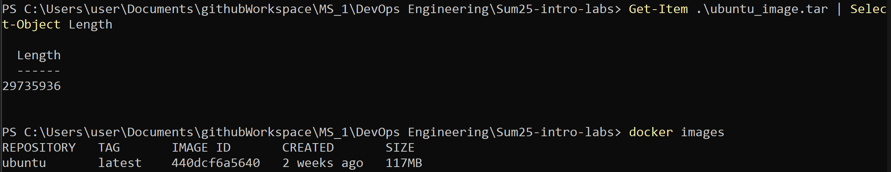

# Lab 6: Containers Lab - Docker

## Task 0: Image Exporting



We can see that the `.tar` file has size of approximately 29 MB, while the original image has size 117 MB. This happens for a couple of reasons:
1. `docker images` shows the virtual size: It reports the total size of all layers of the image including shared base layers, even if they are reused across images. This makes the number larger.

2. `docker save` exports only the image-specific layers: The `.tar` includes only the actual layers and metadata of the specified image, excluding shared or cached base layers that are not uniquely part of `ubuntu:latest`.

3. The 117MB is not actually "compressed" on disk. It's a rough approximation of the image's total file system space usage when expanded in Docker's layer store, not necessarily a directly comparable `.tar` size.

4. The latest Ubuntu image is minimal and modular, meaning the actual contents of the image (as required for export) are much smaller than what Docker estimates for internal use.

## Task 1: Core Container Operations

### Part 1: List Containers

```sh
docker ps -a
CONTAINER ID   IMAGE     COMMAND   CREATED   STATUS    PORTS     NAMES
```

### Part 2: Pull Ubuntu Image

```sh
docker images
REPOSITORY   TAG       IMAGE ID       CREATED       SIZE
ubuntu       latest    440dcf6a5640   2 weeks ago   117MB
```
After pulling `ubuntu:latest` we can see that its image size is 117 MB.

### Part 3: Run Interactive Container

```sh
docker run -it --name ubuntu_container ubuntu:latest
root@e4701d94fb60:/# exit
exit
```

### Part 4: Remove Image

```sh
docker rmi ubuntu:latest
Error response from daemon: conflict: unable to delete ubuntu:latest (must be forced) - container e4701d94fb60 is using its referenced image 440dcf6a5640
```
Docker does not allow image deletion if any container (running or stopped) was created from that image. To delete the image, the container must be removed first using `docker rm ubuntu_container`.

## Task 2: Image Customization

### Part 1: List Containers

```sh
docker run -d -p 80:80 --name nginx_container nginx
Unable to find image 'nginx:latest' locally
latest: Pulling from library/nginx
ee95256df030: Pull complete
23e05839d684: Pull complete
ce7132063a56: Pull complete
3da95a905ed5: Pull complete
9bbbd7ee45b7: Pull complete
48670a58a68f: Pull complete
6c8e51cf0087: Pull complete
Digest: sha256:93230cd54060f497430c7a120e2347894846a81b6a5dd2110f7362c5423b4abc
Status: Downloaded newer image for nginx:latest
f56c4031a9b817a5c1957bcbafd2ac8500c1ce012ceed609684db447a37b05e3
```

```sh
curl localhost


StatusCode        : 200
StatusDescription : OK
Content           : <!DOCTYPE html>
                    <html>
                    <head>
                    <title>Welcome to nginx!</title>
                    <style>
                    html { color-scheme: light dark; }
                    body { width: 35em; margin: 0 auto;
                    font-family: Tahoma, Verdana, Arial, sans-serif; }
                    </style...
RawContent        : HTTP/1.1 200 OK
                    Connection: keep-alive
                    Accept-Ranges: bytes
                    Content-Length: 615
                    Content-Type: text/html
                    Date: Sat, 05 Jul 2025 12:00:31 GMT
                    ETag: "685adee1-267"
                    Last-Modified: Tue, 24 Jun 2025 ...
Forms             : {}
Headers           : {[Connection, keep-alive], [Accept-Ranges, bytes], [Content-Length, 615], [Content-Type,
                    text/html]...}
Images            : {}
InputFields       : {}
Links             : {@{innerHTML=nginx.org; innerText=nginx.org; outerHTML=<A href="http://nginx.org/">nginx.org</A>;
                    outerText=nginx.org; tagName=A; href=http://nginx.org/}, @{innerHTML=nginx.com;
                    innerText=nginx.com; outerHTML=<A href="http://nginx.com/">nginx.com</A>; outerText=nginx.com;
                    tagName=A; href=http://nginx.com/}}
ParsedHtml        : mshtml.HTMLDocumentClass
RawContentLength  : 615
```

### Part 2: Customize Website

```sh
docker cp index.html nginx_container:/usr/share/nginx/html/
Successfully copied 2.05kB to nginx_container:/usr/share/nginx/html/
```

### Part 3: Create Custom Image

```sh
docker commit nginx_container my_website:latest
sha256:10a7...
```

### Part 4: Remove Original Container

```sh
docker rm -f nginx_container
nginx_container
docker ps -a
CONTAINER ID   IMAGE           COMMAND       CREATED          STATUS                      PORTS     NAMES
e4701d94fb60   ubuntu:latest   "/bin/bash"   21 minutes ago   Exited (0) 20 minutes ago             ubuntu_container
```
As we can see, no nginx_container there.

### Part 5: Create New Container

```sh
docker run -d -p 80:80 --name my_website_container my_website:latest
7294...
```

### Part 6: Test Web Server

```sh
curl http://127.0.0.1:80


StatusCode        : 200
StatusDescription : OK
Content           : <html>
                    <head>
                    <title>The best</title>
                    </head>
                    <body>
                    <h1>website</h1>
                    </body>
                    </html>
RawContent        : HTTP/1.1 200 OK
                    Connection: keep-alive
                    Accept-Ranges: bytes
                    Content-Length: 92
                    Content-Type: text/html
                    Date: Sat, 05 Jul 2025 12:10:22 GMT
                    ETag: "68691459-5c"
                    Last-Modified: Sat, 05 Jul 2025 12...
Forms             : {}
Headers           : {[Connection, keep-alive], [Accept-Ranges, bytes], [Content-Length, 92], [Content-Type,
                    text/html]...}
Images            : {}
InputFields       : {}
Links             : {}
ParsedHtml        : mshtml.HTMLDocumentClass
RawContentLength  : 92
```

### Part 7: Analyze Image Changes

```sh
docker diff my_website_container
C /etc
C /etc/nginx
C /etc/nginx/conf.d
C /etc/nginx/conf.d/default.conf
C /run
C /run/nginx.pid
```
**Output Explanation:**
- `C` (changed): These changes were made after the container started.
- `/etc/nginx/conf.d/default.conf` was likely updated or touched by Nginx during boot.
- `/run/nginx.pid` is a runtime file created to track the Nginx process.
- No content under `/usr/share/nginx/html/` is shown because the custom HTML file was already part of the image snapshot (`docker commit`), so it’s not a "change" from the container’s perspective.

## Task 3: Container Networking

### Part 1: Create Network

```sh
docker network create lab_network
e1dd...
```

### Part 2: Run Connected Containers

```sh
docker run -dit --network lab_network --name container1 alpine ash
Unable to find image 'alpine:latest' locally
latest: Pulling from library/alpine
fe07684b16b8: Pull complete
Digest: sha256:8a1f...
Status: Downloaded newer image for alpine:latest
8cf9...
docker run -dit --network lab_network --name container2 alpine ash
3164...
```

### Part 3: Test Connectivity

```sh
docker exec container1 ping -c 3 container2
PING container2 (172.20.0.3): 56 data bytes
64 bytes from 172.20.0.3: seq=0 ttl=64 time=0.182 ms
64 bytes from 172.20.0.3: seq=1 ttl=64 time=0.089 ms
64 bytes from 172.20.0.3: seq=2 ttl=64 time=0.092 ms

--- container2 ping statistics ---
3 packets transmitted, 3 packets received, 0% packet loss
round-trip min/avg/max = 0.089/0.121/0.182 ms
```

### Part 4: Documentation

Docker's user-defined bridge networks include a built-in DNS service. When containers are on the same network:
- Docker maintains an internal DNS server.
- Each container is automatically assigned a hostname equal to its container name (e.g., container2).
- Other containers on the same network can resolve that name to an internal IP using Docker's embedded DNS (not system DNS).
- This allows name-based communication without IP hardcoding.

In our case, container1 resolves container2 using that internal DNS and can ping it by name.

## Task 4: Volume Persistence

### Part 1: Create Volume

```sh
docker volume create app_data
app_data
```

### Part 2: Run Container with Volume

```sh
docker run -d -v app_data:/usr/share/nginx/html --name web nginx
2f24...
```

### Part 3: Modify Content

```sh
docker cp index.html web:/usr/share/nginx/html/
Successfully copied 2.05kB to web:/usr/share/nginx/html/
```

### Part 4: Verify Persistence

```sh
docker stop web; docker rm web
web
web
```

```sh
docker run -d -v app_data:/usr/share/nginx/html --name web_new nginx
d598...
```

```sh
curl localhost


StatusCode        : 200
StatusDescription : OK
Content           : <html>
                    <head>
                    <title>The best</title>
                    </head>
                    <body>
                    <h1>website</h1>
                    </body>
                    </html>
RawContent        : HTTP/1.1 200 OK
                    Connection: keep-alive
                    Accept-Ranges: bytes
                    Content-Length: 92
                    Content-Type: text/html
                    Date: Sat, 05 Jul 2025 13:27:09 GMT
                    ETag: "68691459-5c"
                    Last-Modified: Sat, 05 Jul 2025 12...
Forms             : {}
Headers           : {[Connection, keep-alive], [Accept-Ranges, bytes], [Content-Length, 92], [Content-Type,
                    text/html]...}
Images            : {}
InputFields       : {}
Links             : {}
ParsedHtml        : mshtml.HTMLDocumentClass
RawContentLength  : 92
```
We can indeed see that the context persists.

## Task 5: Container Inspection

### Part 1: Run Redis Container

```sh
docker run -d --name redis_container redis
Unable to find image 'redis:latest' locally
latest: Pulling from library/redis
ab22bb3606ca: Pull complete
4f4fb700ef54: Pull complete
881b4a6fb2ec: Pull complete
db655ba2dcca: Pull complete
6d7393f5b310: Pull complete
4ef8fa7693bb: Pull complete
Digest: sha256:b43d...
Status: Downloaded newer image for redis:latest
1a12...
```

### Part 2: Inspect Processes

```sh
docker exec redis_container ps aux
OCI runtime exec failed: exec failed: unable to start container process: exec: "ps": executable file not found in $PATH: unknown
```

So I go with:
```sh
docker top redis_container
UID                 PID                 PPID                C                   STIME               TTY                 TIME                CMD
999                 1354                1332                0                   13:31               ?                   00:00:00            redis-server *:6379
```

### Part 3: Network Inspection

```sh
docker inspect -f '{{range.NetworkSettings.Networks}}{{.IPAddress}}{{end}}' redis_container
172.17.0.4
```

### Part 4: Document Differences

When working with Docker containers, both `docker exec` and `docker attach` let us interact with a running container, but they serve very different purposes and should be used in different situations:

---

`docker exec`: runs a new command inside the container, starting a new process inside an already running container. It doesn't interfere with the main process running in the container, and it gives us a fresh terminal session just for that command.

It's most useful for:
- Inspecting the container (e.g., checking logs, listing files)
- Debugging (e.g., running `sh` or `bash`)
- Running scripts or commands without affecting the main application

We can run `exec` multiple times, from multiple terminals, and it won’t harm the container.

**Use case:** We're running a web server in a container and want to quickly check the contents of a log file or look at the list of files in a directory without interrupting the server.

---

`docker attach`: connects to the container’s main process. This command attaches the terminal directly to the main process of the container - the one that was started when the container was created.

This is riskier because:
- If we press Ctrl+C, we might stop the entire container.
- Only one terminal can be attached at a time.
- We must detach carefully using Ctrl+P followed by Ctrl+Q.

**Use case:** We're running a container that starts an interactive script, like a Python REPL or a custom CLI tool, and we want to interact with it directly as if it were running in our terminal.

## Task 6: Cleanup Operations

### Part 1: Verify Cleanup

```sh
docker system df
TYPE            TOTAL     ACTIVE    SIZE      RECLAIMABLE
Images          5         5         9.335GB   8.957GB (95%)
Containers      6         5         151.6kB   12.29kB (8%)
Local Volumes   2         2         598B      0B (0%)
Build Cache     34        0         12.32GB   12.32GB
```

### Part 2: Create Test Objects

```sh
1..3 | ForEach-Object { docker run --name "temp$_" alpine echo "hello" }
hello
hello
hello
```

Created a custom Dockerfile now, as I had an error trying to run the command below previously.

```sh
docker build -t temp-image .; docker rmi temp-image
[+] Building 2.0s (6/6) FINISHED                                                                   docker:desktop-linux
 => [internal] load build definition from Dockerfile                                                               0.0s
 => => transferring dockerfile: 82B                                                                                0.0s
 => [internal] load metadata for docker.io/library/alpine:latest                                                   0.1s
 => [internal] load .dockerignore                                                                                  0.0s
 => => transferring context: 2B                                                                                    0.0s
 => [1/2] FROM docker.io/library/alpine:latest@sha256:8a1f...  1.3s
 => => resolve docker.io/library/alpine:latest@sha256:8a1f...  1.3s
 => [2/2] RUN echo "temporary image layer"                                                                         0.3s
 => exporting to image                                                                                             0.2s
 => => exporting layers                                                                                            0.1s
 => => exporting manifest sha256:cf83...                  0.0s
 => => exporting config sha256:f4b3...                    0.0s
 => => exporting attestation manifest sha256:bd01...      0.0s
 => => exporting manifest list sha256:ed3e...             0.0s
 => => naming to docker.io/library/temp-image:latest                                                               0.0s
 => => unpacking to docker.io/library/temp-image:latest                                                            0.0s

View build details: docker-desktop://dashboard/build/desktop-linux/desktop-linux/wtlt...
Untagged: temp-image:latest
Deleted: sha256:ed3e...
```

### Part 3: Remove Stopped Containers

```sh
docker container prune -f
Deleted Containers:
b338...
5bc8...
cf00...
e470...

Total reclaimed space: 24.58kB
```

### Part 4: Remove Unused Images

```sh
Deleted Images:
untagged: ubuntu:latest
deleted: sha256:440d...
deleted: sha256:dbdf...
deleted: sha256:f924...
deleted: sha256:b08e...

Total reclaimed space: 29.73MB
```

### Part 5: Verify Cleanup

```sh
docker system df
TYPE            TOTAL     ACTIVE    SIZE      RECLAIMABLE
Images          4         4         9.217GB   8.957GB (97%)
Containers      5         5         139.3kB   0B (0%)
Local Volumes   2         2         598B      0B (0%)
Build Cache     38        0         12.32GB   12.32GB
```

Cleanup Summary:
- All stopped containers were successfully removed.
- One unused image (Ubuntu) was deleted, reclaiming ~30MB.
- All volumes remained in use.
- Still consuming 12.32GB - entirely reclaimable (used `docker builder prune -f
`).