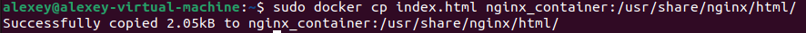

# Lab 6 - Docker

## Task 1 - Core Container Operations

Команда `docker ps -a` выводит список активных контейнеров, в данный момент он пуст, ничего не запустили


`docker pull ubuntu:latest` подтягивает последний образ ubuntu. Чтобы проверить размер, можем ввести команду `docker image ls`


Запускаю контейнер с убунту `docker run -it --name ubuntu_container ubuntu:latest`, после чего выхожу из него командой `exit`. \
При вводе команды `docker rmi ubuntu:latest` получается ошибка, которая не дает удалить образ.

Данная ошибка возникает, так как на данный образ все еще ссылается созданный нами контейнер. Даже с учетом того, что он остановлен. Сначала нужно удалить контейнер командой `docker rm`, после чего удалять образ.

## Task 2 - Image Customization

Запустили контейнер nginx командой `docker run -d -p 80:80 --name nginx_container nginx`. Проверяем командой `curl localhost`


Создаем файл `touch index.html`, вставляем в него HTML код из задания лабораторной, копируем в контейнер командой `docker cp index.html nginx_container:/usr/share/nginx/html/`. 


Создаем свой образ `docker commit nginx_container my_website:latest`. \
Удаляем оригинальный контейнер `docker rm -f nginx_container` \
Создаем новый контейнер со своим образом `docker run -d -p 80:80 --name my_website_container my_website:latest` \
Проверяем веб-сервер командой `curl http://127.0.0.1:80`


Команда `docker diff my_website_container` показывает изменения между контейнером в текущий момент и образом, из которого контейнер стартовал. В данном случае у файлов коды C, это значит, что они были изменены (не добавлены A или удалены D), при запуске контейнера nginx изменил эти файлы (вообще, файла всего два, остальное родительские директории измененных файлов).


## Task 3 - Container Networking

Командой `docker network create lab_network` была создана дополнительная сеть. Командами 
```
docker run -dit --network lab_network --name container1 alpine ash
docker run -dit --network lab_network --name container2 alpine ash
```
были созданы контейнеры, связанные с данной сетью. \
Из контейнера 1 пингуем контейнер 2 по имени с помощью команды `docker exec container1 ping -c 3 container2` \
Результат выполнения команд ниже. 


Внутри каждой сети докер поднимает мини DNS сервер, когда контейнером запрашивается имя, он ищет его среди всех сетевых алиасов и имен контейнеров, которые он знает. Если не находит, передает DNS-серверу выше.

## Task 4 - Volume Persistence

Создали новый том, запустили в нем контейнер, скопировали в него существовавший из первого задания `index.html`. \
Останавливаем и удаляем контейнер. \


Создаем новый контейнер с тем же томом. \
Выполняем команду `curl localhost` и получаем содержимое нашего файла `index.html`


## Task 5 - Container Inspection

Создаем Redis контейнер \
При нахождении процесса Redis сервера у меня вылезла ошибка, якобы в redis-образе нет команды ps (т.к. нет пакета procps). Можно зайти в контейнер и установить, но я этого не делал. \
Дальше получаем айпи адрес контейнера.


Команда `docker attach` позволяет подключить к контейнеру устройства ввода/вывода, позволяя работать с ним в текущей консоли, тогда как `docker exec` запускает новую команду в контейнере, не переходя в него полностью. В первом случае одно неаккуратное Ctrl + C положит контейнер, во втором такое исключается.

## Task 6 - Cleanup Operations

Проверяем использование диска докером \
Создаем 3 контейнера и останавливаем их \
Создаем 2 изображения, не связанных с контейнерами

Командой `docker container prune -f` убираем остановленные контейнеры \
Командой `docker image prune -a -f` убираем неиспользуемые образы \
Проверяем использование диска снова. Результаты на скриншоте ниже.
