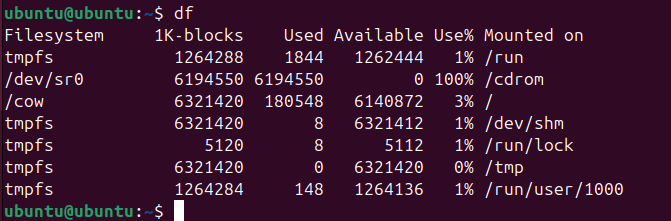

# Task 0

## Export Image
```
docker save -o ubuntu_image.tar ubuntu:latest
```
File is bigger than original image for 120 MB

# Task 1: Core Container Operations


This error occurs due to Docker's protective mechanism to prevent accidental removal of images that are being used by containers.

# Task 2: Image Customization


The docker diff command shows changes made to a container's filesystem compared to its original image.

# Task 3: Container Networking


Docker's internal DNS automatically resolves container names to their IP addresses within the same network. Each container runs a lightweight DNS server (127.0.0.11) that queries Docker's embedded DNS system, which maintains up-to-date mappings of container/service names to their current IPs, enabling containers to communicate using hostnames instead of hardcoded IP addresses. This works for both default bridge networks and user-defined networks, with automatic updates when containers start/stop.

# Task 4: Volume Persistence


# Task 5: Container Inspection



```docker exec``` vs ```docker attach```:
```docker exec``` launches a new command in a running container (ideal for debugging or running one-off commands without interrupting the main process), while ```docker attach``` connects your terminal to the container's primary process (PID 1), making it suitable for interacting with interactive applications like shells. Use exec for most inspection tasks and attach only when you need direct control of the main process's stdin/stdout.

# Task 6: Cleanup Operations


