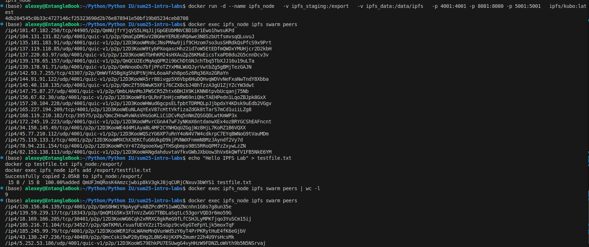

# Lab 7

В данной лабораторной работе реализуем концепцию reconciliation loop - сверяем актуальное состояние с состоянием, описанным в Git и возвращаем его назад при несанкционированных изменениях.

